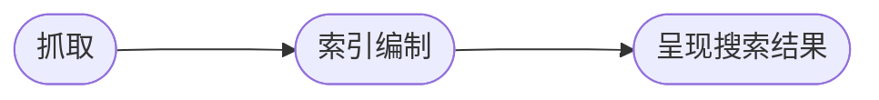

# SEO

了解搜索引擎，根据搜索引擎的的要求，提供能够更好的描述自己，更容易让搜索引擎理解的内容。

SEO 的实施是一个持续的优化过程，应用已知的最佳实践方案，然后在实践中逐步优化。

> [参考 搜索引擎优化 (SEO) 新手指南](https://developers.google.com/search/docs/fundamentals/seo-starter-guide?hl=zh-cn)

SEO 可以分成这么几个主要内容

如何让浏览器收录

如何让浏览器更好地理解

如何向用户更好地展现结果

## 如何让浏览器收录

用户要使用搜索引擎搜到我们的网页，首先搜索引擎得收录我们的网站

### 收录过程

参考 [关于 Google 搜索运作方式的深度指南](https://developers.google.com/search/docs/fundamentals/how-search-works?hl=zh-cn)



### 被动收录

就是做好网站的发布，能够对外访问，然后等着爬虫来抓。

大概就是单身等着七大姑八大姨介绍吧。

### 间接收录

将网页链接添加到比较知名的网站。

- 哪些地方比较热闹，她经常去的，提前去那候着，创造机会
- 哪些人跟她比较亲近，通过她身边的人接近

### 主动收录

社牛或者上了年级被家里催得不行的，可以主动出击。

主动跟搜索引擎打招呼，问约不约 [参考](https://developers.google.com/search/docs/crawling-indexing/sitemaps/build-sitemap?hl=zh-cn#addsitemap)

主要有两种比较好的方式

- 通过 ping 工具：大概就是电视剧里面那种碰撞的相遇吧
- 通过 [Google Search Console](https://search.google.com/search-console/about) 提交 sitemap：大概就是发了消息等回复

### 禁止收录

类似于声明了不单身不约的那种吧，大部分人就不来打扰了，还是有些想来松松土浇浇水的。

可通过 `robots.txt` 告诉搜索引擎别收录。

```txt
# brandonsbaseballcards.com/robots.txt
# Tell Google not to crawl any URLs in the shopping cart or images in the icons folder,
# because they won't be useful in Google Search results.
User-agent: googlebot
Disallow: /checkout/
Disallow: /icons/
```

`robots.txt` 只是“应该”遵守的约定，敏感信息自然是网络上能访问就不安全了，需要采取其他受限访问的方式限制。

## 评判标准

## 分析方式

## TDK

## SSR

## baidu
