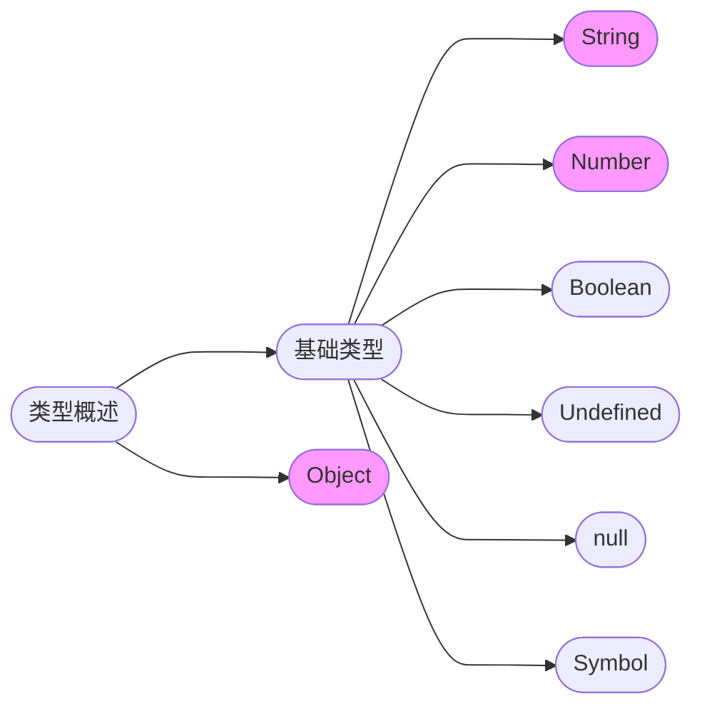
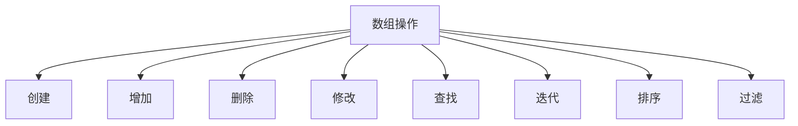
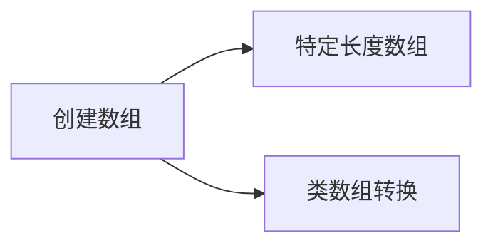
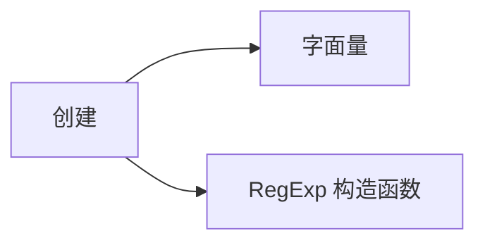

# 基础知识

## 变量提升

在只有 `var` 的年代，对于自定义标识符，可以拆分为 **声明** 和 **赋值** 两个步骤去理解。

```js
console.log(a); // undefined
foo(); // in foo

var a = 12;
function foo() {
  console.log("in foo");
}
```

如上所示，定义了两个变量 `a` 和函数 `foo`。

- **声明提升，赋值不提升**：在定义`a`的位置之前访问，没有报错，打印出来的是 `undefined`，这说明在打印的位置，编译器是知道有这玩意的
- **声明提升，赋值也提升**：函数在声明的位置之前调用，并没有报错，说明在调用的位置，编译器是能知道函数存在，并且拿到了它的内容

:::info
var 变量提升，可以解释为 **声明提升，但是赋值不提升**。
:::

## let & const

在引入了 `let`，`const` 和块级作用域之后，“声明”这一个描述就不够具体了，如下

```js
{
  console.log(a); // undefined
  var a;
}

{
  console.log(b); // Uncaught ReferenceError: Cannot access 'a' before initialization
  let b;
}
```

对于 `var`声明的 `a`，访问会打印默认值 undefined。
而对于 `let` 声明的 `b`，会直接报错，提示需要先初始化。

为了便于理解，引入了 let 和 const 之后，可以将变量的定义过程，新增一个 **占位** 阶段

| 阶段 | 解释                               |
| ---- | ---------------------------------- |
| 占位 | 占了标识符名称，但不允许访问       |
| 声明 | 声明语句执行，但不赋值             |
| 赋值 | 表示我们的自定义初始化，第一次赋值 |

对应关系如下

```js
{
  console.log(b); // Uncaught ReferenceError: Cannot access 'a' before initialization

  // 占位：在声明之前，不允许访问b
  let b;
  // 声明：使用let声明，但未赋值，这阶段访问是默认值
  b = 666;
  // 赋值：设置值之后
}
```

所谓的占位阶段，就是我们说的常说的 TDZ(暂时性死区)。

## TDZ

TDZ(暂时性死区)表示你要的东西存在，但是你还不能拿。这也暗含着一层意思 —— 编译器是知道这个东西存在的。

如果从编译的角度去看，不管是何种方式声明，在编译过程中变量都会被识别，加入到执行上下文中。

从实现上，可以这么去模拟 TDZ

| 阶段 | 模拟操作                                      |
| ---- | --------------------------------------------- |
| 占位 | 定义了 getter 函数，访问即抛出 ReferenceError |
| 声明 | 重新定义了 getter 函数，访问输出 undefined    |
| 赋值 | 重新定义了 getter 函数允许正常访问            |

如果将变量提升拆分成 **占位提升**，**初始化提升**，**赋值提升** 三个部分，那么 let 是 创建提升，但是声明和赋值不提升。

<details>
  <summary>TDZ 是必要的吗</summary>
  <div>
    是也不是，取决于你看的角度。TDZ
    约定不要在声明之前使用，是为了减少错误发生概率的策略选择而已。就跟喝肥宅快乐水一样，不喝快乐水能死吗？也许不会，但是喝了会很快乐呀，你说喝这个快乐水是不是必要呢？
  </div>
</details>

## 类型概述

JS 的数据类型简单总结为 6 + 1 + BigInt 共 8 种数据类型



这 7 种类型，除了 Symbol 还算新人，其他都是已经工作很多年了，也是平时用的最多的。

Undefined，Boolean，null 的使用相对简单，主要关注 Number, String 和 Object 三个内容进行归纳总结即可。

<!-- | 类型   | 研究文档                  |
| ------ | ------------------------- |
| Number | [Number](/docs/JS/number) |
| String | [String](/docs/JS/string) |
| Object | [Object](/docs/JS/object) | -->

## 类型检测

一般根据具体需要来使用不同的工具

|        目标类型         |            判断方式            |
| :---------------------: | :----------------------------: |
| Exclude<基础类型, null> |             typeof             |
|        Function         |             typeof             |
|          Array          |         Array.isArray          |
|          null           |              ===               |
|        实例关系         |           instanceof           |
|          Other          | Object.prototype.toString.call |

一般而言，typeof x 是比较安全的，检查某个变量常用 typeof 判断是否定义

```js
if (typeof x !== "undefined") {
  // do something
}
```

不过由于 TDZ 的存在，不那么安全了，typeof 这个检测也被 🈲 了。

:::info 归纳
我觉得好的方式是找一个，或者自行封装一个小工具包，团队内统一使用，一次有效归纳，不需要再做取舍纠结，也减少偶然的错误。
:::

## 类型转换

JS 中各种转换规则很纷杂，理解和掌握是有理解和记忆难度的。

### 转换分类

一般说到类型转换，都会提到**显式转换/强制转换** 和 **隐式转换** 这两种划分。

我理解，显隐是相对的，如果是从字面意义的“明显程度“来做区分，那每个人理解深度不一样，是没有标准的。

显隐，应该是从表达式的目标和实现区分

- 强制转换：目标上是类型转换，实现上明确调用转换方法或使用目的是类型转换的操作符
- 隐式转换：目标上并不是做转换，实现上并没有调用特定的转换方法或目的是类型转换的操作符

显隐的区分，更多只是为了帮助我们理解那些特殊的情况，隐式转换使用的场景并不是明确的需要类型转换的地方。

在使用类型转换时，我们思考的顺序如下所示


首先根据目标类型划分，然后再选择转换的实现方式，这是梳理类型转换相关知识的较好的方式。

### toString

需要转换为字符串的常用场景主要有

| 场景         | 示例 |
| ------------ | ---- |
| 值的相等比较 |      |
| 类型判断     |      |
| 数字转字符串 |      |
| 数组转字符串 |      |
| 对象转字符串 |      |

#### Primitive

基础类型的转换比较简单，最简单的方式是与一个空字符串`''`相加，基本上就是原来的内容转换成字符串形式。

```js
null + ""; // 'null'
undefined + ""; // 'undefined'
true + ""; // 'true'
1 + ""; // '1'
```

也有一些特殊情况，但不复杂

```js
0.0000000001 + ""; // '1e-10' 数字特别大或者特别小会变成指数形式
Symbol("foo").toString(); // 'Symbol(foo)'
```

其中 Symbol 的字符串更多只是便于区分，日常开发中也不需要将其转换为字符串。

#### Array

数组转字符串

```js
[1, 2, 3].toString(); // '1,2,3'
```

默认情况下，`toString` 其实就是尝试调用 `join`，join 的默认拼接字符是 `,`。
如果覆盖了 toString 或者 join 可能会得到不同的结果。

```js
const arr = [1, 2, 3];
arr.join = "wow";
arr.toString(); // [object Array]
```

如上所示，覆盖 join 为一个非函数，将会调用 Object.prototype.toString。

#### Object

参考[JSON](#JSON)

### toNumber

非数字转数字，开发过程中使用到的基本都是字符串转数字

其中比较值得注意的有几个

- `+` 二元运算，一元操作引起的转换，执行与 `Number()` 一样的转换
- `==` 比较隐式转换

### 小结

原则是

- 减少类型转换
- 避免隐式转换
- 限制强制转换

像 `==` 这样的，虽然有时候恰好是会有比较巧妙的实现，但我会避免使用。

而像`+`这样的，就约束字符串只包含数字字符这样的前提。

## Array

[Array](https://developer.mozilla.org/en-US/docs/Web/JavaScript/Reference/Global_Objects/Array/reverse) 是 Object 之外最常用的引用类型，具有非常丰富的操作方法，很多时候需要组合着来使用。



### 创建

一般都使用字面量的方式创建，主要关注两个稍微特别的场景



这俩也是开发中很常见的场景，示例如下

```js
// 特定长度数组
const arr1 = Array(7); // arr1.length is 7

// 类数组转换
const set = new Set().add(1).add(2).add(2);
const arr2 = Array.from(set); // [1,2]
const arr3 = [...set]; // [1,2]
```

### 注意事项

```js
// 末尾逗号之后的元素被忽略
const arr2 = [1, ,]; // arr2.length is 2

// 空位处理不一致，在不同版本方法对空位的处理不一样，应该始终避免数组出现空位
const arr3 = [, , ,];
```

### 备忘

- reduce 第二个参数没有使用过，一些场景可以用
- reduceRight, copyWithin，entries 可以根据情况提高使用率
- flat 和 flatMap 可以应用在一些试用项目

## RegExp

正则表达式的编写，很考验熟练度，我一般借助其他可视化解释工具来进一步确认。

| 工具                                                 |
| ---------------------------------------------------- |
| VSCode RegExplain 插件，图形化显示正则               |
| [regexper.com 图形化显示正则](https://regexper.com/) |
| [在线快速编辑测试正则](https://regex101.com/)        |

正则的创建有两种方式



一般都是字面量的方式创建，包含变量的情况才需要使用 `RegExp` 构造函数创建

```js
const prefix = "c";
const text = "cat cow wow";
new RegExp(prefix).test(text);
```

### 使用

RegExp 方法基本上只用 [test](https://developer.mozilla.org/en-US/docs/Web/JavaScript/Reference/Global_Objects/RegExp/test) 和 [exec](https://developer.mozilla.org/en-US/docs/Web/JavaScript/Reference/Global_Objects/RegExp/exec)，然后其他常用的地方就是字符串的一些方法调用，比如 replace, match。

使用正则的方法，基本上分成两类

- 关注匹配具体内容：reg.exex, str.match
- 不关注匹配的具体内容：reg.test, str.replace

exec 有几个特别的地方

- 不设置 `g` 标记的时候，只返回第一个匹配的信息，设置了 `g` 之后，依次向后匹配
- 返回值虽然是一个数组，但是添加了 input 属性，每次匹配的 `index`, `lastIndex`(设置了`g`之后才会返回)
- 返回 `arr[1-i]` 依次是匹配的组

```js
const prefix = "(cat)";
const text = "cat cow wow";
new RegExp(prefix).exec(text);
// 0: "cat", 1: "cat", groups: undefined, index: 0, input: "cat cow wow", length: 2
```

<details>
  <summary>input属性是原始字符串还是剩余未匹配部分</summary>
  <div>完整的原始字符串</div>
</details>

### 常用

## JSON {#JSON}

## 引用类型

## TODO

:::note TODO
BigInt
:::
