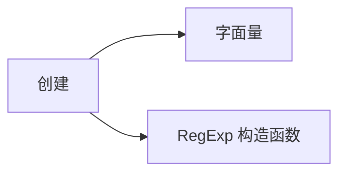
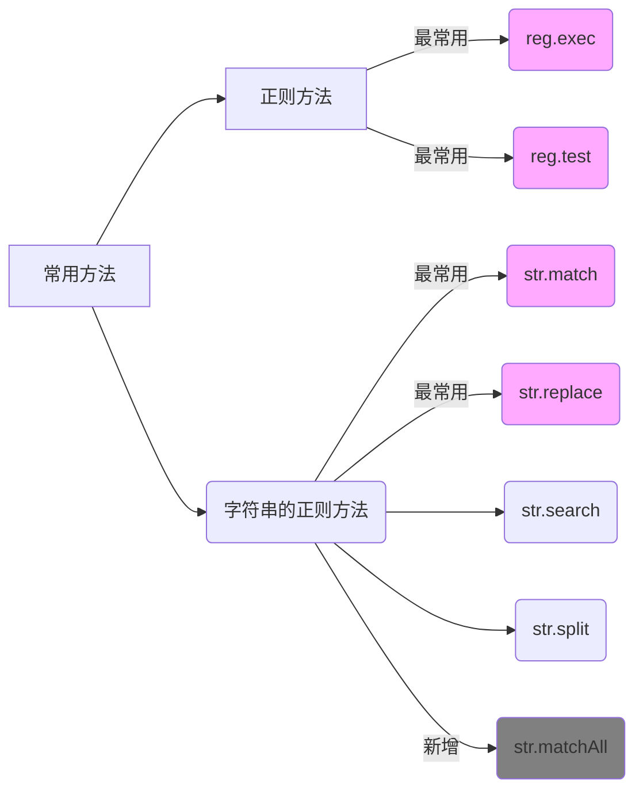
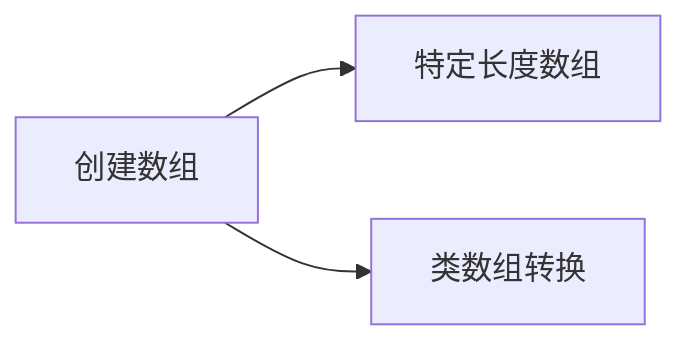

# 引用类型

本文简单总结 Object 之外的其他引用类型。

## RegExp

正则的创建有两种方式



一般都是字面量的方式创建，包含变量的情况才需要使用 `RegExp` 构造函数创建

```js
const prefix = "c";
const text = "cat cow wow";
new RegExp(prefix).test(text);
```

使用正则构造函数时，如果第一个参数是正则表达式，修饰符`flag`应该直接写在第一个参数的表达式里面。
如果写在第二个参数，ES5 会有兼容问题。

```js
// ES6+ OK
const regex = new RegExp(/cat/, "i");

// ES5+ OK
const regex = new RegExp(/cat/i);
```

### 正则方法

正则表达式用于字符串，涉及到的常用方法，一部分属于正则实例，一部分属于字符串包装对象。



总共 `2 + 5 = 7` 个方法，最常用的是前面 4 个方式，`matchAll` 还比较新，兼容性有待增强。

正则实例方法基本上只用 [test](https://developer.mozilla.org/en-US/docs/Web/JavaScript/Reference/Global_Objects/RegExp/test) 和 [exec](https://developer.mozilla.org/en-US/docs/Web/JavaScript/Reference/Global_Objects/RegExp/exec)，exec 有几个特别的地方

- 不设置 `g` 标记的时候，只返回第一个匹配的信息，设置了 `g` 之后，依次向后匹配
- 返回值虽然是一个数组，但是添加了 input 属性，每次匹配的 `index`, `lastIndex`(设置了`g`之后才会返回)
- 返回 `arr[1-i]` 依次是匹配的组

```js
const prefix = "(cat)";
const text = "cat cow wow";
new RegExp(prefix).exec(text);
// 0: "cat", 1: "cat", groups: undefined, index: 0, input: "cat cow wow", length: 2
```

<details>
  <summary>input属性是原始字符串还是剩余未匹配部分</summary>
  <div>完整的原始字符串</div>
</details>

ES6 之后，RegExp.prototype 新增了一些内部方法

```js
Symbol(Symbol.match);
Symbol(Symbol.matchAll);
Symbol(Symbol.replace);
Symbol(Symbol.search);
Symbol(Symbol.split);
```

当调用字符串的正则方法时，会调用正则实例上调的对应方法，这样统一了 RegExp, String 上正则相关方法实现

```js
const reg = /cat/;
reg[Symbol.split] = function (str) {
  return "hahaha " + str;
};

const str = "esmyy";
str.split(reg); // 'hahaha wow'
```

也可以直接调用正则上的方法来替代字符串的正则方法。

```js
const reg = /cat/;
const str = "cat is cute";

str.replace(reg, "dog");
reg[Symbol.replace](str, "dog");
```

:::tip 思考
我觉得这个正则方法统一实现的改变，是很有意思的。虽然从调用来说，部分方法仍旧是在 String 上，但只是一个引用了，RegExp 模块化的特点更鲜明了。
:::

### 工具推荐

正则表达式的编写，很考验熟练度，可借助其他图形化解释工具来确认

| 工具                                                 |
| ---------------------------------------------------- |
| VSCode RegExplain 插件，图形化显示正则               |
| [regexper.com 图形化显示正则](https://regexper.com/) |
| [在线快速编辑测试正则](https://regex-vis.com/)       |

## Array

[Array](https://developer.mozilla.org/en-US/docs/Web/JavaScript/Reference/Global_Objects/Array) 是 Object 之外最常用的引用类型，具有非常丰富的操作方法，很多时候需要组合着来使用。

一般都使用字面量的方式创建，两个常用的特别的场景



示例如下

```js
// 特定长度数组
const arr1 = Array(7); // arr1.length is 7

// 类数组转换
const set = new Set().add(1).add(2).add(2);
const arr2 = Array.from(set); // [1,2]
const arr3 = [...set]; // [1,2]
```

有两个注意事项

```js
// 末尾逗号之后的元素被忽略
const arr2 = [1, ,]; // arr2.length is 2

// 空位处理不一致，在不同版本方法对空位的处理不一样，应该始终避免数组出现空位
const arr3 = [, , ,];
```

:::note
reduce 第二个参数没有使用过，一些场景可以用。
reduceRight, copyWithin，entries 可以根据情况提高使用率。
flat 和 flatMap 可以先了解。
:::

## Map

## Set

## Error
