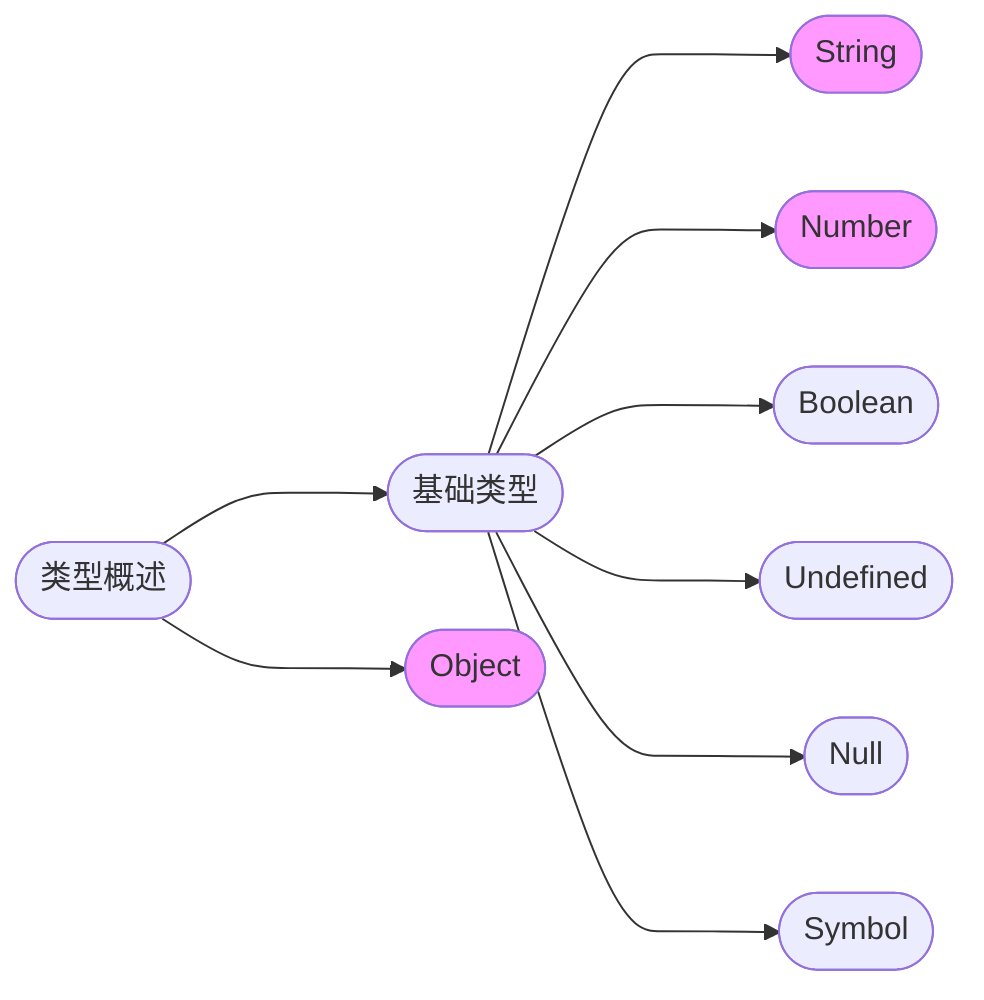

# 数据类型

JS 的数据类型简单总结为 6 + 1 + BigInt 共 8 种数据类型

```mermaid
flowchart LR
  Type([类型概述]) ---> A
  Type ---> Object([Object])
  style Object fill:#f9f
  A([基础类型]) ---> String([String])
  style String fill:#f9f
  A ---> Number([Number])
  style Number fill:#f9f
  A ---> Boolean([Boolean])
  A ---> Undefined([Undefined])
  A ---> Null([Null])
  A ---> Symbol([Symbol])
```
