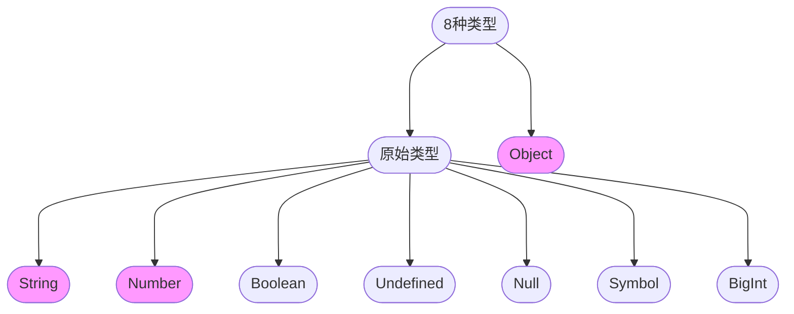

# 数据类型



## 原始类型

原始类型没有自己的方法和属性，其中 Symbol 已经逐步应用，BigInt 使用的仍比较少。

> In JavaScript, a primitive (primitive value, primitive data type) is data that is not an object and has no methods or properties.

## 引用类型

引用类型的实例对象有自己的属性和方法，引用类型变量只是一个指针，指向了一个对象。

<Mindmap
  chart={`
  mindmap
    Object((Object))
      ...其他
      Array
      Function
      RegExp
`}
/>

JS 中的引用类型都继承自 Object，还有 Function，RegExp, Date 等子类型，参考 [引用类型](./02-reference.md)

## 包装对象

> When properties are accessed on primitives, JavaScript auto-boxes the value into a wrapper object and accesses the property on that object instead.

原始类型中，有些类型比较特殊

<Mindmap
  chart={`
  mindmap
    root((包装对象))
      Number
      String
      Boolean
`}
/>

这几个类型各自对应有一个函数，这些函数有一个特点 —— 作为构造函数调用时返回一个对象，作为普通函数调用，返回一个原始值。
当使用构造函数去生成这些类型的实例时，生成的对象称之为对于

## 类型检测

根据具体需要来使用不同的工具

|        目标类型         |            判断方式            |
| :---------------------: | :----------------------------: |
| Exclude<基础类型, null> |             typeof             |
|        Function         |             typeof             |
|          Array          |         Array.isArray          |
|          null           |              ===               |
|        实例关系         |           instanceof           |
|          Other          | Object.prototype.toString.call |

一般而言，typeof x 是比较安全的，检查某个变量常用 typeof 判断是否定义

```js
if (typeof x !== "undefined") {
  // do something
}
```

不过由于 TDZ 的存在，不那么安全了，typeof 这个检测也被 🈲 了。

:::info 归纳
我觉得好的方式是找一个，或者自行封装一个小工具包，团队内统一使用，一次有效归纳，不需要再做取舍纠结，也减少偶然的错误。
:::

## BigInt
