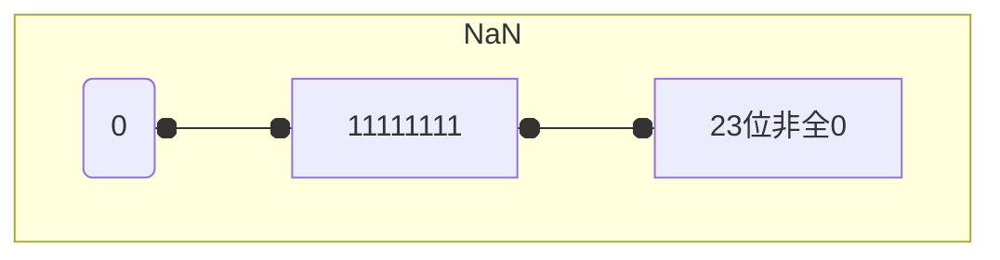

## Number

对于数字，有必要了解 [IEEE 754](https://baike.baidu.com/item/IEEE%20754/3869922)，公式如下

<p>
V = (-1)<sup>s</sup>*2<sup>E</sup>*M
</p>

分成 3 个部分

| 符号表示 | 含义   | 32 位时位数 | 64 位时位数 |
| -------- | ------ | ----------- | ----------- |
| s        | 符号位 | 1           | 1           |
| M        | 指数位 | 8           | 11          |
| E        | 小数位 | 23          | 52          |

E 部分各 bit 并非完全按照数值结果，计算时是有偏移的。
根据指数域的不同，数值可以分为规格化、非规格化、特殊值，三种情况下计算方式是不一样的。

### 特殊值

NaN,Infinity,-Infinity 三个特殊值，均是指数域全 1

- NaN: 指数域全 1，但是尾数域不全为 0 的数
- Infinity: 符号位，即指数域名全 1，尾数域全 0
- -Infinity:



### 数值转换

主要有 parseInt, parseFloat 和 Number 三种方式

### parseInt

语法格式是 parseInt(string, radix)，把握两点

- 始终指定第二参数 radix，明确进制
- 首字符需是指定 radix 下的合法字符，如对于 10 进制，首字符需满足 `/^[\d+-]/.test(string)`，否则均是 NaN

```js
parseInt(""); // NaN
parseInt(" "); // NaN
```

额外说一下关于 radix > 10 的情况吧。数字加字母共 36 位，因此 radix 的范围 [2,36]，对于 11 进制， a 是合法字符，对于 12 进制，a 和 b 是合法字符，依此类推。

```js
parseInt("a", 11); // 10
parseInt("b", 12); // 11
parseInt(NaN, 36); // 30191

// Infinity 的 `I`是19进制的合法字符
parseInt(1 / 0, 18); // NaN
parseInt(1 / 0, 19); // 18
```

### parseFloat

只要知道它只支持 10 进制就好了。parseFloat 和 Number.parseFloat 功能并没有什么不同。

### Number()

有以下核心要点

- 字符串转换时，如有任意非法字符则为 NaN，包括多个小数点的情况(如'1.2.3')
- 对象会执行所谓的”拆箱转换“，即调用 valueOf 和 toString，

```js
Number(undefined); // NaN
Number(null); // 0
```
