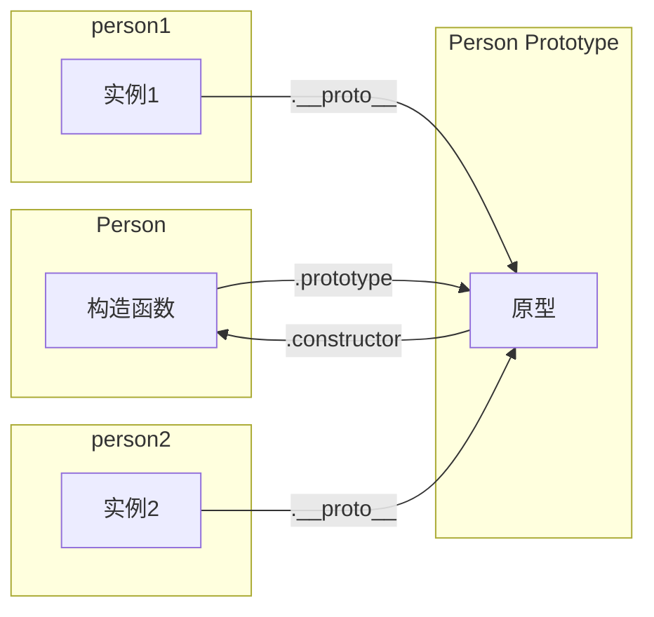

# 对象

JS 中对象是一组属性的无序集合，可以把对象想象成一张散列表，其中的内容就是一组名/值对，值可以是数据或者函数。

对于对象的创建过程，经典的介绍过程就是《JavaScript 高级程序设计》里面介绍的从工厂模式开始，到构造函数模式、原型模式...组合寄生式构造函数模式。

<!-- 逐步升级需求，随着需求升级之后，当前实现方式问题凸显，不能满足新的需要，然后新的实现方式应运而生。 -->

## 工厂模式

使用一个普通函数去创建同一类型的对象，这种方式称做工厂模式，流程很简单


这种模式是开发中广泛应用的，比如当几个接口具有较多的参数交集时，通过一个工厂函数去统一生成公共参数对象。

```ts
function getSubmitParams(type, form) {
  const params = {
    productId: query.id,
    type: type,
    ...form,
  };

  // ...
  params.time = Date.now();

  return params;
}
```

很多书籍文章对工厂模式的归纳是下面这样的

> 工厂模式虽然可以解决创建多个类似对象的问题，但没有解决对象标识问题（即新创建的对象是什么类型）。

现在也不算什么问题了，可以用 TS 类型去标识，或者从实践上用到合适的地方，就没有这个问题。

:::tip
我觉得工厂模式适合用来创建字面量对象，目标更多是复用属性，而不是作为 utils 或者类去使用。
用对了场景，就不存在对象标识的必要性，也就没有所谓对象标识问题了。
:::

## 构造函数

构造函数可以称为构造对象的函数，目的就是创建对象。

理论上来说，使用 new 调用的函数就是构造函数，当然，从实践上来说，没有充分利用构造函数的特性，却又作为构造函数去使用，不是一个好的实践。

### 构造函数实例化过程

new 实例化有以下执行过程

1. 创建一个新对象
2. 设置对象的 [[Prototype]] 指向构造函数的 prototype
3. this 指向新对象
4. 执行构造距离逻辑，给新对象添加属性
5. 如果构造函数返回非空对象，则返回该对象；否则，返回刚创建的新对象。

根据这个过程，new 实例化，模拟实现如下

```js
function objectFactory(Constructor, ...args) {
  // 1. 创建一个对象
  // 2. 设置 [[prototype]]
  const obj = Object.create(Constructor.prototype);
  // const obj = {};
  // Object.setPrototypeOf(obj, Constructor.prototype);

  // 3. this 指向 obj
  // 4. 执行属性方法添加过程
  const ret = Constructor.apply(obj, args);

  // 5. 返回对象
  return typeof ret === "object" && ret !== null ? ret : obj;
}
```

### 构造函数模式

所谓的构造函数模式也可以称为 **构造函数内部赋值的模式**，特点是 **属性和方法都在构造函数内部赋值**。

```js
function Person(name, age) {
  this.name = name;
  this.age = age;
  this.sayName = function () {
    console.log(this.name);
  };
}

const p1 = new Person("esmyy", 666);
```

当我们拎出来一个”构造函数模式“单独去介绍时，侧重的是 new 调用构造函数时的一部分特点

- 没有显式地创建对象
- 属性和方法赋值给 this
- 没有 return

构造函数模式不等于与构造函数实例化过程，它是 “用了 new 实例化，又没完全用的这种使用方式”的一个归纳。
它 **属性和方法赋值给 this**，而不是共享，这展示了这个模式下方法重复定义的问题，这更像是有意和 prototype 作了切割，是为了更好地和原型模式作对比。

:::tip 小结
构造函数模式指的是使用了 new 实例化，却又不使用 prototype 进行共享，属性和方法都设置在实例上的使用方式。

这种模式解决的是类型识别问题，存在的问题是方法的重复定义。
:::

### 原型模式

构造函数的问题在于方法的重复定义，为了实现复用，需要将方法挂到构造函数相关的 “某个地方”，这个地方就是所谓的 prototype，也叫原型。
使用 prototype 共享属性法，这种生成对象的方式叫做原型模式。

```js
function Person(name, age, job) {
  this.name = name;
  this.age = age;
  this.job = job;
}

Person.prototype.sayNmae = function () {
  console.log(this.name);
};
Person.prototype.TEST_SHARE_OBJ = {
  value: 666,
};

const person1 = new Person("esmyy", 28, "fe");
const person2 = new Person("myy", 28, "be");
Object.getPrototypeOf(person1) === Object.getPrototypeOf(person2); // true
```

使用原型模式后，构造函数，原型，实例三者之间的关系如下



可以很明显看到，不同的实例共享了 prototype，这带来了很大的便利和提升。

:::tip
共享就要考虑如何使用引用对象的问题，这其实不叫问题比较好，是需要了解和注意的特性。
:::

## 继承与原型链

在 JS 中，继承的实现就是设置子类的原型为父类的实例。

```js
function SuperType(superOptions) {
  // ...
}

function SubType(subOptions) {
  // ...
}

SubType.prototype = new SuperType(superOptions);
```

通过继承，prototype 一个串一个，形成了一条比大辣棒还长的链条，到地老天荒，海枯石烂 这就是原型链 🤦‍♀️ 屁话真多。

:::tip
原型链是原型串在一起，那么自然原型模式的引用值共享的问题，也会有。

而继承关系的出现，需要考虑子类型和父类型实例化时的参数关联
:::

### 经典继承

经典继承也叫做盗用构造函数，它的实现是在子类型的实例上执行父类型属性初始化过程。核心结构描述

```js
function SuperType(options) {
  this.name = options.name;
}

function SubType(options) {
  this.text = `你好，练习时长达到 ${options.time} 的练习生 ${options.name}，请问你会打篮球吗？`;
  SuperType.call(this, {
    name: options.name,
  });
}

const instance1 = new SubType({ name: "kunkun", time: "两年半" });
```

这个使用方式，解决了原型链的两个问题，但是处理的还不够好，只复制了属性而没有复制方法。

:::tip
老实说，经典继承和盗用构造函数，两名字都没好到哪里去，对于理解没什么太大帮助。

这个只复制属性而没有复制方法的使用方式，就像构造函数模式，”用了 new 过程，又没完全用“一样。
:::

### 组合继承

组合继承是组合了经典继承和原型链，既调用 SuperType.call(this, args ) 来进行初始化，也使用 SupType.prototype = new SuperType() 设置原型进行共享。

```js
function SuperType(options) {
  this.name = options.name;
}

function SubType(options) {
  this.text = `你好，练习时长达到 ${options.time} 的练习生 ${options.name}，请问你会打篮球吗？`;
  SuperType.call(this, {
    name: options.name,
  });
}

const instance1 = new SubType({ name: "kunkun", time: "两年半" });
SupType.prototype = new SuperType();
```

这样用明显有问题，new SuperType() 的参数却与 SubType 的参数没有关联。

:::tip
这个使用方式，又是一个”用了，又没完全用“的使用。
:::

### 寄生式组合继承

拿了父类型的属性，拿了父类型的方法过来用，然后自己再添点，就这么活着。

```js
function SuperType(options) {
  this.name = options.name;
}

function SubType(options) {
  this.text = `你好，练习时长达到 ${options.time} 的练习生 ${options.name}，请问你会打篮球吗？`;
  SuperType.call(this, {
    name: options.name,
  });
}

const proto = Object.create(SuperType.prototype);
proto.constructor = SubType;
SubType.prototype = proto;
```

其实吧，就是组合继承补上 prototype 嘛，SuperType.prototype 直接挪过来用，而不是使用 SuperType 的实例作为子类的原型。

## class

class 是前面所说的构造函数，各种原型，继承的集大成者。如今在开发中，要实现继承，或者是创建一类对象，使用 class 即可。

一个 Class 的示例如下

```js
"use strict";
class SuperType {
  name = "";
  time = "";
  constructor(options) {
    this.name = options.name;
  }

  sayWelcome() {
    console.log(
      `你好，练习时长达到 ${this.time} 的练习生 ${this.name}，请问你会打篮球吗？`
    );
  }
}

class SubType extends SuperType {
  name = "";
  constructor(options) {
    super({ name: options.name, time: options.time });
  }

  sayHello() {
    console.log(`${this.name} 你太美`);
  }
}

const instance = new SubType({ age: "kunkun", time: "两年半" });
```

转码到 ES5 之后如下

```js
"use strict";

function _assertThisInitialized(self) {
  if (self === void 0) {
    throw new ReferenceError(
      "this hasn't been initialised - super() hasn't been called"
    );
  }
  return self;
}
function _inheritsLoose(subClass, superClass) {
  subClass.prototype = Object.create(superClass.prototype);
  subClass.prototype.constructor = subClass;
  _setPrototypeOf(subClass, superClass);
}
function _setPrototypeOf(o, p) {
  _setPrototypeOf = Object.setPrototypeOf
    ? Object.setPrototypeOf.bind()
    : function _setPrototypeOf(o, p) {
        o.__proto__ = p;
        return o;
      };
  return _setPrototypeOf(o, p);
}
function _defineProperty(obj, key, value) {
  key = _toPropertyKey(key);
  if (key in obj) {
    Object.defineProperty(obj, key, {
      value: value,
      enumerable: true,
      configurable: true,
      writable: true,
    });
  } else {
    obj[key] = value;
  }
  return obj;
}
function _toPropertyKey(arg) {
  var key = _toPrimitive(arg, "string");
  return typeof key === "symbol" ? key : String(key);
}
function _toPrimitive(input, hint) {
  if (typeof input !== "object" || input === null) return input;
  var prim = input[Symbol.toPrimitive];
  if (prim !== undefined) {
    var res = prim.call(input, hint || "default");
    if (typeof res !== "object") return res;
    throw new TypeError("@@toPrimitive must return a primitive value.");
  }
  return (hint === "string" ? String : Number)(input);
}
var SuperType = /*#__PURE__*/ (function () {
  function SuperType(options) {
    _defineProperty(this, "name", "");
    _defineProperty(this, "time", "");
    this.name = options.name;
  }
  var _proto = SuperType.prototype;
  _proto.sayWelcome = function sayWelcome() {
    console.log(
      "\u4F60\u597D\uFF0C\u7EC3\u4E60\u65F6\u957F\u8FBE\u5230 " +
        this.time +
        " \u7684\u7EC3\u4E60\u751F " +
        this.name +
        "\uFF0C\u8BF7\u95EE\u4F60\u4F1A\u6253\u7BEE\u7403\u5417\uFF1F"
    );
  };
  return SuperType;
})();
var SubType = /*#__PURE__*/ (function (_SuperType) {
  _inheritsLoose(SubType, _SuperType);
  function SubType(options) {
    var _this;
    _this =
      _SuperType.call(this, {
        name: options.name,
        time: options.time,
      }) || this;
    _defineProperty(_assertThisInitialized(_this), "name", "");
    return _this;
  }
  var _proto2 = SubType.prototype;
  _proto2.sayHello = function sayHello() {
    console.log(this.name + " \u4F60\u592A\u7F8E");
  };
  return SubType;
})(SuperType);
var instance = new SubType({
  age: "kunkun",
  time: "两年半",
});
```

可以看到，就是前面所说的寄生组合式继承。ES6 真香，语法糖真香。

## 总结

从实践上来说，用对场景，发挥各个模式的特点，扬长避短，各个”有问题“的模式，也是发光发热的存在。

|      模式      | 实现描述                                         | 不足/特点                                                                     |
| :------------: | ------------------------------------------------ | ----------------------------------------------------------------------------- |
|    工厂模式    | 普通函数创建对象                                 | 对象没标识                                                                    |
|  构造函数模式  | new 实例化又不用 prototype，方法写到实例         | 方法重复定义                                                                  |
|    原型模式    | 正常 new 实例化，用 prototype 共享               | 我觉得没啥问题                                                                |
|     原型链     | 使用父类实例作为子类原型，但两个类型间参数没关联 | prototype 引用类型属性共享可能导致问题<br/>prototype 的方法初始化参数缺少关联 |
|    经典继承    | 在子类实现中复制了父实例属性，没用 prototype     | 所谓经典，也许就是只要了属性，没要方法吧。靠着家里的关系发展，不是躺着啃老    |
|    组合继承    | 经典继承 + 原型链                                | 这就真啃老了，既要又要，还不给父类一点东西，没沟通好                          |
| 寄生式组合继承 | 就是 class                                       | -                                                                             |

## 体会

《JavaScript 高级程序设计》经典的介绍与说明过程，逻辑清晰，层层递进，对于初学者理解有很大的帮助。

JS 发展到现在，站在前人的肩膀，对于一点一点发展的过程没有那么深的体悟。

这中间的一个个设计模式，也许当时是突破性的创新摸索，是持续使用了较长时间的方案。

但在如今，其功用却已经被发展而来的工具所替代，这一个个模式的重要性，从功用转向了铭记。

:::tip -\_-
这些模式真难记，很繁琐，用 class 加转码就行 😂
<br/>
平淡安逸享其成的后来者，不必复前人筚路蓝缕的历程，这却也是一种欣慰。
:::

## Q & A

<details>
  <summary>为什么是设置 SubType.prototype 是 SuperType 的实例，而不是直接设置为 SuperType.prototype 呢</summary>
  <div>
    如果设置的是 SubType.prototype = SuperType.prototype，这就是原型模式而已，没有形成链条。
    更重要的是，SuperType.prototype 里面自然是get/set SuperType实例的属性或方法，而 SubType 并不能保证有对应属性。
  </div>
</details>
