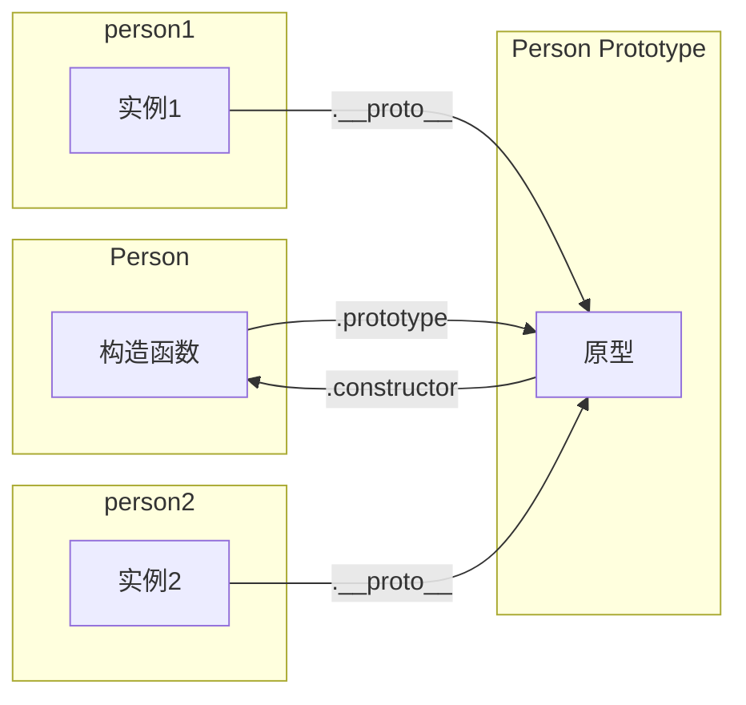

# 对象

JS 中对象是一组属性的无序集合，可以把对象想象成一张散列表，其中的内容就是一组名/值对，值可以是数据或者函数。

对于对象的创建过程，经典的介绍过程就是《JavaScript 高级程序设计》里面介绍的从工厂模式开始，到构造函数模式、原型模式...组合寄生式构造函数模式。

:::note 体会
以前我会觉得《JavaScript 高级程序设计》经典的介绍与说明过程，逻辑清晰，层层递进，让我大受震撼，对于理解有很大的帮助。
如今我还是觉得很好很好，但是却不再奉为圭臬。走得远一些，直接看到了后半段的结果，中间的过程有时候反而像是为了解释而制造了过于复杂的过程。
:::

<!-- 逐步升级需求，随着需求升级之后，当前实现方式问题凸显，不能满足新的需要，然后新的实现方式应运而生。 -->

## 工厂模式

使用一个普通函数去创建类似的对象，这种方式称做工厂模式，流程很简单


这种模式是开发中广泛应用的，比如当几个接口具有较多的参数交集时，通过一个工厂函数去统一生成公共参数对象。

```ts
function getSubmitParams(type, form) {
  const params = {
    productId: query.id,
    type: type,
    ...form,
  };

  // ...
  params.time = Date.now();

  return params;
}
```

以前深以为然的一段描述

**工厂模式虽然可以解决创建多个类似对象的问题，但没有解决对象标识问题（即新创建的对象是什么类型）。**

这是需求升级了，却仍想着用工厂模式才有的问题，已经不再是工厂模式适用的场景了。

## 构造函数

构造函数可以称为构造对象的函数，目的就是创建对象。

从调用上来说，使用 new 调用的函数就是构造函，当然，从实践上来说，没有充分利用构造函数的特性，却又作为构造函数去使用，不是一个好的实践。

### 构造函数实例化过程

new 实例化有以下执行过程

1. 创建一个新对象
2. 设置对象的 [[Prototype]] 指向构造函数的 prototype
3. this 指向新对象
4. 执行构造距离逻辑，给新对象添加属性
5. 如果构造函数返回非空对象，则返回该对象；否则，返回刚创建的新对象。

根据这个过程，new 实例化，模拟实现如下

```js
function objectFactory(Constructor, ...args) {
  // 1. 创建一个对象
  // 2. 设置 [[prototype]]
  const obj = Object.create(Constructor.prototype);
  // const obj = {};
  // Object.setPrototypeOf(obj, Constructor.prototype);

  // 3. this 指向 obj
  // 4. 执行属性方法添加过程
  const ret = Constructor.apply(obj, args);

  // 5. 返回对象
  return typeof ret === "object" && ret !== null ? ret : obj;
}
```

<details>
  <summary>如果构造函数有return会怎样？如果return是null，是undefined，是number呢？</summary>
  <div>如果构造函数返回非空对象，则返回该对象；否则，返回刚创建的新对象。这里非空对象，可以理解为非原始类型。也就是说上面说的这些原始值的return都会被忽略。</div>
</details>

<!-- 构造函数实例化，既包含了 new

- 使用 new 来调用
- 原型 prototype -->

### 构造函数模式

所谓的构造函数模式也可以称为 **构造函数内部赋值的模式**，特点是 **属性和方法都在构造函数内部赋值**。

```js
function Person(name, age) {
  this.name = name;
  this.age = age;
  this.sayName = function () {
    console.log(this.name);
  };
}

const p1 = new Person("esmyy", 666);
```

当我们拎出来一个”构造函数模式“单独去介绍时，侧重的是 new 调用构造函数时的一部分特点

- 没有显式地创建对象
- 属性和方法赋值给 this
- 没有 return

特别是 **属性和方法赋值给 this** 这个特点，展示了这个模式下方法重复定义的问题，这其实是有意和 prototype 作了切割，是为了更好地和原型模式作对比。

:::tip 总结来说
构造函数模式不等于与构造函数实例化过程，它是 “用了 new 实例化，又没完全用的这种使用方式”的一个归纳。
:::

### 原型模式

构造函数的问题在于属性和方法的重复定义，为了实现复用，需要将可复用的属性，方法挂到构造函数相关的**某个地方**，这个地方就是所谓的 prototype，也叫原型。

使用 prototype 共享属性的方法，这种生成对象的方式叫做原型模式。

```js
function Person(name, age, job) {
  this.name = name;
  this.age = age;
  this.job = job;
}

Person.prototype.sayNmae = function () {
  console.log(this.name);
};
Person.prototype.TEST_SHARE_OBJ = {
  value: 666,
};

const person1 = new Person("esmyy", 28, "fe");
const person2 = new Person("myy", 28, "be");
Object.getPrototypeOf(person1) === Object.getPrototypeOf(person2); // true
```

prototype 并没有什么神奇的，就是一个共享的对象，至于说由于共享引用对象引起的问题，那不是问题，是需要了解和注意的特性。

使用原型模式后，构造函数，原型，实例三者之间的关系如下



## 继承与原型链

在 JS 中，继承的实现就是设置子类的原型为父类的实例。

```js
function SuperType(superOptions) {
  // ...
}

function SubType(subOptions) {
  // ...
}

SubType.prototype = new SuperType(superOptions);
```

通过继承，prototype 一个串一个，形成了一条比大辣棒还长的链条，到地老天荒，海枯石烂 这就是原型链 🤦‍♀️ 屁话真多。

<details>
  <summary>为什么是设置 SubType.prototype 是 SuperType 的实例，而不是直接设置为 SuperType.prototype 呢</summary>
  <div>
    如果设置的是 SubType.prototype = SuperType.prototype，这就是原型模式而已，没有形成链条。
    更重要的是，SuperType.prototype 里面自然是get/set SuperType实例的属性或方法，而 SubType 并不能保证有对应属性。
  </div>
</details>

:::info
原型链的特点

当链上有引用值的时候，共享容易出现问题。

子类型在实例化时不能给父类型的构造函数传参。
:::

### 经典继承

经典继承也叫做盗用构造函数，核心结构描述

```js
function SuperType(options) {
  this.name = options.name;
}

function SubType(options) {
  this.text = `你好，练习时长达到 ${options.time} 的练习生 ${options.name}，请问你会打篮球吗？`;
  SuperType.call(this, {
    name: options.name,
  });
}

const instance1 = new SubType({ name: "kunkun", time: "两年半" });
```

这个使用方式，尝试解决的是原型链的两个问题，当然，又带来新的问题，没有用上 SuperType 的原型。

老实说，经典继承和盗用构造函数，两名字都没好到哪里去，对于理解没什么太大帮助。

### 组合继承

组合继承就是”经典继承“和”原型链”一起嘛，既调用 SuperType.call(this, args )来进行子类实例化，也使用 SupType.prototype = new SuperType() 设置原型进行共享。

```js
function SuperType(options) {
  this.name = options.name;
}

function SubType(options) {
  this.text = `你好，练习时长达到 ${options.time} 的练习生 ${options.name}，请问你会打篮球吗？`;
  SuperType.call(this, {
    name: options.name,
  });
}

const instance1 = new SubType({ name: "kunkun", time: "两年半" });
SupType.prototype = new SuperType();
```

好吧，显然都不用说，这样用明显有问题嘛，SuperType.call 用了自定义参数，而

### 寄生式组合继承

## class

class 是前面所说的构造函数，各种原型，继承的集大成者。如今在开发中，要实现继承，或者是创建一类对象，都应该通过 class 来实现。

:::tip
从工厂模式到 class，中间说的各种”问题“，其实都是需求升级之后，原来的实现方式不满足而已，并不是各种方式就是有问题不能使用，不同的实现方式都有各自的优点，可以用于不同的场景。
:::

<!-- 深拷贝与浅拷贝 -->
