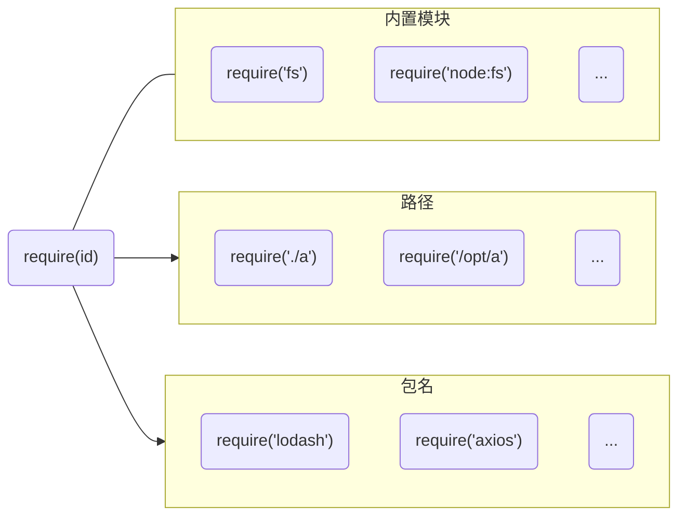

# CommonJS

[CommonJS](https://nodejs.org/docs/latest-v16.x/api/modules.html) 规范主要用于服务器端模块化代码组织

| 名称     | 适用侧       | 关键变量                                 |
| -------- | ------------ | ---------------------------------------- |
| CommonJS | Server(Node) | module, module.exports, require, exports |

CommonJS 的几个模块相关的标识符，并不是 ECMAScript 规范里面的关键字

```js
console.log(typeof module); // object
console.log(typeof module.exports); // object
console.log(typeof exports); // object
console.log(typeof require); // function
```

这几个关键字，本质都是对象，对象无非就是方法，属性这些内容。把握这个本质，对于理解有比较大的帮助。

## 环境说明

| 环境    | 说明     |
| ------- | -------- |
| Node.js | v16.19.0 |

## 基本用法

在 CommonJS 中，每个文件是一个单独的模块，可以有自己独立的内容，使用 require 导入其他模块，使用 module.exports 导出自身的内容。如下定义了一个 main --> a --> b 的引用关系

```js
// main.js
const a = require("./a");
module.exports = {
  name: "main",
};

// a.js
const b = require("./b");
module.exports = {
  name: "a",
};

// b.js
module.exports = {
  name: "b",
};
```

如无特别说明，后续的介绍将基于这个关系进行。

## 模块解析

在每个模块中都可以通过赋值 module.exports 来导出当前模块的内容。这意味着 module 是一个局部变量，如果 module 是模块之间共享的全局变量，是不能这样覆盖的 exports 属性的。比如，process 是一个全局变量

```js
// main.js
process.myWallet = {
  balance: 0.5,
};

// a.js
process.myWallet = {
  balance: 0.01,
};

// b.js
console.log(process.myWallet.balance); // 0.01
```

同一时刻只有一个值，也就无从导出多个模块的内容了。不同的模块里的 module 对象不是同一个，或者说每个模块文件对应一个 module 对象。
:::info
学习 CommonJS，就是要搞清楚，如何将一个”模块文件“，转换为代表每个模块的 module 对象，然后如何使用。
:::

### 初始化 module

当我们执行一个 `node main.js` 的时候，初始化过程如下

```js title="Module._load"
Module._load = function (request, parent, isMain) {
  // 1. 子模块加载，维护引用关系
  if (parent) {
    // 添加到 parent.children，懒加载的处理等
  }

  // 2. 内置模块直接返回
  if (StringPrototypeStartsWith(request, "node:")) {
    const module = loadBuiltinModule(request.slice(5), request);
    return module.exports;
  }

  // 3. 判断是否已经缓存
  const filename = Module._resolveFilename(request, parent, isMain);
  const cachedModule = Module._cache[filename];
  if (cachedModule !== undefined) {
    updateChildren(parent, cachedModule, true);
    // ...循环引用提示等省略
    return cachedModule.exports;
  }

  // 4. 尝试加载内置模块
  const mod = loadBuiltinModule(filename, request);
  if (
    mod?.canBeRequiredByUsers &&
    BuiltinModule.canBeRequiredWithoutScheme(filename)
  ) {
    return mod.exports;
  }

  // 5. 非内置模块实例化
  const module = new Module(filename, parent);
  if (isMain) {
    process.mainModule = module;
    module.id = ".";
  }

  // 6. 保存描述对象缓存
  Module._cache[filename] = module;

  // 7. 加载模块真实内容
  module.load(filename);
  return module.exports;
};

Module._load("main.js", null, true);
```

这一步的作用是在解析每个模块的具体内容之前，为每个模块生成一个描述对象 module，这个 module 就是在每个模块中直接使用的那个关键变量。每个模块都可以用这样一个对象去描述， 对应的 Module 构造函数如下

```js
function Module(id = "", parent) {
  this.id = id;

  // path 其实是目录路径
  this.path = path.dirname(id);

  // 默认的 exports 是 {}
  setOwnProperty(this, "exports", {});
  moduleParentCache.set(this, parent);
  updateChildren(parent, this, false);
  this.filename = null;
  // 用来标记模块是否已经加载，在缓存，循环依赖等问题上发挥重要作用
  this.loaded = false;
  this.children = [];
}
```

从中可以看到，每个模块的默认值是 `{}`，而且其他的属性需要查看具体 `load` 的执行才能确认。

### 读取原始内容

load 函数就是 module 具体属性值的设置，其中关键的是根据拓展名调用对应的 handler 函数去执行具体内容的加载过程。

```js
Module.prototype.load = function (filename) {
  this.filename = filename;
  this.paths = Module._nodeModulePaths(path.dirname(filename));

  // 找出拓展名，比如 main.js 是 .js
  const extension = findLongestRegisteredExtension(filename);
  Module._extensions[extension](this, filename);
  this.loaded = true;
};
```

注意 `module.loaded` 是整个模块转换完成以后，才会设置为 true。
以 .js 为例说明，处理如下

```js
Module._extensions[".js"] = function (module, filename) {
  // 1. 从缓存中获取内容或读取内容
  const cached = cjsParseCache.get(module);
  let content;
  if (cached?.source) {
    content = cached.source;
    cached.source = undefined;
  } else {
    content = fs.readFileSync(filename, "utf8");
  }

  // ...

  module._compile(content, filename);
};
```

拓展名处理函数，就是根据拓展名读取模块的 content。

### 生成导出对象

读取之后是解析其内容，执行 content 中的代码

```js title="Module.prototype._compile"
Module.prototype._compile = function compiler(content, filename) {
  // 1. 包裹源模块内容，生成模块包装函数
  const compiledWrapper = wrapper(filename, content, this);

  // 2. 生成关键变量
  const dirname = path.dirname(filename);
  const require = makeRequireFunction(this, redirects);
  let result;
  const exports = this.exports;
  const thisValue = exports;
  const module = this;

  // 3. 传递关键变量，执行返回模块内容
  return Reflect.apply(compiledWrapper, thisValue, [
    exports,
    require,
    module,
    filename,
    dirname,
  ]);
};
```

这个 `_compile` 是理解 CommonJS 的关键中的关键。
在这里对模块本身的内容进行了一个包装，生成一个模块创建函数 compiledWrapper，然后生成模块所需的 exports, require 等参数，调用 compiledWrapper 完成了模块的解析。compiledWrapper 包装实现过程有些复杂，但基本的逻辑是简单的，可以看做下面这个简单包装

```js
/**
 * script: 每个模块的内容
 */
function wrapper(script: string) {
  const wrapperArr = [
    "(function (exports, require, module, __filename, __dirname) { ",
    "\n});",
  ];
  return wrapperArr[0] + script + wrapperArr[1];
}
```

最终模块设置过程，就是使用关键变量，执行包装后的 `script`，理解为 eval 执行就可以。

```js
function compile() {
  const script = wrapper(script: string);
  const dirname = path.dirname(filename);
  const require = makeRequireFunction(this, redirects);
  const exports = this.exports;
  const thisValue = exports;
  const module = this;

  eval(wrapper(script));
}
```

回想一下设置模块导出的过程，\_compile 函数执行完成之后，`module.exports` 就包含了模块导出的内容，最终所有模块的内容，都可以通过 main.js 的 module 访问到。

### require 实现

`require` 本身是一个函数，实现如下

```js
const require = makeRequireFunction(module, redirects);

function makeRequireFunction(mod, redirects) {
  const Module = mod.constructor;

  let require = function require(path) {
    return mod.require(path);
  };

  // 模块路径处理
  function resolve(request, options) {
    validateString(request, "request");
    return Module._resolveFilename(request, mod, false, options);
  }

  require.resolve = resolve;

  // 通过 paths 查找模块
  function paths(request) {
    validateString(request, "request");
    return Module._resolveLookupPaths(request, mod);
  }

  resolve.paths = paths;

  // 不同模块的 require 参数中，这些属性都是一样的
  setOwnProperty(require, "main", process.mainModule);
  require.extensions = Module._extensions;
  require.cache = Module._cache;

  return require;
}
```

在每个模块中，require 是不一样的，但是 main，extensions 和 cache 等属性是共享的。

## module

module 是 Module 的实例，每个模块里面都有一个 module 对象，代表当前模块。
可以直接断点或者打印 module 对象，查看其具体内容。如下，在 main.js 添加打印

```js title="main.js"
const a = require("./a");
module.exports = {
  name: "main",
};

console.log(module);
```

结果如下

```js
{
  // 定义自身
  id: '.',
  path: '/Users/esmyy/node/demo',
  filename: '/Users/esmyy/node/demo/main.js',

  // 导出内容
  exports: {
    name: 'main',
  },

  // 加载状态标记
  loaded: false,

  // 当前模块 require 的模块
  children: [
    {
      id: '/Users/esmyy/node/demo/a.js',
      path: '/Users/esmyy/node/demo',
      exports: {
        name: 'a',
      },
      filename: '/Users/esmyy/node/demo/a.js',
      loaded: true,
      children: [
        {
          id: '/Users/esmyy/node/demo/b.js',
          path: '/Users/esmyy/node/demo',
          exports: {
            name: 'b',
          },
          filename: '/Users/esmyy/node/demo/b.js',
          loaded: true,
          children: [],
          paths: [
            '/Users/esmyy/node/demo/node_modules',
            '/Users/esmyy/node/node_modules',
            '/Users/esmyy/node_modules',
            '/Users/node_modules',
            '/node_modules',
          ],
        },
      ],
      paths: [
        '/Users/esmyy/node/demo/node_modules',
        '/Users/esmyy/node/node_modules',
        '/Users/esmyy/node_modules',
        '/Users/node_modules',
        '/node_modules',
      ],
    },
  ],
  // 模块查找路径
  paths: [
    '/Users/esmyy/node/demo/node_modules',
    '/Users/esmyy/node/node_modules',
    '/Users/esmyy/node_modules',
    '/Users/node_modules',
    '/node_modules',
  ],
};
```

module 对象清晰简洁地描述了模块的内容，并且通过 children 维护了模块间的引用关系。有了 Module 这样的一个构造函数/类型，现在可以抛开文件的概念，从对象的角度去看待每一个模块。

## require

`require` 导入的内容可以分成 3 类



相对路径或者绝对路径的比较好找，就是 resolve 一下绝对路径即可，其他两个的查找过程有一些注意点

##### 内置模块

内置模块的导入可以直接使用模块名称，也可以使用 `node:`前缀，使用 `node:`前缀
可以确保导入的是内置模块，不会被覆盖

```js
const fakeFs = {
  name: "fakeFs",
};
require.cache["fs"] = { exports: fakeFs };
require.cache["node:fs"] = { exports: fakeFs };
console.log(require("fs") === fakeFs); // true
console.log(require("node:fs") === fakeFs); // false
```

##### 包名

对于 npm 包的查找，将会按照前面 `module.paths` 数组顺序尝试查找，就是从当前目录一级一级向上找 node_modules

```js
{
  paths: [
    '/Users/esmyy/node/demo/node_modules',
    '/Users/esmyy/node/node_modules',
    '/Users/esmyy/node_modules',
    '/Users/node_modules',
    '/node_modules',
  ],
}
```

## 总结与体会

可以将 CommonJS 的模块文件当做某种特定模板格式的文件，这种文件不被 JS 所支持，所以需要转换成某种被支持的形式。
CommonJS 巧妙地将 require， exports 实现为 JS 已经支持的对象，把模块生成过程转换为了一个函数执行的过程，理解起来很顺畅。了解了 CommonJS 模块的实现之后，再回头看，发现和 IIFE 本质是相通的。

```js
(function (exports, require, module, __filename, __dirname) {
  const module = {};
  // ...
  module.exports = {
    name: "a",
  };
  return module;
})(exports, require, module, __filename, __dirname);
```

JS 的发展，是先继承再发展，不是抛掉过去狂奔，总是离不开执行上下文和作用域这些核心的特点的。

## Q & A

理解 CommonJS 模块，有必要看一下官方的介绍 ——
[Node.js Modules](https://nodejs.org/docs/latest-v16.x/api/modules.html)

<details>
  <summary>module.exports 和 exports 有什么区别</summary>
  <div>简单来说初始时 exports 和 module.exports 两者指向同一个引用，最终对外导出是用的 module.exports 的引用。我的实践是不要混用两者，始终导出一个对象，不要去纠结那些不好的用法的七七八八的破问题。</div>
</details>

<details>
  <summary>require 如何解决重复加载问题</summary>
  <div>每个模块加载之后，以绝对路径为 key，保存在 Module 对象的静态属性上，下次引入时判断有缓存直接返回。</div>
</details>

<details>
  <summary>动态加载了解一下？</summary>
  <div>动态不等于异步，反而是表现的同步的特点。CommonJS 中，require 调用或者 exports 的设置是同步的，不同地方require，虽然引用是一样的，但是对象的属性可能还没设置上。动态加载就是尽量慎用，然后保持require在顶部，exports 在底部是一个好的实践。</div>
</details>
