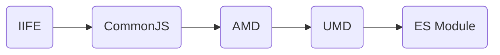

# 模块化

模块，就是代码的定义，组织和加载，各模块化方案使用和实现上差别，但主逻辑是一致的。

```js
// 1. 引入依赖

// 2. 定义模块

// 3. 导出内容
```

模块化方案经历了以下过程



| 名称       | 适用侧        | 关键字/关键属性         |
| ---------- | ------------- | ----------------------- |
| CommonJS   | Server(Node)  | module.exports, require |
| AMD        | Client        | define/require          |
| UMD        | Server/Client | -                       |
| ES6 Module | Server/Client | export/import           |
| TMD        | -             | 不好意思，走错片场了    |

当然，还有 CMD 也是不得不提到的，可以参考 [CMD 模块定义规范](https://github.com/seajs/seajs/issues/242)。

<!-- ## Webpack 中的模块加载原理

JS 中的内容，在 loader 转换之后，其实还是没有转换掉”import“ 或者 ”export“ 之类的内容。在 compilation 的 seal 才会对各个模块中的导入导出相关的关键字进行替换，替换为 webpack_require 相关的属性。根据模块的不同，输出的引导函数中，会定义类似于 webpack_require.r，webpack_require.n 等这样的工具函数用以获取模块，在不同类型的模块化规范间做转换。 -->

<!-- https://developer.mozilla.org/en-US/docs/Web/JavaScript/Guide/Modules -->

<!-- JS的加载过程 https://v8.dev/features/modules#mjs -->
<!-- importmap. -->

<!-- v8 https://v8.dev/docs -->
<!-- https://hacks.mozilla.org/2018/03/es-modules-a-cartoon-deep-dive/ -->

<!-- 依赖管理 -->

<!-- 查看 NodeJS的源码 https://github.com/nodejs/node/blob/main/lib/internal/modules/cjs/loader.js -->
