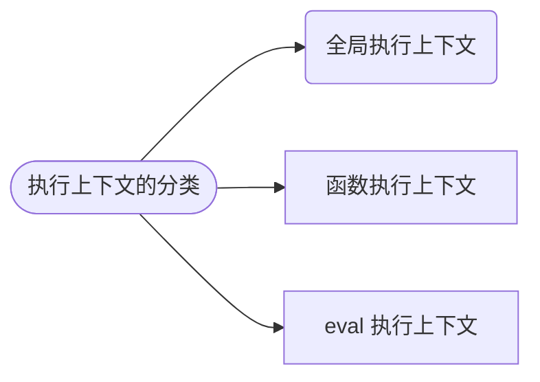
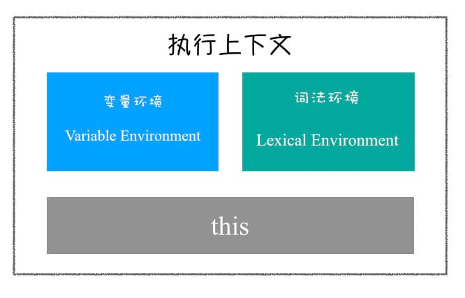

# 执行上下文

下面这行代码的执行结果是什么？

```js
console.log(a);
```

回答这个问题，需要知道执行到该行代码时的环境是怎样的，也就是程序的执行上下文。

## 概述

[执行上下文](https://262.ecma-international.org/5.1/#sec-10.3)(Execution Contexts，以下简称 ctx) 是一段代码被执行时所处的环境。
”一段“的概念很重要，这个”一段“是管理区间的划分，对应执行上下文的分类，如下



全局，函数，eval，有一个特点 —— 相对独立的“一段”，其内部代码，在执行时才会进行编译。

根据 [ECMA 规范中的定义](https://262.ecma-international.org/5.1/#sec-10.3)，上下文由以下三个部分组成



## 变量环境

## 变量对象

## 词法环境

## 调用栈
