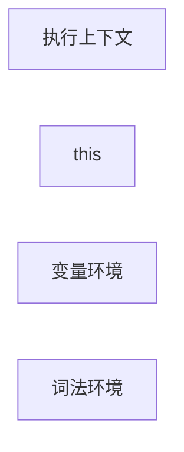

# 执行上下文

下面这行代码的执行结果是什么？

```js
console.log(a);
```

回答这个问题，需要知道执行到该行代码时的环境是怎样的，也就是程序的执行上下文。

## 概述

[执行上下文](https://262.ecma-international.org/5.1/#sec-10.3)(Execution Contexts，以下简称 ctx) 是一段代码被执行时所处的环境。
”一段“的概念很重要，这个”一段“是管理区间的划分，对应执行上下文的分类，如下


全局，函数，eval，有一个特点 —— 相对独立的“一段”，其内部代码，在执行时才会进行编译。

根据 [ECMA 规范中的定义](https://262.ecma-international.org/5.1/#sec-10.3)，上下文由以下三个部分组成




为了方便理解，先做一个大概的描述

- 变量环境，一个对象，var 和 function 声明的变量提升到这里
- 词法环境，一个对象，对应一个作用域中 let, const 定义的变量
- 词法环境栈，每个栈元素是一个词法环境

为方便，文中变量是泛指声明的标识符，包含 const 声明的。

## 变量环境

> Identifies the Lexical Environment whose environment record holds bindings created by VariableStatements and FunctionDeclarations within this execution context.

变量环境对象，保存了变量提升的内容。变量环境是特殊的词法环境，它包含整个执行上下文中通过 var 和 function 声明定义的变量，不包含通过 let, const 声明的变量。

如下使用 var, let, const 声明了一些变量

```js {6}
function foo() {
  var a = 1;
  let b = 2;
  let c = 3;
  var d = 4;
  let e = 5;
}

foo();
```

<MyImg src={require("./assets/context-0.jpg")} width="500px" />

在右侧的 Scope 中，Local 对应当前上下文，现在还看不出有什么特别的内容。接下来将一部分声明挪到一个`{}`块里面，如下

<MyImg src={require("./assets/context-1.jpg")} width="500px" />

右侧显示多了一个 Block

- 在`{}`块级作用域中通过 var 声明的变量 d，被提升到了 Local 里面
- 通过 let 和 const 声明的，被放到一个新的 Block 中

根据定义，所有 var 和 function 定义的变量保存在变量环境对象中，对于 let, const 上面的 b,c,e 保存在词法环境中。那么此时执行上下文中的状态可以表示如下
<MyImg src={require("./assets/ctx-ve.jpg")} width="500px" />

:::note 变量对象
有 let, const 和块级作用域之后，声明变量的方式拓展了，变量对象不包含所有变量，只包含 **所有通过 var, function 声明的变量**。始终不变的是 —— 变量对象包含所有通过 var, function 声明的变量。
:::

## 词法环境

> Identifies the Lexical Environment used to resolve identifier references made by code within this execution context.

简单来说，执行上下文中所有和 let, const 相关的变量，都归属于词法环境。
但需要注意的是，词法环境不应该被当做一个对象，而应该称作词法环境栈会比较容易理解。

如何理解呢，看个 🌰

```js
function foo() {
  var a = 1;
  let b = 2;
  {
    const c = 3;
    var d = 4;
    let e = 5;
  }
}

foo();
```

变量环境和执行上下文是一一对应，可以这样描述，但词法环境不与上下文一一对应，而是与词法作用域对应，这种描述就不是很便于理解了。可以简单理解为

## 调用栈
