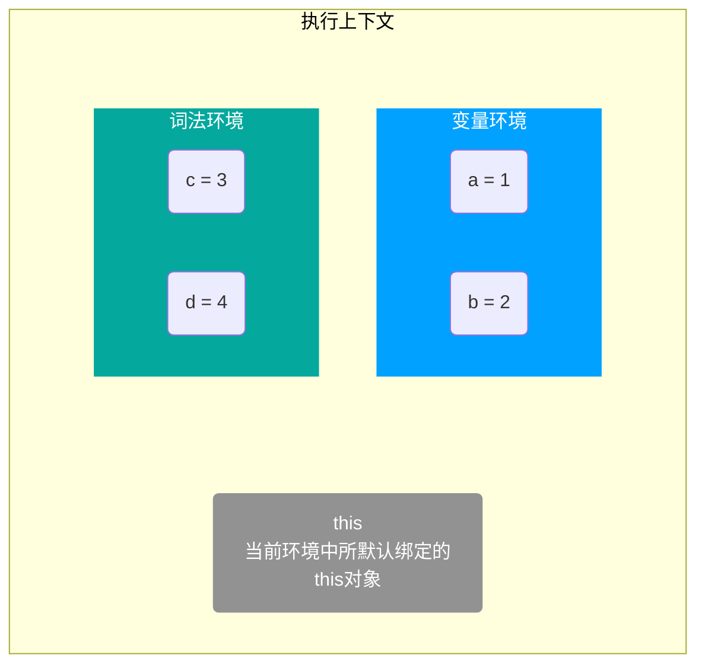
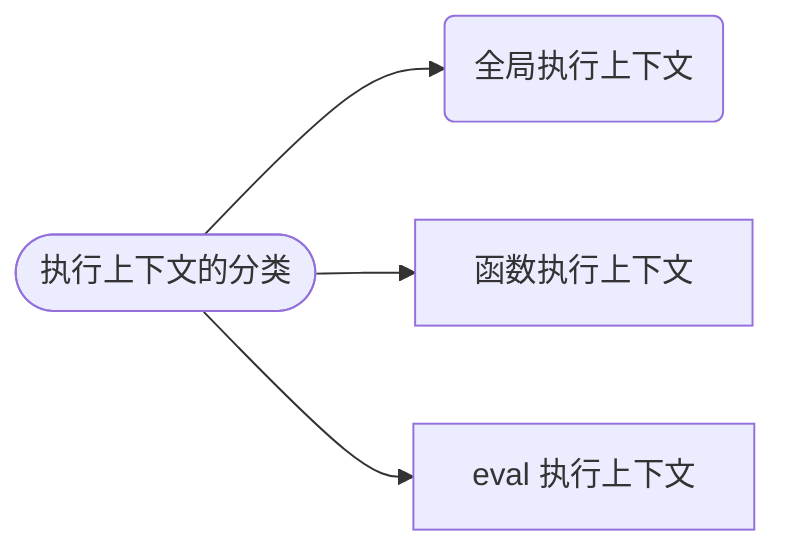
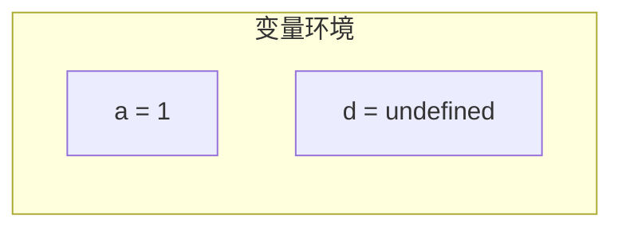
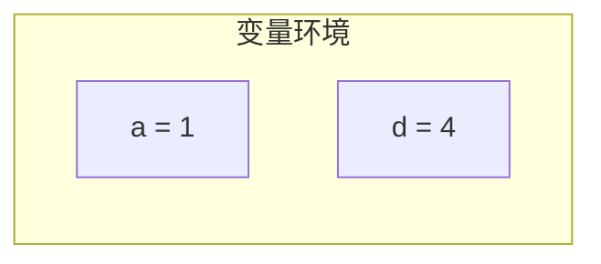
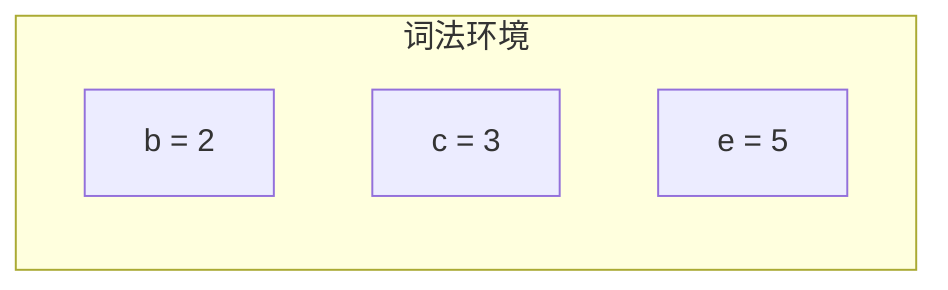

# 执行上下文

下面这行代码的执行结果是什么？

```js
console.log(a);
```

回答这个问题，需要知道执行到该行代码时的环境是怎样的，也就是程序的执行上下文。

## 概述

[执行上下文](https://262.ecma-international.org/5.1/#sec-10.3)(Execution Contexts，以下简称 ctx) 是 JavaScript 执行一段代码时的运行环境。这个环境是什么呢？根据 [ECMA 规范中的定义](https://262.ecma-international.org/5.1/#sec-10.3)，具体来说是组成三个部分



简单说来，这 3 个组成部分的含义如下

| 组成     | 含义                              |
| -------- | --------------------------------- |
| 变量环境 | 通过 var, function 声明的那些变量 |
| 词法环境 | 通过 let, const 声明的那些变量    |
| this     | 当前环境中所默认绑定的对象        |

执行上下文也可以描述为，当程序执行到某一处时，在该处能够访问哪些变量，this 是什么

<Mindmap
  chart={`
  mindmap
    Object((执行上下文))
      我能访问哪些变量
      这些变量什么值
      this绑定对象是谁
`}
/>

:::note 注
为了方便理解，首先文中所说的变量是泛指声明的标识符，包含 var, let, function, const 声明的。
:::

## 分类

上下文中”一段“的概念很重要，这个”一段“是管理区间的划分，对应执行上下文的分类，如下



全局，函数，eval，有一个特点 —— 相对独立的“一段”，其内部代码，在执行时才会进行编译。
我们说的上下文，主要就是指函数执行上下文。针对函数这样的”一段“而言，程序执行上下文可以理解为在函数里面执行时，执行函数内部的变量情况。

各个概念的含义大概是下面这样

| 名称         | 别名     | 说明                                                                                     |
| ------------ | -------- | ---------------------------------------------------------------------------------------- |
| 变量环境     | 变量对象 | 执行上下文中 var 和 function 声明的变量提升到这里                                        |
| 词法环境     | -        | 特指到具体的作用域名时，指的是作用域的词法环境对象，当针对上下文时，指的是词法环境对象栈 |
| 词法环境对象 | -        | 特定作用域的词法环境                                                                     |
| 词法环境栈   | -        | 每个栈元素是一个词法环境对象                                                             |

- 变量环境，也叫做变量对象，作用于中 var 和 function 声明的变量提升到这里
- 词法环境对象，
- 词法环境，当特指到具体的作用域名时，指的是作用域的词法环境对象，当针对上下文时，指的是词法环境对象栈
- 词法环境栈，每个栈元素是一个词法环境对象

- 每个可以理解为一个对象，对应一个作用域中 let, const 定义的变量

## 变量环境

> Identifies the Lexical Environment whose environment record holds bindings created by VariableStatements and FunctionDeclarations within this execution context.

变量环境也可以称为变量对象，保存了变量提升的内容。如下使用 var, let, const 声明了一些变量

```js
function foo() {
  var a = 1;
  let b = 2;
  // highlight-next-line
  let c = 3;
  var d = 4;
  let e = 5;
}

foo();
```

当程序执行到高亮处时，此时变量环境是



继续执行

```js
function foo() {
  var a = 1;
  let b = 2;
  let c = 3;
  var d = 4;
  // highlight-next-line
  let e = 5;
}

foo();
```

此时变量环境是



这就是变量环境，包含了执行上下文中通过 var 和 function 声明定义的变量，但不包含通过 let, const 声明的变量。由于整个变量提升是上下文级别的，整个上下文级别只有一个变量环境，因此变量环境也可以称作变量对象。

<!-- 当程序执行到高亮处时，所处的执行上下文是怎样的呢？或者说 foo 执行上下文是怎样的

<MyImg src={require("./assets/context-0.jpg")} width="500px" />

在右侧的 Scope 中，Local 对应当前上下文，现在还看不出有什么特别的内容。接下来将一部分声明挪到一个`{}`块里面，如下

<MyImg src={require("./assets/context-1.jpg")} width="500px" />

右侧显示多了一个 Block

- 在`{}`块级作用域中通过 var 声明的变量 d，被提升到了 Local 里面
- 通过 let 和 const 声明的，被放到一个新的 Block 中

根据定义，所有 var 和 function 定义的变量保存在变量环境对象中，对于 let, const 上面的 b,c,e 保存在词法环境中。那么此时执行上下文中的状态可以表示如下

<MyImg src={require("./assets/ctx-ve.jpg")} width="500px" />

:::note 变量对象
有 let, const 和块级作用域之后，声明变量的方式拓展了，变量对象不包含所有变量，只包含 **所有通过 var, function 声明的变量**。始终不变的是 —— 变量对象包含所有通过 var, function 声明的变量。
::: -->

## 词法环境

> Identifies the Lexical Environment used to resolve identifier references made by code within this execution context.

简单来说，执行上下文中所有和 let, const 相关的变量，都归属于词法环境。如何理解呢，还是刚才的 🌰

```js
function foo() {
  var a = 1;
  let b = 2;
  let c = 3;
  var d = 4;
  const e = 5;
  // highlight-next-line
}

foo();
```

这个时候词法环境是下面这样的



let, const 在块级作用域声明变量时，情况就不一样了

```js
function foo() {
  var a = 1;
  let b = 2;
  let c = 3;
  var d = 4;
  const e = 5;
  {
    let b = 66;
    // highlight-next-line
  }
}

foo();
```

ES6 支持块级作用域，这里显然对于变量 `b` 而言，在 `{}`内访问的和在 `foo` 函数作用域里面的不是同一个，但是却都在同一个执行上下文中。那么显然，词法环境不能像变量环境那样只是一个对象，它需要有顺序关系

TODO: 这个时候有一个问题, e 处于 TDZ，是否应当归属于词法环境

变量环境和执行上下文是一一对应，可以这样描述，但词法环境不与上下文一一对应，而是与词法作用域对应，这种描述就不是很便于理解了。可以简单理解为

## 调用栈

let, const 声明的变量保存在词法环境中，需要结合作用域来看，有

但需要注意的是，词法环境不应该被当做一个对象，而应该称作词法环境栈会比较容易理解。
