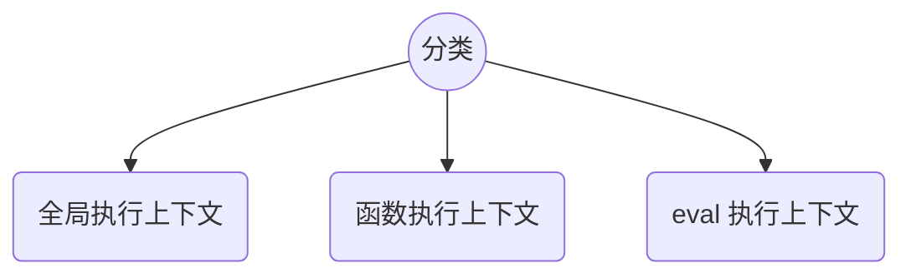
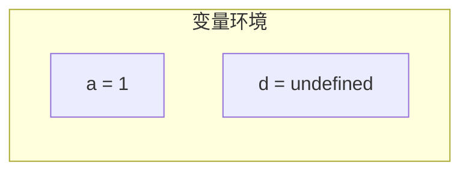
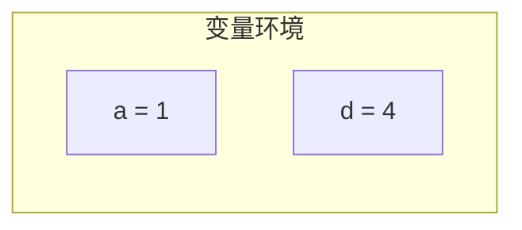
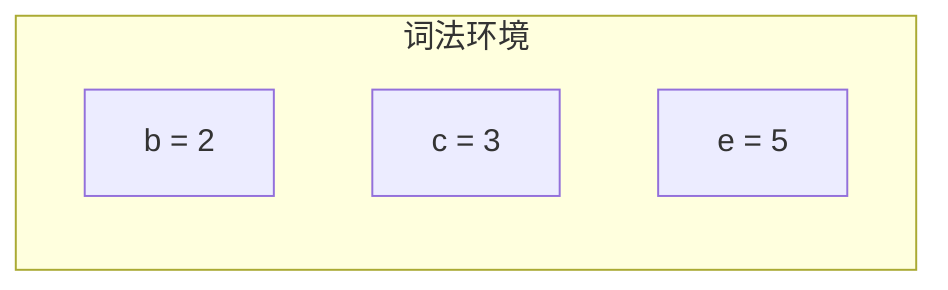
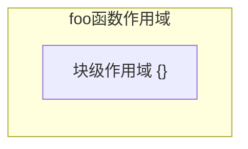
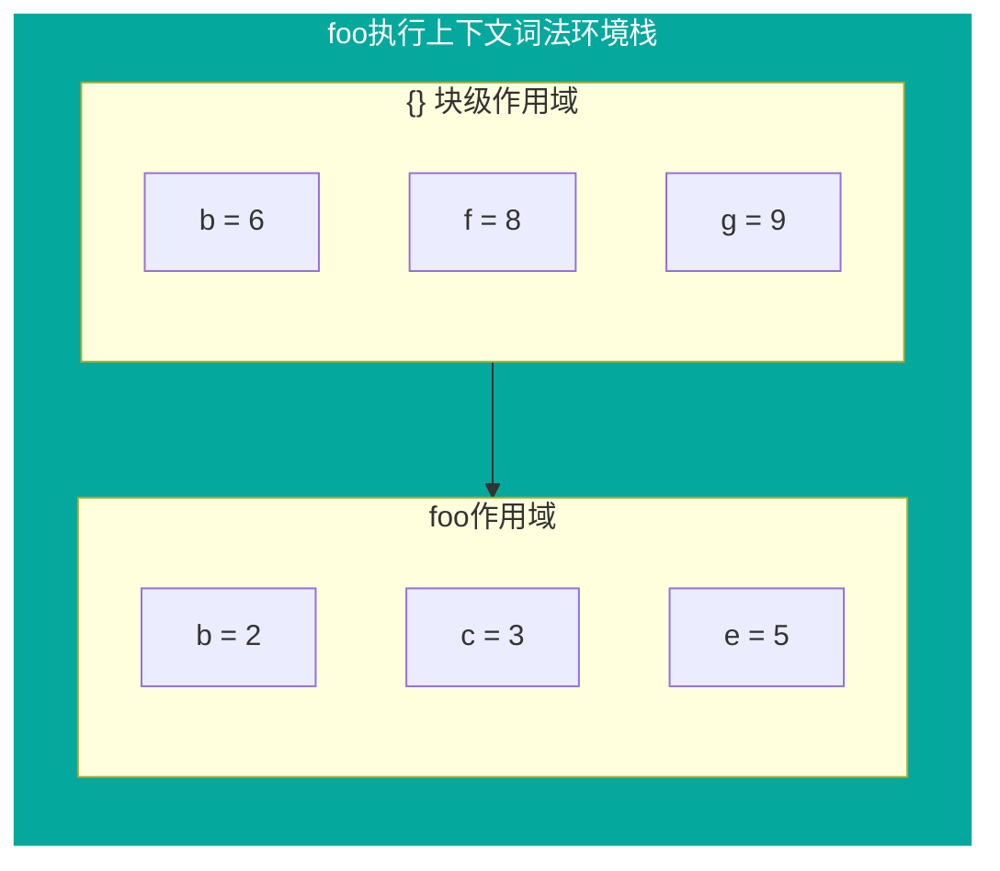

# 执行上下文

下面这行代码的执行结果是什么？

```js
console.log(a);
```

要正确回答这个问题，光这点信息是不够的，需要知道执行到该行代码时的环境是怎样的，也就是程序的执行上下文。

## 概述

执行上下文是 JavaScript 执行一段代码时的运行环境。环境是什么？

> 环境是指相对并相关某项中心事物的周边事物

针对某一段，或者某一行代码来说它所处的执行上下文时，根据 [ECMA 规范中的定义](https://262.ecma-international.org/5.1/#sec-10.3)，这个”周边事物“由三个部分组成

<MyImg src={require("./assets/ctx-composition.jpg")} width="400px" />

简单说来，这 3 个组成部分的含义如下

| 组成     | 含义                              |
| -------- | --------------------------------- |
| 变量环境 | 通过 var, function 声明的那些变量 |
| 词法环境 | 通过 let, const 声明的那些变量    |
| this     | 当前环境中所默认绑定的对象        |

执行上下文也可以描述为，当程序执行到某一处时，或者是在某一段代码范围内，能够访问哪些变量，this 是什么。

<Mindmap
  chart={`
  mindmap
    Object((执行上下文))
      我能访问哪些变量
      这些变量什么值
      this绑定对象是谁
`}
/>

:::note 注
为了方便理解，首先文中所说的变量是泛指声明的标识符，包含 var, let, function, const 声明的。
:::

## 分类

上下文中”一段“的概念很重要，这个”一段“是管理区间的划分，对应执行上下文的分类，如下



全局，函数，eval，有一个特点 —— 相对独立的“一段”，其内部代码，在执行时到该段时才会进行编译。
我们说的上下文，主要就是指函数执行上下文。针对函数这样的”一段“而言，程序执行上下文可以理解为在函数里面执行时，函数内部的变量情况。

函数执行上下文是主要关注的内容，我们说执行上下文时说的那个“一段”主要就是指函数。

## 变量环境

> Identifies the Lexical Environment whose environment record holds bindings created by VariableStatements and FunctionDeclarations within this execution context.

变量环境也可以称为变量对象，保存了变量提升的内容。如下使用 var, let, const 声明了一些变量

```js
function foo() {
  var a = 1;
  let b = 2;
  let c = 3;
  // highlight-next-line
  var d = 4;
  const e = 5;
}

foo();
```

当程序执行到高亮处时，此时变量环境是



继续执行

```js
function foo() {
  var a = 1;
  let b = 2;
  let c = 3;
  var d = 4;
  // highlight-next-line
  const e = 5;
}

foo();
```

此时变量环境是



这就是变量环境，包含了执行上下文中通过 var 和 function 声明定义的变量，但不包含通过 let, const 声明的变量。
这个时候执行上下文可以表示为

<MyImg src={require("./assets/ctx-ve.jpg")} width="400px" />

:::tip 🤔
由于整个变量提升是上下文级别的，整个上下文级别只有一个变量环境，因此变量环境也可以称作变量对象。
:::

<!-- 当程序执行到高亮处时，所处的执行上下文是怎样的呢？或者说 foo 执行上下文是怎样的

<MyImg src={require("./assets/context-0.jpg")} width="500px" />

在右侧的 Scope 中，Local 对应当前上下文，现在还看不出有什么特别的内容。接下来将一部分声明挪到一个`{}`块里面，如下

<MyImg src={require("./assets/context-1.jpg")} width="500px" />

右侧显示多了一个 Block

- 在`{}`块级作用域中通过 var 声明的变量 d，被提升到了 Local 里面
- 通过 let 和 const 声明的，被放到一个新的 Block 中

根据定义，所有 var 和 function 定义的变量保存在变量环境对象中，对于 let, const 上面的 b,c,e 保存在词法环境中。那么此时执行上下文中的状态可以表示如下

<MyImg src={require("./assets/ctx-ve.jpg")} width="500px" />

:::note 变量对象
有 let, const 和块级作用域之后，声明变量的方式拓展了，变量对象不包含所有变量，只包含 **所有通过 var, function 声明的变量**。始终不变的是 —— 变量对象包含所有通过 var, function 声明的变量。
::: -->

## 词法环境

> Identifies the Lexical Environment used to resolve identifier references made by code within this execution context.

简单来说，执行上下文中所有和 let, const 相关的变量，都归属于词法环境。如何理解呢，还是刚才的 🌰

```js
function foo() {
  var a = 1;
  let b = 2;
  let c = 3;
  var d = 4;
  const e = 5;
  // highlight-next-line
}

foo();
```

这个时候词法环境是下面这样的



let, const 在块级作用域声明变量时，情况就不一样了

```js
function foo() {
  var a = 1;
  let b = 2;
  let c = 3;
  var d = 4;
  const e = 5;
  // highlight-next-line
  console.log(b);
  {
    let b = 6;
    const f = 8;
    const g = 9;
    // highlight-next-line
    console.log(b);
  }
}

foo();
```

ES6 支持块级作用域，在这里的`{}`块级作用域中是能够访问外部`foo`作用域中的变量的，这说明同一个执行上下文中，会同时存在两个变量`b`。如果我们把词法环境，也看做一个对象，那么岂不是说人家对象有 `2b` 属性？这不好，影响社会和谐家庭幸福国家命运世界和平。

**执行上下文中的词法环境，其实是一个栈。**

在`foo`函数中，存在着嵌套的作用域



引入一个词法环境对象的概念，它包含作用域中的所有 let,const 声明的变量。作用域和词法环境对象一一对应，嵌套的作用域依次入栈自身的词法环境对象，查找变量时依次从所在位置向栈底查找，这样，词法环境可以表示为



这也是局部作用域能够实现的基本原理，通过栈结构维护了变量查找的规则。

:::tip 🤔
当针对上下文来说时，词法环境指的是词法环境栈，当特指到具体的作用域时，词法环境指的是作用域的词法环境对象。
:::

TODO: 这个时候有一个问题, e 处于 TDZ，是否应当归属于词法环境

## 变量查找

查找的规则是先词法环境栈，再变量环境。

```js
function foo() {
  var a = 1;
  let b = 2;
  {
    let c = 3;
    var d = 4;
    const e = 5;

    let b = 66;
    // highlight-next-line
    console.log("a + b is: ", a + b + c + d + e);
  }
}

foo();
```

对于变量 `b`，在词法环境栈的栈顶的对象就查找到了是 66，其他的变量查找的过程也是一样的，因此最终输出是 79

<MyImg src={require("./assets/ctx-identifier.jpg")} width="400px" />

## 调用栈

调用栈就是执行上下文栈，是用来管理执行上下文的。函数执行上下文是主要关注的执行上下文，可以认为调用栈是用来维护函数调用关系的。前面的例子做一些修改

```js
function foo() {
  var a = 1;
  let b = 2;
  function bar() {
    let c = 3;
    var d = 4;
    const e = 5;
    let b = 66;
    // highlight-next-line
    console.log("a + b is: ", a + b + c + d + e);
  }

  bar();
}

foo();
```

此时执行上下文栈可表示为如下

<MyImg src={require("./assets/call-stack-cascader.jpg")} width="400px" />

那么对于变量 `a`，显然跨了作用域，甚至是在不同的执行上下文中了。是如何查找到的呢？看起来是在 bar 执行上下文找不到，就到 foo 执行上下文找。但是真的是这样吗？

- JavaScript 采用的可是静态作用域，为何是沿着上下文找？上下文和作用域的生存期可不是一样的。
- 如果是返回了 bar，然后在外部调用，则调用时栈中已经没有 foo 的执行上下文了，又该去哪里找 `a`？

这些问题将在闭包，作用域，和内存管理等相关文章中进行说明。

## 总结

在引入块级作用域之前，用一个对象去保存所有变量的引用就可以了，这在以前叫做变量对象。

引入块级作用域之后，由于普通块级作用域执行并不创建新的上下文，通过将变量对象拆分，用变量环境来替代原变量对象，用词法环境来隔离嵌套作用域中的同名变量，通过词法环境栈来维护变量查找顺序。

| 名称              | 说明                                                                                      |
| ----------------- | ----------------------------------------------------------------------------------------- |
| 变量环境/变量对象 | 包含执行上下文中 var 和 function 声明的变量，<br/>是一个特殊的词法环境                    |
| 词法环境          | 特指到具体的作用域名时，指的是作用域的词法环境对象。<br/>当针对上下文时，指的是词法环境栈 |
| 词法环境对象      | 特定作用域的词法环境                                                                      |
| 词法环境栈        | 每个栈元素是一个词法环境对象                                                              |
