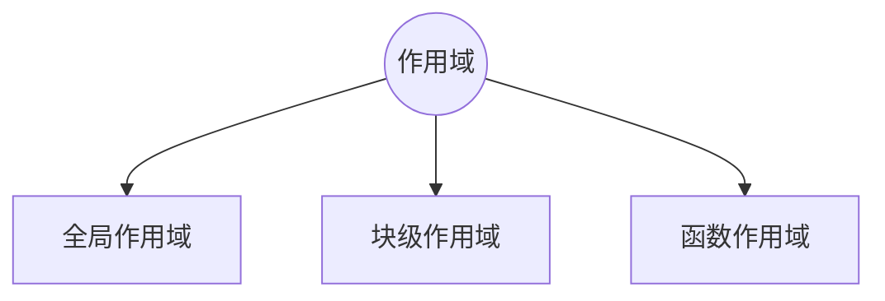
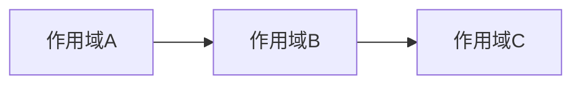
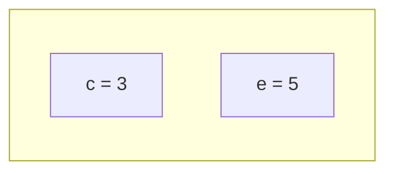

# 作用域

作用域是变量所属区域的划分，是一套存储和查找变量的规则。

##### 存储

变量归属于谁。定义的这个变量，放在谁家，归谁管，这对应作用域的分类。



这就像行政区域划分一样，怎样的一个区域应该具有独立的治理部门。

##### 查找

我到哪里去找我要的变量？如何在不同的归属地之间查找的规则，这对应作用域链相关的内容。



## 块级作用域

块级作用域(block scope)，是在`{}`中形成的一个独立的词法空间，是一个比函数更小级别的词法环境。

函数作用域对应有函数执行上下文，而块级作用域并没有块级执行上下文。
块级作用域在执行上下文中表现为词法环境栈中的一个词法环境对象

```js
function foo() {
  var a = 1;
  let b = 2;
  {
    let c = 3;
    var d = 4;
    const e = 5;
    // highlight-next-line
    console.log(e);
  }
}

foo();
```

`{}`对应的词法环境为



块级作用域是必须与 `let`, `const` 的使用结合在一起，否则没有什么意义

```js
function foo() {
  var a = 1;
  let b = 2;
  {
    var c = 3;
    var d = 4;
    var e = 5;
  }
}

foo();
```

在这个例子中，`{}`中所有的变量都会提升，从变量查找的角度看，没有达到”局部“的意义。

:::tip 🤔
块级作用域和词法环境对象一一对应，块级作用域是与 let, const 组合使用的。没有 let, const 的块级作用域人生一片苍白，而没有块级作用域的 let, const 还有其他选择 🤷‍♂️。
:::

## 函数作用域

从作用域的角度看，函数执行上下文
函数作用域就是函数内
函数形成一个独立的函数执行上下文，

函数作用域和函数执行上下文的关系？

就像是黄河和各省份之间的关系，各省份就是

## 作用域链

作用域链就是按照规则去查找变量时，经过的一个个作用域串起来形成的链。

```js
function foo() {
  var a = 1;
  let b = 2;
  var d = 3;
  function bar() {
    let c = 3;
    var d = 4;
    const e = 5;
    let b = 66;
    // highlight-next-line
    console.log("a + b is: ", a + b + c + d + e);
  }

  bar();
}

foo();
```

对于 bar 中的 RHS，先在 bar 函数作用域中查找，如果未找到，则继续在 bar 所在的词法作用域(即 foo)中查找。一个很自然的想法是，在上下文之间增加一个 outer 引用，引用栈中的前一个执行上下文。

<MyImg src={require("./assets/lookup.jpg")} width="600px" />

引用前一个执行上下文，这样虽然大部分场景也能解释得通，但不准确。
作用域虽然与执行上下文紧密相关，但是要始终记得，标识符的查找，是沿着作用域链，而非执行上下文栈。如 ECMA (opens new window)所述

> A Lexical Environment consists of an Environment Record and a possibly null reference to an outer Lexical Environment.

词法环境，始终指向另一个词法环境(变量对象也是一个特殊的词法环境)。

<MyImg src={require("./assets/scope-outer.jpg")} width="400px" />

## 闭包场景下的作用域链

## 垃圾回收

原始类型保存在栈中，引用类型保存在堆中。

栈垃圾回收，堆垃圾回收，栈垃圾就是移动栈顶指针的位置，在下次新的调用入栈时直接覆盖。

堆垃圾，或者说对象的垃圾回收，就比较复杂。

V8 分成新生代和老生代，新生代中的是存在比较短的对象，老生代中保存存活时间比较长的。
新生代的垃圾回收，称作副垃圾回收器，而老生代中回收，称作主垃圾回收器。

新生代中又分为对象区域和空闲区域，当对象区域快满了，重新标记整理复制到空闲区，空闲区和对象区角色翻转。

新生代就是快用快换，比较小的区域。

老生代用的是主垃圾回收器，大对象或者从新生代

## 有点小的结

作用域是势力范围的划分，是一套存储和查找变量的规则。作用域链就是按照规则去查找变量时，经过的一个个作用域串起来形成的链。JavaScript 采用的是静态作用域，每个词法作用域都可以理解为一个对象

```js
{
  // ...
}
```
