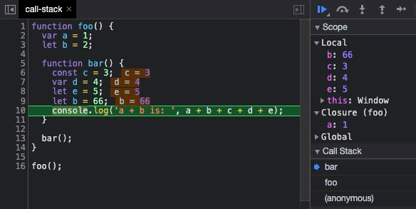

# 闭包

闭包是作用域闭包，要理解闭包，先理解作用域。

## 闭包的描述

关于闭包，有很多比较典型的描述

- **你不知道的 JS**：当函数可以记住并访问所在的词法作用域时，就产生了闭包，即使函数是在当前词法作用域之外执行。

- **JavaScript 高级教程**：闭包指的是那些引用了另一个函数作用域中变量的函数，通常是在嵌套函数中实现的。
- **另一种很普遍的描述**：函数 foo 返回了一个函数 bar，并且函数 bar 中使用了函数 foo 的变量，bar 函数就叫闭包。
  不能说这些描述不正确，都很正确，但我却总觉得差点意思，有些蹊跷。照这些说法

- 怎样怎样....产生了闭包
- 闭包....是函数，是函数，函数，数...

第 1 点，很明显只是在描述闭包的 形，只是在想方设法告诉你，闭包长什么样子。第 2 点，把闭包说成是某些条件下的函数，对于理解并没有太大的帮助。

走过千山万水，见种种描述，此般那般解释，对于闭包，终究需要自己去补全以上种种描述中所差的那点意思。

## 闭包的形成

闭包典型的代码示例如下

```js
function foo() {
  var a = 1;
  function bar() {
    console.log(a);
  }

  return bar;
}

var baz = foo();
baz(); // 1
```

满足了以下三个条件：

- 嵌套的函数
- 内部函数访问了外部函数作用域中定义的变量
- 内部定义的函数被返回，在其定义的词法作用域之外调用

也就是常说的

> 父函数返回子函数，子函数引用父函数中的变量，子函数在父函数之外调用

闭包长这个样子，具备了以下能力

- **独立的空间存储变量**：通过外部函数 foo，创建了一个独立的作用域去存储变量。
- **提供外部使用这些变量的方法**：返回一个 bar 函数，bar 内部使用了这些变量。
- **变量留存在内存中**：外部函数执行外之后，变量仍能够存在，这涉及到垃圾回收策略，被引用的变量，将继续存在而不被回收。

从能力的角度看，闭包就是这些能力的一个组合。

## 需求的角度看闭包

做一件事，当然是因为要满足某个需求啦。首先来看一个需求，对以下数组按照 id 升序排序

```js
const arr = [
  { id: 2333, value: 22 name: 'mayueyue' },
  { id: 666, value: 80, name: 'myy' },
  { id: 888, value: 6, name: 'fengpeng' },
]
```

这个很简单，可以使用 sort 方法提供 compareFunction 即可

```js
const sortByIdArr = arr.sort(function (a, b) {
  const val1 = obj1["id"];
  const val2 = obj2["id"];
  if (val1 > val2) {
    return 1;
  } else if (val1 < val2) {
    return -1;
  } else {
    return 0;
  }
});
```

但是这样写法拓展性不强，如果又有一个需求是通过其他属性如 value 进行升序排序，总不能拷一份 compareFunction 去改改吧，那就太难看了。这个时候可以引入一个”比较函数的生成函数“来灵活地创建 compareFunction，如下

```js
function createComparisonFunction(prop) {
  return function (obj1, obj2) {
    const val1 = obj1[prop];
    const val2 = obj2[prop];
    if (val1 > val2) {
      return 1;
    } else if (val1 < val2) {
      return -1;
    } else {
      return 0;
    }
  };
}

const idCompareFunction = createComparisonFunction("id");
const sortByIdArr = arr.sort(idCompareFunction);

const valueCompareFunction = createComparisonFunction("value");
const sortByValueArr = arr.sort(valueCompareFunction);
```

这类 createXXXFunction 是很常见的利用闭包的例子，在这个例子里面，直接的需求是进行排序，闭包是一种实现的方案。或者也可以说，闭包是实现的一种间接的，深层次的需求。

在这个例子中，createComparisonFunction 函数作用域里面保存了 prop，在后续比较时，就相当于提前预置了要比较的属性。

从需求的角度看，闭包是一种实现方案，它会创建独立的空间，暂时放一些东西，并提供对这些变量/属性的操作方法。闭包作为一种实现方案，其实就是闭包的 3 个能力组合的应用。

## 作用域角度看闭包

为了便于理解，可以用一个对象描述作用域，这个对象我们称为作用域对象

```js
{
  // ...
  [[outer]]: // parent scope reference
}
```

每个作用域对象中有一个 `[[outer]]` 属性，用以指向父级作用域，形成作用域链。以下面的例子来说



从作用域的角度，我们关心的是变量查找的规则，对于 bar 函数作用域而言，关切的是通过 [[outer]] 保持对所在的词法作用域(foo 函数作用域)的引用。按理说引用的 foo 函数作用域对象应该像下面这样

```js
foo: {
  a;
  b;
  bar[[outer]];
}
```

实际上却是这个 Closure (foo)

```js
Closure(foo);
a: 1;
```

Closure (foo) 是 foo 函数作用域中变量的子集，而不是整个 foo 函数作用域。这是因为 **[[outer]]所引用的对象，和 “外部作用域对象” 两者并不一定等价**。当 bar 执行时，foo 函数已经执行完成，虽然 bar 还需要 foo 函数作用域对象中的变量，但是显然只是需要一部分。Closure (foo) 是将所需要的那部分变量进行拷贝，而那些不再被引用的变量就可以释放了。

:::tips 小结
从作用域的角度，闭包是作用域链上的一个节点，是内部函数的 [[outer]] 指向的一个对象，是**外部函数作用域中，被内部函数引用的那部分变量的集合。**
:::

## 总结

现在闭包通常是指 ”父函数返回子函数，子函数引用父函数中的变量，子函数在父函数之外调用“ 这样的一种情况，这可谓之”经典闭包“。

**从能力角度：**闭包是 3 大能力的组合。像 IIFE，作为 namespace 的对象，模块，等具备类似于经典闭包的能力。

**从需求角度**：闭包是一种实现方案。

**从作用域角度**：闭包是外部函数作用域中，被内部函数引用的那部分变量的集合。

我们经常会遇到“xxx 是不是闭包？”这样的问题，通常意义来说，闭包等于经典闭包，要能力和形式都一致才行。

重要的不是去判断某段代码“是不是闭包”，重要的是具备的能力以及满足了需要。闭包是一组特定能力组合的称呼，通过这个能力组合，作为一种经典的解决方案去实现我们的需求。
