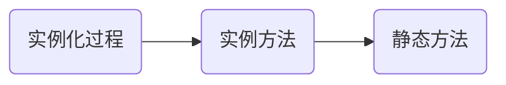

# 深入 Promise 原理

把握本质 —— [Promise](https://developer.mozilla.org/en-US/docs/Web/JavaScript/Reference/Global_Objects/Promise) 是个构造函数。

:::note 说明
本文假设的前提是对于 Promise 的使用已经比较熟练，常用的 API 等都知道，在这个基础上尝试去深入理解，理解 Promise 的实现。
:::

## 基础概述

简单描述 Promise 相关的概念



### 实例化过程

语法

```js
new Promise(executor);
```

基本示例

```js
new Promise((resolve, reject) => {
  // ...
});
```

执行器是同步执行的，如下

```js
const p = new Promise((resolve, reject) => {
  console.log("a");
});

console.log("b");
// 打印顺序 a,b
```

由此可知，实例化的过程，是先执行构造函数，在构造函数中调用了执行器函数，则构造函数基本结构如下

```js
function resolve(value) {}

function reject(reason) {}

class MyyPromise {
  constructor(executor) {
    executor(resolve, reject);
  }
}
```

resolve 和 reject 是函数，但不是实例属性。考虑到聚合，可以把 resolve, reject 设置到原型上，但不对外暴露。同时为了方便理解，使用支持属性修饰符的 TS 来表示

```ts
class MyyPromise {
  constructor(executor) {
    executor(this.resolve, this.reject);
  }

  private resolve(value) {
    // ...应该会调用 then 注册的回调
  }

  private reject(reason) {
    // ...应该会调用 catch 注册的回调
  }
}
```

resolve 和 reject 执行之后，是到 then，或者 catch 中执行，所以可以知道的是

- resolve 会调用 then
- reject 会调用 catch

### 实例方法

Promise 有三个实例方法

```js
then(onFulfilled, onRejected)

catch(onRejected)

finally(onFinally)
```

根据基本的链式调用使用方式，可知这几个实例方法是注册回调

```js
new Promise((resolve, reject) => {})
  .then((data) => {
    // ...
  })
  .catch((e) => {
    // ...
  })
  .finally(() => {});
```

并且由于支持链式注册多个 then, catch，回调之间有顺序关系。以 then 的回调为例，可以用队列来描述

```ts
class MyyPromise {
  private onFulfilledCallbacks = [];
  private onRejectedCallbacks = [];
  constructor(executor) {
    executor(this.resolve.bind(this), this.reject.bind(this));
  }

  then(onFulfilled, onRejected) {
    if (onFulfilled) {
      this.onFulfilledCallbacks.push(onFulfilled);
    }

    if (onRejected) {
      this.onRejectedCallbacks.push(onRejected) :
    }
  }

  resolve(value) {
    this.onFulfilledCallbacks.forEach((cb) => {
      cb(value);
    });
  }

  // ...省略
}
```

`catch`只是`then(undefined, onRejected)`的别名，而 finally 也可以由 then 来模拟实现，因此研究时先专注于核心的 then 的实现。

:::caution 注意
由于在 executor 里面 resolve, reject 函数不是以方法形式被调用，需要手动绑定 this，避免隐式丢失。
:::

<!--
### 静态方法

Promise 有 6 个方法，用于处理单个异步流程中状态，多个异步流程中的协调问题。

其中 `Promise.allSettled` 加入的比较晚， -->

## then

resolve 会执行 then 注册的函数，那么

## 链式调用

实例方法支持链式调用，意味着实例方法执行后的返回值也是一个对象，但不像一般的链式调用直接返回 this，Promise 的实例方法返回的不是最初 new Promise 的实例。

## 完善细节

## 相关工具

## Q & A
