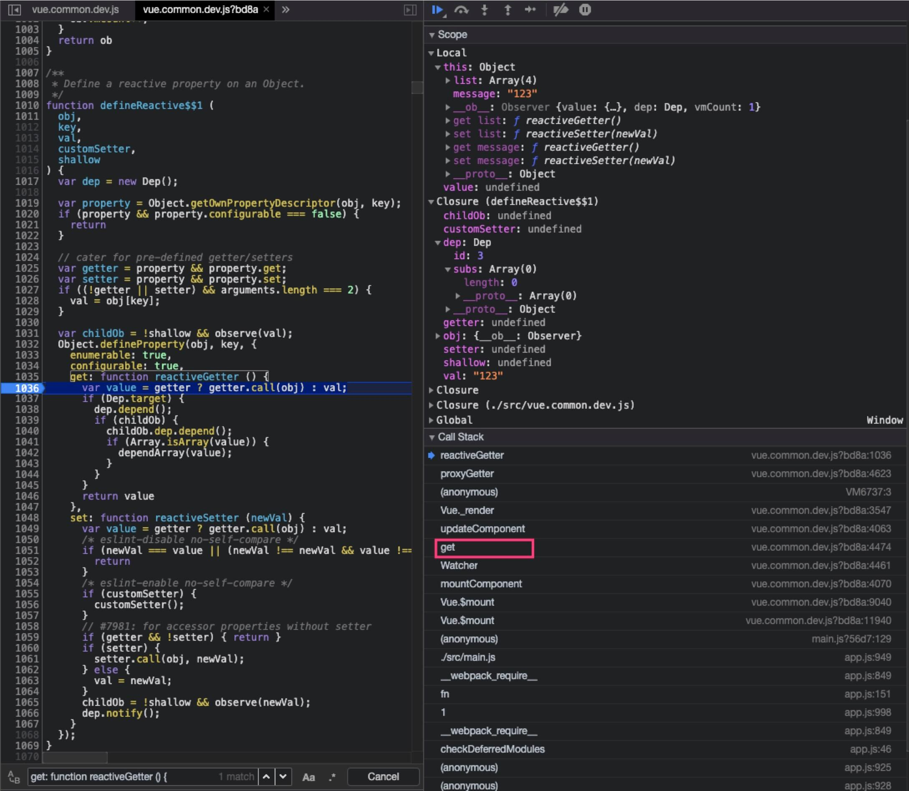

# 依赖收集

依赖收集，就是在使用某个变量的时候，进行登记，在该变量更新后，通知到对应的使用者。 这个登记是在变量自身，而非使用方，具体过程在 defineReactive 中定义的 getter。

其实吧，理解为注册回调就行。

## 前置内容

在 data 初始化时，对于 Object 类型的属性，会调用 defineReactive 对每个属性定义 getter/setter，以进行依赖收集和更新派发。

```js
walk (obj: Object) {
  const keys = Object.keys(obj)
  for (let i = 0; i < keys.length; i++) {
    defineReactive(obj, keys[i])
  }
}

export function defineReactive (
  obj: Object,
  key: string,
  val: any,
  customSetter?: ?Function,
  shallow?: boolean
) {
  const dep = new Dep()

  const property = Object.getOwnPropertyDescriptor(obj, key)
  if (property && property.configurable === false) {
    return
  }

  // cater for pre-defined getter/setters
  const getter = property && property.get
  const setter = property && property.set
  if ((!getter || setter) && arguments.length === 2) {
    val = obj[key]
  }

  let childOb = !shallow && observe(val)
  Object.defineProperty(obj, key, {
    enumerable: true,
    configurable: true,
    get: function reactiveGetter () {
      const value = getter ? getter.call(obj) : val
      if (Dep.target) {
        dep.depend()
        if (childOb) {
          childOb.dep.depend()
          if (Array.isArray(value)) {
            dependArray(value)
          }
        }
      }
      return value
    },
    set: function reactiveSetter (newVal) {
      // ...
    }
  })
}
```

getter 函数实现依赖收集的过程，在说明 getter 时，需要从 Dep 讲起。

## Dep

Dep 是依赖的意思，定义在 src/core/observer/dep.js

```js
import type Watcher from "./watcher";
import { remove } from "../util/index";
import config from "../config";

let uid = 0;

/**
 * A dep is an observable that can have multiple
 * directives subscribing to it.
 */
export default class Dep {
  static target: ?Watcher;
  id: number;
  subs: Array<Watcher>;

  constructor() {
    this.id = uid++;
    this.subs = [];
  }

  addSub(sub: Watcher) {
    this.subs.push(sub);
  }

  removeSub(sub: Watcher) {
    remove(this.subs, sub);
  }

  depend() {
    if (Dep.target) {
      Dep.target.addDep(this);
    }
  }

  notify() {
    // stabilize the subscriber list first
    const subs = this.subs.slice();
    if (process.env.NODE_ENV !== "production" && !config.async) {
      // subs aren't sorted in scheduler if not running async
      // we need to sort them now to make sure they fire in correct
      // order
      subs.sort((a, b) => a.id - b.id);
    }
    for (let i = 0, l = subs.length; i < l; i++) {
      subs[i].update();
    }
  }
}

// The current target watcher being evaluated.
// This is globally unique because only one watcher
// can be evaluated at a time.
Dep.target = null;
const targetStack = [];

export function pushTarget(target: ?Watcher) {
  targetStack.push(target);
  Dep.target = target;
}

export function popTarget() {
  targetStack.pop();
  Dep.target = targetStack[targetStack.length - 1];
}
```

在构造函数中，有一个 id 作为唯一标识，然后就是 subs 订阅者数组，subs 数组里面的每个元素是 Watcher 类型，其实就是订阅者。addSub，removeSub 的功能一目了然了，notify 的意思也很明确，就是通知订阅者更新，比较难理解的是 depend 方法，在用到时再说明。

targetStack 中每个元素是一个 Watcher 类型实例，通过 pushTarget 和 popTarget 来维护栈，而 Dep.target 始终指向表示栈顶的元素。

这里又涉及到 Watcher 了，前面在介绍 Vue 实例化和渲染时简单介绍过，但是仍并未涉及到其核心功能，现在就到了必须要进一步理解 Watcher 才能继续的时候了。

## Watcher

```js
export default class Watcher {
  vm: Component;
  // ...省略其他属性

  constructor(
    vm: Component,
    expOrFn: string | Function,
    cb: Function,
    options?: ?Object,
    isRenderWatcher?: boolean
  ) {
    this.vm = vm;
    if (isRenderWatcher) {
      vm._watcher = this;
    }
    vm._watchers.push(this);
    // options
    if (options) {
      this.deep = !!options.deep;
      this.user = !!options.user;
      this.lazy = !!options.lazy;
      this.sync = !!options.sync;
      this.before = options.before; // 这个为什么不判断类型呢
    } else {
      this.deep = this.user = this.lazy = this.sync = false;
    }
    this.cb = cb;
    this.id = ++uid; // uid for batching
    this.active = true;
    this.dirty = this.lazy; // for lazy watchers
    this.deps = [];
    this.newDeps = [];

    this.depIds = new Set();
    this.newDepIds = new Set();
    this.expression =
      process.env.NODE_ENV !== "production" ? expOrFn.toString() : "";
    // parse expression for getter
    if (typeof expOrFn === "function") {
      this.getter = expOrFn;
    } else {
      this.getter = parsePath(expOrFn);
      if (!this.getter) {
        this.getter = noop;
        process.env.NODE_ENV !== "production" &&
          warn(
            `Failed watching path: "${expOrFn}" ` +
              "Watcher only accepts simple dot-delimited paths. " +
              "For full control, use a function instead.",
            vm
          );
      }
    }
    this.value = this.lazy ? undefined : this.get();
  }

  // ...暂时省略其他方法
}
```

首先判断 isRenderWatcher 将当前实例保存到 vm.\_watcher 属性上，同时推入 vm.\_watchers 数组，从这里可以看到，vm 上面可能会绑定多个 watcher 实例，而只有 vm.\_watcher 是特殊的一个。

Dep 相关的内容有好几个，是重要的内容

```js
this.deps = [];
this.newDeps = [];

this.depIds = new Set();
this.newDepIds = new Set();
```

这四个属性，很明显是新旧两组，后面会有大作用，接下来是 getter 的设置，这个在使用到时再进行说明，最后是调用 get 方法初始化 value。

对于 Watcher 的实例方法，直接讲是不好理解的，在使用到时进行说明。

## 收集过程

以下面的例子进行说明，在模板中有这么一个节点

```js
<div>message is: {{ message }}</div>
```

如以下调用栈所示，初次渲染时，在 new Watcher 时，在构造函数中会设置 vm.\_watcher 为当前实例，然后调用 watcher.get 方法



调用 watcher.get 方法，就是去执行 update component 的过程，在 render 生成 VDOM 的过程中，这里示例中的文本对应的 vnode，大概长这样

```js
{
  // ...
  context: tag: undefined;
  text: "message is: 123";
  child: undefined;
  // ...省略
}
```

在生成 vnode 的过程中，text 节点的计算要获取到 message 属性值，这个时候会调用在 defineReactive 里面给属性定义的 getter 方法，这个时候才真正进入到了 依赖收集 阶段

```js
export function defineReactive (
  obj: Object,
  key: string,
  val: any,
  customSetter?: ?Function,
  shallow?: boolean
) {
  const dep = new Dep()

  const property = Object.getOwnPropertyDescriptor(obj, key)
  if (property && property.configurable === false) {
    return
  }

  // cater for pre-defined getter/setters
  const getter = property && property.get
  const setter = property && property.set
  if ((!getter || setter) && arguments.length === 2) {
    val = obj[key]
  }

  let childOb = !shallow && observe(val)
  Object.defineProperty(obj, key, {
    enumerable: true,
    configurable: true,
    get: function reactiveGetter () {
      const value = getter ? getter.call(obj) : val
      if (Dep.target) {
        dep.depend()
        if (childOb) {
          childOb.dep.depend()
          if (Array.isArray(value)) {
            dependArray(value)
          }
        }
      }
      return value
    },
    set: function reactiveSetter (newVal) {
      // ...
    }
  }
}
```

当 Dep.target 判断为真的时候才会执行收集，现在只需要知道 Dep.target 指向当前正在渲染的组件即可，后面再说明为何如此。

**特别值得注意的是，对于叶子属性，是通过闭包的形式新生成了一个 dep，而不是使用对象本身已经设置的 `obj.__ob__.dep`**

其实这也不难理解，obj.**ob**.dep，维护的是对象本身的依赖，而具体到对象上的某一个属性，每个属性都需要一个 dep 去维护其依赖，如果都维护在 obj.**ob**.dep 上，就需要额外再维护属性和 watcher 的对应关系了

继续往下看，depend 的调用

```js
depend () {
  if (Dep.target) {
    Dep.target.addDep(this)
  }
}
```

addDep 方法如下

```js
addDep (dep: Dep) {
  const id = dep.id
  if (!this.newDepIds.has(id)) {
    this.newDepIds.add(id)
    this.newDeps.push(dep)
    if (!this.depIds.has(id)) {
      dep.addSub(this)
    }
  }
}
```

在理解上，可以简化为这样

```js
watcher.newDeps.push(dep);
watcher.newDepIds.add(dep.id);
dep.subs.push(watcher);
```

那么 deps.subs 就记录了 message 属性被谁依赖，而 \_watcher.newDeps 记录了 watcher 依赖了谁。在 message 被改变时，就可以通过 deps.subs 去通知订阅方，而当订阅方自己有什么想法的时候，也可以取消相关的订阅。

### Dep.target

通过全局查找 pushTarget 的调用，发现在源码中 **只有在执行 watcher.get 的时候，Dep.target 才不为空**，那么什么时候会执行 watcher.get 方法呢？—— 组件初始化 mountComponent 的时候。

在 mountComponent 中，有这样一段调用

```js
updateComponent = () => {
  vm._update(vm._render(), hydrating);
};

new Watcher(
  vm,
  updateComponent,
  noop,
  {
    before() {
      if (vm._isMounted && !vm._isDestroyed) {
        callHook(vm, "beforeUpdate");
      }
    },
  },
  true /* isRenderWatcher */
);
```

在 Watcher 的构造函数中，调用了 get 方法

```js
get () {
  pushTarget(this)
  let value
  const vm = this.vm
  try {
    value = this.getter.call(vm, vm)
  } catch (e) {
    if (this.user) {
      handleError(e, vm, `getter for watcher "${this.expression}"`)
    } else {
      throw e
    }
  } finally {
    // "touch" every property so they are all tracked as
    // dependencies for deep watching
    if (this.deep) {
      traverse(value)
    }
    popTarget()
    this.cleanupDeps()
  }
  return value
}
```

watcher.get 方法的核心功能就是指定上下文调用 getter，getter 其实是\_update 方法，包含了 VDOM 生成，patch 等过程，在这个漫长的过程中，Dep.target 都是当前的这个 vm.\_watcher。

**总结起来，渲染某个组件时，Dep.target 始终指向当前正在渲染的这个组件实例对应的渲染 watcher，即 vm.\_watcher**

## Observer & Dep & Watcher

老实说，Observer, Dep 和 Watcher 这几个内容，我觉得做区分是有一点难度的，究竟该如何理解和区分这几位老哥？

Observer 仿佛在暗示我这里像是一个 观察者模式 应用，而 Dep 的存在又倾向于不太一样的 发布/订阅 模式，我决定不纠结，就当做一个具有调度中心的 发布/订阅 (opens new window)关系就好了。

- Observer: 发布者
- Dep: 调度中心
- Watcher: 订阅者

对于下面这样一个 data 对象而言

```js
new Vue({
  data() {
    return {
      obj: {
        msg: "hahaha",
      },
    };
  },
  template: `<div class="header">
    {{obj.msg}}
  </div>`,
}).$mount("#app");
```

收集依赖后结果如下

```js
obj: Object
  msg: "hahaha"
  __ob__: Observer
    dep: Dep
      id: 4
      subs: Array(1)
        0: Watcher {vm: Vue, deep: false, user: false, lazy: false, sync: false, …}
```

- obj.ob is Observer
- obj.ob.dep is Dep
- obj.ob.dep.subs is Watcher array

Observer 实例化的时候，调用 defineReactive 定义了 getter/setter，在数据更新之后，交给 Dep 处理，由 Dep 负责通知到 Watcher。

## 总结

说到依赖收集，一个比较直接的理解是要确认“组件依赖了哪些变量”，而对于更新，则理解为“组件依赖的变量更新之后，刷新视图”，这不能说是错的，但在 Vue 中，这样的理解太过笼统，也并不能真正把握数据响应的原理。

依赖收集，应该是从数据出发，从每一个叶子属性变量出发，研究“属性被谁依赖”。 所谓响应式，是要在数据变化时，“自动”做某些事情，或者说通知依赖方，关切点在于数据，而非组件或者视图。

从属性出发，对每个属性设置 getter，记录被谁访问了，这对应了依赖收集，而 setter 就对应了更新派发。

需要特别注意的是，这个“谁”，是以 Watcher 的形式存在，并不是说“属性被组件依赖”，这太笼统。

Watcher，对应的可能是视图，也可能是一个 Computed 或者一个 Watch。
