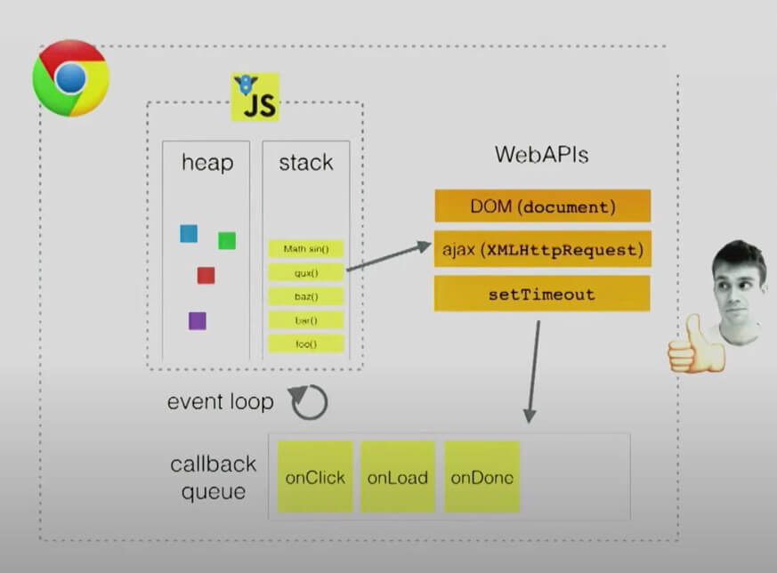

# nextTick

本文说明 tick, nextTick, Vue.prototype.$nextTick 和 Vue.nextTick

## tick

所谓的 tick 就是 EventLoop 的一次循环。

```js
let callback = () => console.log("Regular timeout callback has run");

let urgentCallback = () =>
  console.log("*** Oh noes! An urgent callback has run!");

let doWork = () => {
  let result = 1;

  queueMicrotask(urgentCallback);

  for (let i = 2; i <= 10; i++) {
    result *= i;
  }
  return result;
};

console.log("Main program started");
setTimeout(callback, 0);
console.log(`10! equals ${doWork()}`);
console.log("Main program exiting");
```

对于这一段代码，可以拆分成同步代码，宏任务，微任务三个部分，而在执行过程中，又涉及到调用栈和堆。



图源 Philip Roberts: <https://www.youtube.com/watch?v=6MXRNXXgP_0>

根据 [Whatwg Processing model](https://html.spec.whatwg.org/multipage/webappapis.html#event-loop-processing-model)，对于一个 tick，我理解是这样的：

- tick 的开始是从 task queue 中取出一个为 task
- 执行这个任务，直至 stack 清空
- 检查执行 micro task 队列中的所有任务

## nextTick

在 [派发更新](/docs/frameworks/vue2/reactivity/dispatch-update) 中，修改了数据之后，最终是通过调用 nextTick(flushSchedulerQueue) 执行更新，nextTick 定义在 src/core/util/next-tick.js

```js
const callbacks = [];
let pending = false;

function flushCallbacks() {
  pending = false;
  const copies = callbacks.slice(0);
  callbacks.length = 0;
  for (let i = 0; i < copies.length; i++) {
    copies[i]();
  }
}

// Here we have async deferring wrappers using microtasks.
// In 2.5 we used (macro) tasks (in combination with microtasks).
// However, it has subtle problems when state is changed right before repaint
// (e.g. #6813, out-in transitions).
// Also, using (macro) tasks in event handler would cause some weird behaviors
// that cannot be circumvented (e.g. #7109, #7153, #7546, #7834, #8109).
// So we now use microtasks everywhere, again.
// A major drawback of this tradeoff is that there are some scenarios
// where microtasks have too high a priority and fire in between supposedly
// sequential events (e.g. #4521, #6690, which have workarounds)
// or even between bubbling of the same event (#6566).
let timerFunc;

// The nextTick behavior leverages the microtask queue, which can be accessed
// via either native Promise.then or MutationObserver.
// MutationObserver has wider support, however it is seriously bugged in
// UIWebView in iOS >= 9.3.3 when triggered in touch event handlers. It
// completely stops working after triggering a few times... so, if native
// Promise is available, we will use it:
/* istanbul ignore next, $flow-disable-line */
if (typeof Promise !== "undefined" && isNative(Promise)) {
  const p = Promise.resolve();
  timerFunc = () => {
    p.then(flushCallbacks);
    // In problematic UIWebViews, Promise.then doesn't completely break, but
    // it can get stuck in a weird state where callbacks are pushed into the
    // microtask queue but the queue isn't being flushed, until the browser
    // needs to do some other work, e.g. handle a timer. Therefore we can
    // "force" the microtask queue to be flushed by adding an empty timer.
    if (isIOS) setTimeout(noop);
  };
  isUsingMicroTask = true;
} else if (
  !isIE &&
  typeof MutationObserver !== "undefined" &&
  (isNative(MutationObserver) ||
    // PhantomJS and iOS 7.x
    MutationObserver.toString() === "[object MutationObserverConstructor]")
) {
  // Use MutationObserver where native Promise is not available,
  // e.g. PhantomJS, iOS7, Android 4.4
  // (#6466 MutationObserver is unreliable in IE11)
  let counter = 1;
  const observer = new MutationObserver(flushCallbacks);
  const textNode = document.createTextNode(String(counter));
  observer.observe(textNode, {
    characterData: true,
  });
  timerFunc = () => {
    counter = (counter + 1) % 2;
    textNode.data = String(counter);
  };
  isUsingMicroTask = true;
} else if (typeof setImmediate !== "undefined" && isNative(setImmediate)) {
  // Fallback to setImmediate.
  // Technically it leverages the (macro) task queue,
  // but it is still a better choice than setTimeout.
  timerFunc = () => {
    setImmediate(flushCallbacks);
  };
} else {
  // Fallback to setTimeout.
  timerFunc = () => {
    setTimeout(flushCallbacks, 0);
  };
}

export function nextTick(cb?: Function, ctx?: Object) {
  let _resolve;
  callbacks.push(() => {
    if (cb) {
      try {
        cb.call(ctx);
      } catch (e) {
        handleError(e, ctx, "nextTick");
      }
    } else if (_resolve) {
      _resolve(ctx);
    }
  });
  if (!pending) {
    pending = true;
    timerFunc();
  }
  // $flow-disable-line
  if (!cb && typeof Promise !== "undefined") {
    return new Promise((resolve) => {
      _resolve = resolve;
    });
  }
}
```

代码分成三个部分

- flushCallbacks：flush 译为冲洗，清空，就是取出 callbacks 队列里面的每个回调执行，重置 callbacks 队列为空。
- timerFunc：timerFunc 的目标是通过添加一个微任务去执行回调，微任务的两类主要的 Web API 就是 promise.then/catch/finally 和 MutationObserver ，如果不支持微任务，就回退到使用 setImmediate 和 setTimeout 去添加宏任务。
- nextTick: nextTick 方法定义

对于 nextTick 方法，首先是将 cb 回调函数推入 callbacks 数组里面。然后通过 !pending 合并执行多个 nextTick 回调

```js
if (!pending) {
  pending = true;
  timerFunc();
}
```

!pending 判断在一个 tick 中，只执行一次 timerFunc，这样就将多个 nextTick 注册的回调合并在一个异步任务里面了。并不是一个 nextTick 就是增加一个微任务。

最后提供一个 Promise 化的调用，如果不提供 cb，则运行把 cb 逻辑写到了 then

```js
nextTick().then(() => {
  // ...这里写逻辑
});
```

## $nextTick

定义在 src/core/instance/render.js

```js
import { nextTick } from "../util/index";

export function renderMixin(Vue: Class<Component>) {
  // ...
  Vue.prototype.$nextTick = function (fn: Function) {
    return nextTick(fn, this);
  };
  // ...
}
```

$nextTick 通过一个闭包，将 this 作为第二参数传递给 nextTick。在组件中通过 this.$nextTick 注册的回调中，this 指向当前 vm。

官网对于 $nextTick 的功能描述如下：

> 将回调延迟到下次 DOM 更新循环之后执行。在修改数据之后立即使用它，然后等待 DOM 更新。

也就是说，使用 $nextTick 在回调里面能够获得更新后的 DOM。举例解释

```js
new Vue({
  data: {
    name: "fengpeng",
    age: 25,
  },
  template: `<div>
    <div>name is: {{name}}</div>
    <div>age is: {{age}}</div>
  </div>`,
  mounted() {
    this.$nextTick(() => {
      console.log("log in first $nextTick", this.$el.textContent);
    });
    this.name = "esmyy";
    this.$nextTick(() => {
      console.log("log in second $nextTick", this.$el.textContent);
    });
    this.age = 26;
  },
}).$mount("#app");
```

请回答这几个问题：

**nextTick 会调用几次?**

数据修改的更新派发，也是通过 nextTick 方法实现的。设置 name 和 age，都是对应的 vm.\_watcher，是同一个 watcher，而同一个 watcher，在更新队列中只会加入一次，也就是需要调用一次 nextTick。然后两个 $nextTick 则分别执行一次。

**$nextTick 回调中输出的内容是怎样的？**

```js
log in first $nextTick name is: fengpeng age is: 25

log in second $nextTick name is: esmyy age is: 26
```

DOM 的更新是在 vm.\_watcher.run 执行的时候，在更新 this.name 的时候，派发更新时会将所有与 name 属性相关的 watcher 加入到队列 queueWatcher 里面，这其中就包括本组件的渲染 watcher，即 vm.\_watcher，然后是调用 nextTick(cb) 将 cb 添加到微任务队列中。

nextTick 就保存了一个 callbacks 队列，其中注册的回调是在一个微任务里面顺序执行的

- 第一个 $nextTick：这个 $nextTick 的回调调用时，还没有执行 vm.\_watcher.run，也就还没有执行 DOM 更新，获取到的是老的内容
- 第二个 $nextTick：先执行了 vm.\_watcher.run，然后才执行这个 $nextTick 的回调，因此获取到的是更新后的内容

如果将下面这行内容去掉

```js
this.name = "esmyy";
```

由于是顺序执行，输出就变成了

```js
log in first $nextTick name is: fengpeng age is: 25

log in second $nextTick name is: fengpeng age is: 25
```

所以说，$nextTick 能获取到更新后的 DOM，也是有一点点小条件的。

## Vue.nextTick

```js
Vue.nextTick = nextTick;
```

其实就是 nextTick 函数，啥也没干，就是挂在了 Vue 上作为了一个全局 API。相对于 $nextTick 绑定了 ctx ，这个就是提供一个注册函数。$nextTick 就应该只是必要情况下使用，而 Vue.nextTick 就更少用到就是了。

## 总结

nextTick 是一个微任务回调注册函数，通过一个 callbacks 队列，它在一个 tick 里面用一个异步任务处理通过它注册的所有回调。

$nextTick 是一个组件内获取更新后的 DOM 的回调注册函数，应该只在明确需要获取更新后的 DOM 的情况下使用。

视图更新的派发，$nextTick 都是使用的 nextTick，因此对调用有顺序要求，要在 修改数据之后，否则是无法获取到更新后的 DOM 的。当然，这里的 修改 得是 Vue 能够检测到的修改。

根据我对于 tick 的理解，我其实更愿意称 nextTick 为 before next tick。

## 参考

[What the heck is the event loop anyway? | Philip Roberts | JSConf EU](https://www.youtube.com/watch?v=8aGhZQkoFbQ)

[Mozilla EventLoop](https://developer.mozilla.org/en-US/docs/Web/JavaScript/EventLoop)

[Mozilla Microtask](https://developer.mozilla.org/en-US/docs/Web/API/HTML_DOM_API/Microtask_guide)
