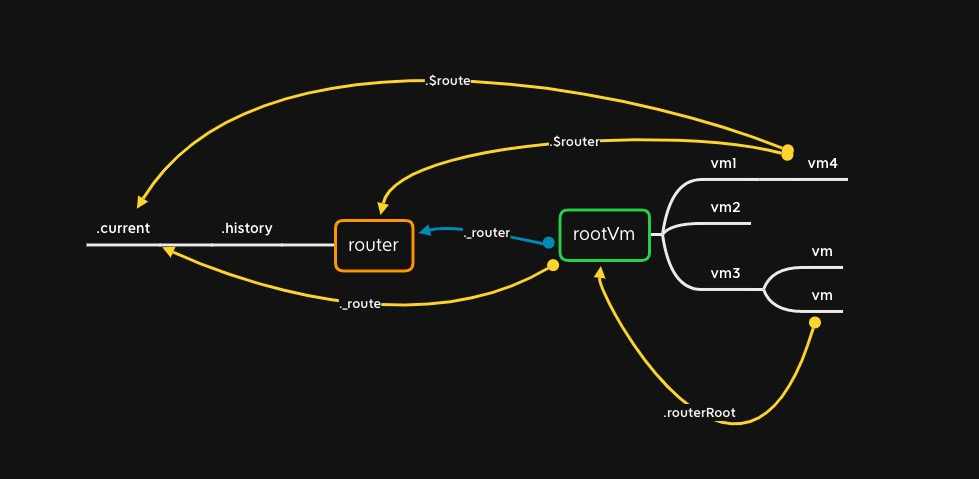

# install

Vue Router 作为一个插件安装，以添加内置路由组件，在每个 Vue 组件实例上添加 VueRouter 实例的引用。

```js
import View from "./components/view";
import Link from "./components/link";

export let _Vue;

export function install(Vue) {
  if (install.installed && _Vue === Vue) return;
  install.installed = true;

  _Vue = Vue;

  const isDef = (v) => v !== undefined;

  const registerInstance = (vm, callVal) => {
    let i = vm.$options._parentVnode;
    if (
      isDef(i) &&
      isDef((i = i.data)) &&
      isDef((i = i.registerRouteInstance))
    ) {
      i(vm, callVal);
    }
  };

  Vue.mixin({
    beforeCreate() {
      if (isDef(this.$options.router)) {
        this._routerRoot = this;
        this._router = this.$options.router;
        this._router.init(this);
        Vue.util.defineReactive(this, "_route", this._router.history.current);
      } else {
        this._routerRoot = (this.$parent && this.$parent._routerRoot) || this;
      }
      registerInstance(this, this);
    },
    destroyed() {
      registerInstance(this);
    },
  });

  Object.defineProperty(Vue.prototype, "$router", {
    get() {
      return this._routerRoot._router;
    },
  });

  Object.defineProperty(Vue.prototype, "$route", {
    get() {
      return this._routerRoot._route;
    },
  });

  Vue.component("RouterView", View);
  Vue.component("RouterLink", Link);

  const strats = Vue.config.optionMergeStrategies;
  // use the same hook merging strategy for route hooks
  strats.beforeRouteEnter =
    strats.beforeRouteLeave =
    strats.beforeRouteUpdate =
      strats.created;
}
```

首先是一个防重复注册检查，然后 Vue.mixin 注册了一个全局的 mixin，定义了$router和$route 属性，注册了 RouterView 和 RouterLink 两个组件。

这里通过$parent去设置每个 vm 对 rootVm 的访问，定义通过$router 和$route 都是代理到 \_routerRoot，其实都只是为了支持 router 嵌套的场景。

## mixin

在 beforeCreate 添加对 router 实例的引用。如果传递了 router 实例(我们 new Vue 根实例初始化，称为 rootVm)，通过\_routerRoot 属性引用 rootVm，通过\_router 引用 router，而对于其他的组件实例，则通过$parent 获取到 rootVm 的引用。

## init

在 rootVm 的 beforeCreate 中调用了 router 实例的 init 方法，其如下

```js
init (app: any /* Vue component instance */) {
  process.env.NODE_ENV !== 'production' &&
    assert(
      install.installed,
      `not installed. Make sure to call \`Vue.use(VueRouter)\` ` +
        `before creating root instance.`
    )

  this.apps.push(app)

  // set up app destroyed handler
  // https://github.com/vuejs/vue-router/issues/2639
  app.$once('hook:destroyed', () => {
    // clean out app from this.apps array once destroyed
    const index = this.apps.indexOf(app)
    if (index > -1) this.apps.splice(index, 1)
    // ensure we still have a main app or null if no apps
    // we do not release the router so it can be reused
    if (this.app === app) this.app = this.apps[0] || null

    if (!this.app) this.history.teardown()
  })

  // main app previously initialized
  // return as we don't need to set up new history listener
  if (this.app) {
    return
  }

  this.app = app

  const history = this.history

  if (history instanceof HTML5History || history instanceof HashHistory) {
    const handleInitialScroll = routeOrError => {
      const from = history.current
      const expectScroll = this.options.scrollBehavior
      const supportsScroll = supportsPushState && expectScroll

      if (supportsScroll && 'fullPath' in routeOrError) {
        handleScroll(this, routeOrError, from, false)
      }
    }
    const setupListeners = routeOrError => {
      history.setupListeners()
      handleInitialScroll(routeOrError)
    }
    history.transitionTo(
      history.getCurrentLocation(),
      setupListeners,
      setupListeners
    )
  }

  history.listen(route => {
    this.apps.forEach(app => {
      app._route = route
    })
  })
}
```

关于 app 的部分是与 VueRouter 实例嵌套有关的处理，在本系列文章中主要研究 单个 VueRouter 实例的情况，不对 app 相关的做深入研究。然后其他的是和 history 相关的设置，调用了 history.transitionTo 和 history.listen，这个在 history 部分加以说明。

## 总结

VueRouter 的两个核心内容是 matcher 和 history。install 过程中设置的各引用之间的关系如下



$router 和 $route 都是设置了 getter 函数的引用，是指向的 rootVm 上对应的属性，当有多个 VueRouter 实例的时候，不同 vm 的 $router 和 $route 指向的不一定是同一个对象。
