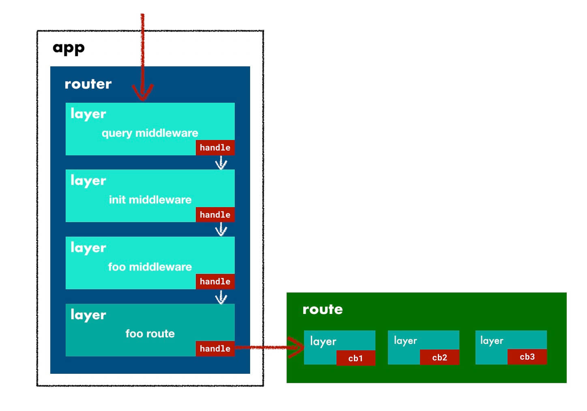

# Express

[Express](http://expressjs.com/) 对 HTTP server 做了一层薄薄的封装，增加 Route 支持较为便利的路由控制分发，支持一些简单的拓展。

## 整体设计

简单介绍 Express 的目录结构和流程。

### 目录结构

```js
lib
├── application.js # api 设置
├── express.js # 入口
├── middleware
│   ├── init.js # request 和 response 拓展中间件
│   └── query.js # 请求参数处理中间件
├── request.js # request 拓展的具体内容
├── response.js # response 拓展的具体内容
├── router # 路由处理转换
│   ├── index.js
│   ├── layer.js
│   └── route.js
├── utils.js # 工具函数
└── view.js # 模板引擎支持
```

### 相关概念

|  名称  |                             说明                             |
| :----: | :----------------------------------------------------------: |
|  app   |                     Express 实例应用程序                     |
| router |                         路由管理对象                         |
| route  |                         单个路由记录                         |
| layer  | 路由或中间件转换后的统一结构，一个匹配层，每层有相应回调函数 |

### 流程概述

基础示例如下

```js
var express = require("express");
var app = express();

// 中间件
app.use("/foo", function (req, res, next) {
  console.log("foo middleware");
  next();
});

// 路由控制
app.get("/foo", function (req, res) {
  console.log("foo route");
  res.send("hello world");
});

app.get("/bar", function (req, res) {
  console.log("bar route");
  res.send("how are you");
});
```

`use` 方法注册中间件，`get` 方法注册路由控制器。 不管是中间件还是路由控制器，都是注册回调，在请求满足某些条件时调用回调函数。

在 express 中，中间件和路由控制器都被转换为所谓的 Layer

```js
const layerQueue = [
  {
    // foo 中间件
  },
  {
    // foo 路由控制器
  },
  {
    // bar 路由控制器
  },
];
```

通过 `use` 和 `get` 等方法注册的回调，会被保存在一个数组(有的称这里为一个 Layer Stack，是不太合适的，并非先注册后执行，而是先注册先执行)。 在接收到请求时，根据请求路径，依次判断 layerQueue 中的每一项是否和当前请求 path 匹配，匹配则执行相应的回调。各个 layer 的执行顺序是按照注册的先后顺序，因而在使用中间件和路由时，是需要注意顺序的。

## Router

路由的初始化是 lazy 的，第一次使用 use, get 或 post 等进行与匹配相关的设置时才会生成 router。初始化后的路由基本结构如下

```js
{
  // ...省略
  name:"router"
  stack:Array(3) [
    {
      handle:function query(req, res, next){ … }
      keys:Array(0) []
      name:"query"
      params:undefined
      path:undefined
      regexp:/^\/?(?=\/|$)/i {fast_star: false, fast_slash: true, lastIndex: 0}
      route:undefined
    },
    {
      handle:function expressInit(req, res, next){ … }
      keys:Array(0) []
      name:"expressInit"
      params:undefined
      path:undefined
      regexp:/^\/?(?=\/|$)/i {fast_star: false, fast_slash: true, lastIndex: 0}
      route:undefined
    },
    {
      handle:function () { … }
      keys:Array(0) []
      name:"bound dispatch"
      params:undefined
      path:undefined
      regexp:/^\/bar\/?$/i {fast_star: false, fast_slash: false, lastIndex: 0}
      route:Route {path: "/bar", stack: Array(1), methods: Object}
    }
  ],
  __proto__: {
    // ...省略其他方法
    get:function(path) {
      // ...
    },
    handle:function handle(req, res, out) {
      // ...
    }
  }
}
```

关注 stack 和 `__proto__` 上的部分方法。

stack 属性包含了由 get, use 等设置的路由，中间件转化而来的所有 Layer。 stack[0] 是在 lib/middleware/query.js 内置的 query 中间件，负责将请求 URL 中的参数转换为对象挂到 req 对象上。 stack[1] 是在 lib/middleware/init.js 内置的初始化中间件，对原始的 req 和 res 进行拓展。

Router.prototype，提供了 get 方法用于根据 path 获取路由，提供了 handle 方法作为路由处理的 main 函数。

最终实例化后 router 被挂载到了 app.\_router 上，当应用程序接收到请求时，会调用 app.handle 处理，而 app.handle 就交给了 router.handle，router.handle 负责对 stack 数组进行遍历，找到匹配的 layer 然后执行 layer.handle。 调用关系

```js
app.handle - router.handle - layer.handle - callback;
```

## Layer

以下面的 /bar 路由为例

```js
app.get("/bar", function (req, res) {
  console.log("bar route");
  res.send("how are you");
});
```

对应的 Layer 如下

```js
{
  handle:function () { … }
  keys:Array(0) []
  name:"bound dispatch"
  params:undefined
  path:undefined
  regexp:/^\/bar\/?$/i {fast_star: false, fast_slash: false, lastIndex: 0}
  route:Route {
    methods:Object {get: true}
    path:"/bar"
    stack:Array(1) [
      {
        handle:function(req, res, next) { … }
        keys:Array(0) []
        method:"get"
        name:"<anonymous>"
        params:undefined
        path:undefined
        regexp:/^\/?$/i {fast_star: false, fast_slash: false, lastIndex: 0}
      }
    ]
  },
  __proto__: {
    handle_request:function handle(req, res, next) { … }
    match:function match(path) { … }
  }
}
```

处理过程如下

- 通过 layer.match 方法，使用 regexp 和当前请求 path，判断是否需要执行当前 layer 的回调。
- 如果 match，调用 handle_request 进入到当前 layer 执行过程。
- handle_request 则调用 layer.handle，layer.handle 负责对 route.stack 里面配置的多个回调进行顺序调用，依次调用其中的每个 handle。对于中间件，route 为空，这 layer.handle 就是所配置的回调。
- layer.handle 调用 route.stack[x].handle，依次完成当前 layer 的回调执行。

调用关系

```js
layer.match - layer.handle_request - layer.handle - callback;
```

## Middleware

中间件会被转化为 Layer

```js
app.use(
  "/bar",
  function (req, res, next) {
    console.log("bar middleware");
    next();
  },
  function (req, res, next) {
    console.log("foo middleware 2");
    next();
  }
);
```

以上事例给 /bar 路由增加了两个回调，这两个回调会被处理成两个 layer。路由类型的 layer 其 handle 函数是一个回调分发处理函数，而中间件类型的 layer，每个 layer 的 handle 就是所配置的一个回调

```js
{
  handle:function(req, res, next) {
    console.log('bar middleware');
    next();
  }
  keys:Array(0) []
  name:"<anonymous>"
  params:Object {}
  path:"/bar"
  regexp:/^\/bar\/?(?=\/|$)/i {fast_star: false, fast_slash: false, lastIndex: 0}
  route:undefined
    __proto__: {
    handle_request:function handle(req, res, next) { … }
    match:function match(path) { … }
  }
}
```

执行过程与前面所述 layer 执行过程基本一致。

## req 和 res

NodeJS 会把请求抽象成一个 http.IncomingMessage 实例，把响应抽象成 http.ServerResponse 实例，我们一般称作 req 和 res。

Express 对原始的请求和响应对象做了增强，增加了一些属性和方法，比如说增加了 req.header 方法，用以更方便地获取头部字段；增加了 res.send, res.sendStatus 等方法，提供了更简洁的响应的设置。

## 总结

Express 通过 layer 的概念，统一了 middleware 和 route



应用程序结构很清晰

```bash
app
  router
    layer
      route
        middleware
```

对应的调用流程也很清晰

```js
// middleware
app.handle -> router.handle -> layer.handle -> route.handle/middleware.handle
```

每一层次具有统一的入口函数 handle 做该层的处理。

相对于原生的 NodeJS 而言，Express 主要的功能点

- req 和 res 的拓展
- 路由控制分发
- 中间件的支持

只做了一层基础的封装，并没有做工程级别的限制和约定，使用很灵活的。

- 优点：可以快速搭建一个具备路由分发和中间件能力的服务端应用程序。
- 不足：缺少工程级别的设计规范，太过灵活缺乏统一性。
