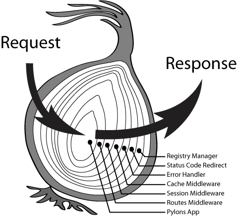

# Koa

Koa 由 Express 幕后的原班人马打造。 Koa 中间件选择了洋葱圈模型，使用 async/await 来实现后置处理逻辑，增加了 Context 来表示当前请求的上下文。

## 目录结构

```bash
lib
├── application.js
├── context.js
├── request.js
└── response.js
```

Koa 的源码目录结构十分简单，就是以上所示 4 个内容，其他的都抽离成独立的中间件。

## Context

使用 Context(ctx) 上下文对象，来整合 request 和 response 等相关的上下文

```js
class Application extends Emitter {
  // ...
  createContext(req, res) {
    const context = Object.create(this.context);
    const request = (context.request = Object.create(this.request));
    const response = (context.response = Object.create(this.response));
    context.app = request.app = response.app = this;
    context.req = request.req = response.req = req;
    context.res = request.res = response.res = res;
    request.ctx = response.ctx = context;
    request.response = response;
    response.request = request;
    context.originalUrl = request.originalUrl = req.url;
    context.state = {};
    return context;
  }

  // ...
}
```

Express 只有 request 和 response，当需要设置一些贯穿整个请求处理过程的数据时，往往设置在 request 还是 response，都不合适。

Koa 增加了 Context，更加符合语义。

## Middleware

中间件使用了所谓的洋葱圈模型



洋葱圈实现所谓的后置处理，可通过 co(generator/yield) 或者 async/await 来实现的。一个示例如下

```js
const Koa = require("./lib/application");
const Router = require("./koa-router-7.4.0/lib/router.js");
const app = new Koa();
const router = new Router();

app.use(async (ctx, next) => {
  console.log(ctx.query, ctx.request.query);
  console.log(1);
  await next();
  console.log(2);
});

app.use(async (ctx, next) => {
  console.log(3);
  await next();
  console.log(4);
});

router.get("/foo", (ctx, next) => {
  console.log(5);
  ctx.body = "foo page";
});
```

输出顺序是 1-3-5-4-2

:::caution why
为什么要这样设置？
:::

## 对比 Express

使用 async/await 来处理回调，实现后置处理逻辑
没有默认的 query 等插件，query，router 等都提取为单独的中间件
新增 Context，更加符合语义
Middleware 采用洋葱模型

## 总结

Koa 和 Express 一样，都是基础性框架，是对原始 Node.js 的一层封装，可以作为基石，在此基础上设计一套完整的项目实施方案而后应用。
