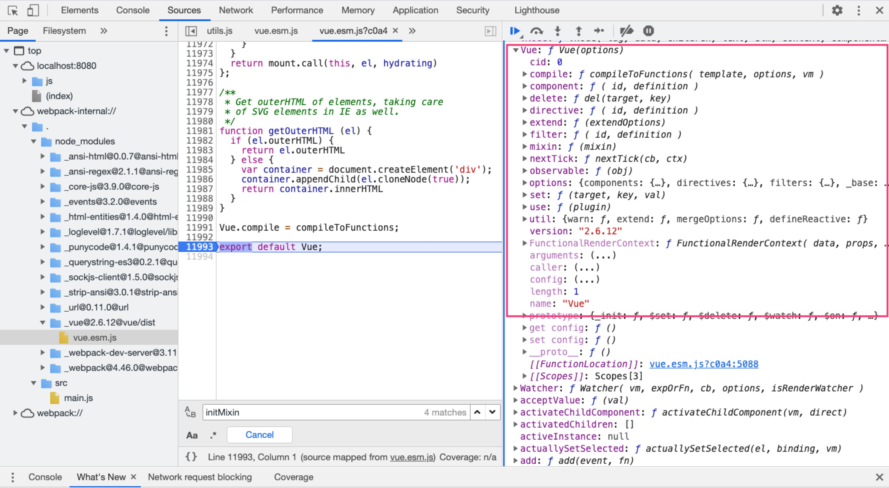
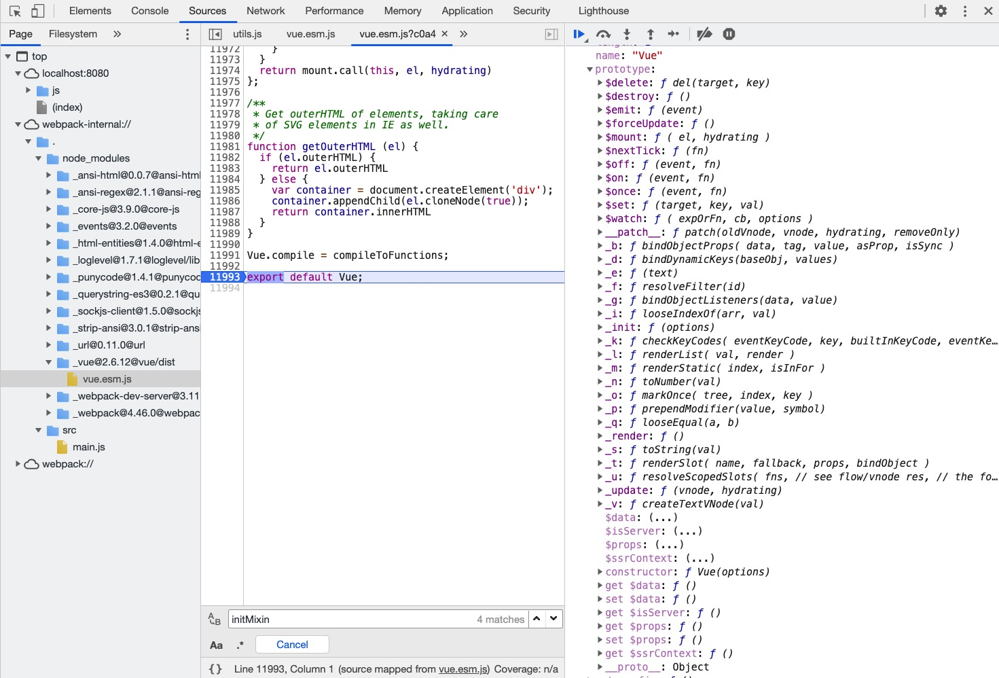
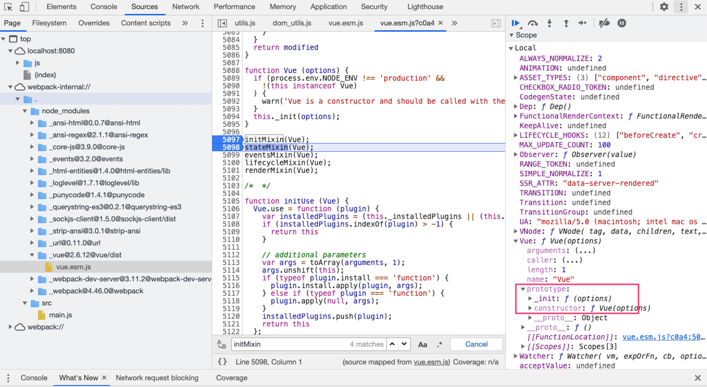

# 构造函数

根据 new Vue 调用，可以猜测到 Vue 大概是这样的一个结构

```js
function Vue() {
  // ...
}

Vue.xxx = a;
Vue.prototype.yyy = b;
```

JavaScript 这种写法其实不便于观察这个 “类” 的整体面貌。

本文的目标就在于说明 Vue 构造函数及 Vue.prototype 本身的定义，说说 **那些 new Vue 之前的事情**。

## 构造函数

Vue 构造函数定义在 `src/core/instance/index.js`

```js
import { initMixin } from "./init";
import { stateMixin } from "./state";
import { renderMixin } from "./render";
import { eventsMixin } from "./events";
import { lifecycleMixin } from "./lifecycle";
import { warn } from "../util/index";

function Vue(options) {
  if (process.env.NODE_ENV !== "production" && !(this instanceof Vue)) {
    warn("Vue is a constructor and should be called with the `new` keyword");
  }
  this._init(options);
}

initMixin(Vue);
stateMixin(Vue);
eventsMixin(Vue);
lifecycleMixin(Vue);
renderMixin(Vue);

export default Vue;
```

根据经验，可以知道这堆 **xxxxMixin** 是对 Vue 构造函数或者其原型进行设置。

```js
initMixin(Vue);
stateMixin(Vue);
eventsMixin(Vue);
lifecycleMixin(Vue);
renderMixin(Vue);
```

此处进行了很好的模块划分，但是通过这些源码，我们仍旧难以对 Vue 这个“类”形成一个完整的印象，需要深入进去看，才会知道每个模块给 Vue 或者 Vue.prototype 加了些什么内容。

只是直接看源码是不够的，可以通过 **断点调试** 和 **源码阅读** 相结合，通过直接查看各步骤 ”运行时“ 结果，快速了解各模块所作所为。如下，当我们在 vue.js 最底部添加断点时，我们可以直接看到 Vue 的全貌



熟悉的同学应该很快就能看出来，这里大部分的属性就是官方文档所说的**全局 API**，比如 `Vue.use`，`Vue.extend`。

`Vue.prototype`的内容如下



`$xxx`属性是官方文档里面说的那些实例 API，包括实例属性，数据方法和事件方法等等。

`_xxx`都是方法，是在编译，渲染等过程中使用的一些方法。对于`_xxx`，在这里稍微提一下，它可以分成两个部分

- `_init`，`_render`，`_patch`，`_update`是四个非常重要的内部方法，每一个就代表着一大块核心的功能，这几个在后面是需要单独讲解的；
- 其他的`_x`方法，是一些工具方法，可以在其右边看到它更容易理解的方法名，比如说 `createTextVNode` 就是创建一个文本的虚拟 DOM 节点；

当然，这里只是在 new Vue 之前，我们可以看到 Vue 和 Vue.prototype 的定义，在实例化过程中，还会添加一些其他方法，比如说 $createElement 的别名 `_c` 这个最知名的方法。

## 断点调试

前面通过在 `vue.js` 最末尾断点，快速了解了 Vue 和 Vue.prototype 的整体面貌，同样的方式，可以通过断点快速了解各个模块大概做了什么。如下在 stateMixin 行断点



在 Scope 面板可以看到，Vue.prototype 上有一个`_init`方法，这便是 `initMixin` 添加的内容。

下面概括展示一下各个 mixin 模块做了什么

```js
function Vue(options) {
  this._init(options);
}

// initMixin
Vue.prototype._init = function (options?: Object) {
  /* ... */
};

// stateMixin
Vue.prototype.$data = this._data;
Vue.prototype.$props = this._props;
Vue.prototype.$set = set;
Vue.prototype.$delete = del;
Vue.prototype.$watch = function foo() {};

// eventsMixin
Vue.prototype.$on;
Vue.prototype.$once;
Vue.prototype.$off;
Vue.prototype.$emit;

// lifecycleMixin
Vue.prototype._update;
Vue.prototype.$forceUpdate;
Vue.prototype.$destroy;

// renderMixin
Vue.prototype.$nextTick;
Vue.prototype._render;
```

上面只是最里层的 `instance-entry` 拓展的内容内容，外面的三层 `entry` 增加的内容如下

```js
// src/core/index.js
Vue.prototype.$isServer;
Vue.prototype.$ssrContext;
Vue.FunctionalRenderContext;
Vue.version = "__VERSION__";

// src/platforms/web/entry-runtime.js
Vue.config.mustUseProp = mustUseProp;
Vue.config.isReservedTag = isReservedTag;
Vue.config.isReservedAttr = isReservedAttr;
Vue.config.getTagNamespace = getTagNamespace;
Vue.config.isUnknownElement = isUnknownElement;
extend(Vue.options.directives, platformDirectives);
extend(Vue.options.components, platformComponents);
Vue.prototype.__patch__ = inBrowser ? patch : noop;
Vue.prototype.$mount;

// src/platforms/web/entry-runtime-with-compiler.js
const mount = Vue.prototype.$mount;
Vue.prototype.$mount = function (
  el?: string | Element,
  hydrating?: boolean
): Component {
  // ...
};

Vue.compile = compileToFunctions;
```

综合以上，就可以得到一个较为完整的 `Vue` 构造函数的形象，并且大概知道各个 mixin，各级 entry 是做了什么。

### 总结

从阅读的角度，我一般将源码分为 iife 和 runtime 两个部分，举例来说

```js
function Vue() {
  // ...
}

Vue.xxx = a;
Vue.prototype.yyy = b;
```

iife 就是会直接执行部分，比如说这里 Vue 函数的定义，Vue.xxx 和 Vue.prototype.yyy 的赋值。runtime 部分主要是指函数，对于函数，如果不是 IIFE 函数，在快速阅读时就可以跳过。其实就是从上往下，根据执行顺序来查看。

我们可以通过 iife 部分快速了解宏观面貌，形成一个比较形象的认知，然后再通过 runtime 部分实时断点调试，去了解主要的模块，去把握关键的细节。

iife 部分：既然 Vue 本身是个构造函数，我们就可以推测到其定义的基本流程和形式，可以通过对 iife 部分的快速浏览，对整体的定义形成一个”类“的形象。

runtime 部分：通过断点调试，可以直观地了解各个 entry、mixin 大概功能。
