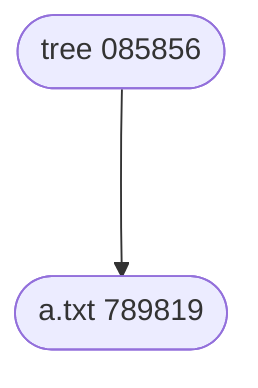
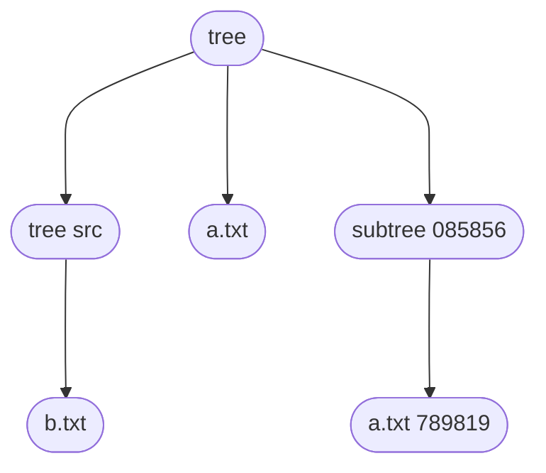
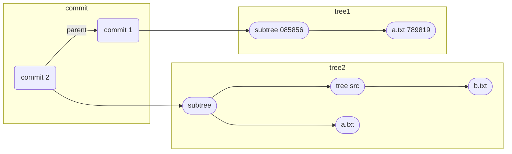

# Git

新版本的 Mac 自带了 git 命令。

## 入门

[Learn Git Branching](https://learngitbranching.js.org/?locale=zh_CN): 比较有趣的入门操作说明

[Pro Git 2](https://git-scm.com/book/zh/)：比较全面，包含比较深入内容的

我觉得新手最好是先看看介绍，了解基本的概念，自己练习练习一些场景。当然，记住两个点：

- 不要 -f
- 不要没有保存内容就乱切分支

其他都问题不大。

:::info 😂😂😂
还记得我实习那会儿，没有提交就各种分支乱切，往事不堪回首 😂
:::

我个人比较喜欢用命令，平时会以命令行为主，也不用特别刻意去记，能够满足日常工作要求就可以

我平时主要用到的工具有

- Oh-My-Zsh 的 git 插件
- VSCode 的两个插件 Git Graph 和 GitLens
- SourceTree

## git config

使用 git config 设置全局的或者局部的 user 信息

```shell
git config user.email iamesmyy@gmail.com
git config user.name esmyy

# 全局
git config user.name esmyy -g
```

设置的内容都保存在 `.git/config`，如下

```shell {9-11}
➜  .git git:(main) cat config
[core]
        repositoryformatversion = 0
        filemode = true
        bare = false
        logallrefupdates = true
        ignorecase = true
        precomposeunicode = true
[user]
        email = iamesmyy@gmail.com
        name = esmyy
[remote "origin"]
        url = https://github.com/esmyy/esmyy.github.io.git
        fetch = +refs/heads/*:refs/remotes/origin/*
[branch "main"]
        remote = origin
        merge = refs/heads/main
```

当前 git 仓库的一些都在这里，不过一般不需要改这个文件就是了。

## alias

熟悉基础的命令之后，我觉得使用 alias 来提升操作效率和体验很重要。

比如在 .zshrc 中添加如下设置和获取用户信息的别名

```shell
alias lg="git config user.email iamesmyy@gmail.com && git config user.name esmyy"

alias name="git config user.name"
alias email="git config user.email"
```

我还使用了 [Oh-My-Zsh 的 git 插件](https://github.com/ohmyzsh/ohmyzsh/blob/master/plugins/git/git.plugin.zsh)，其中提供了丰富的 alias，能够提高操作效率。

## commit 规范

需要在比较成熟的团队，才可能有比较严格的执行以及后续的一些统计分析。

小团队里面，如果没有严格的执行要求，往往容易被滥用，乱用。

比较知名的是 [Angular 的规范](https://github.com/angular/angular/blob/main/CONTRIBUTING.md#-commit-message-guidelines)

各团队基于此做一套适用自身的规范即可。

## Hooks

git 支持的钩子，在 `.git/hooks` 里面都有 example

```shell title=".git/hooks"
.git/hooks
├── applypatch-msg.sample
├── commit-msg.sample
├── fsmonitor-watchman.sample
├── post-update.sample # server
├── pre-applypatch.sample
├── pre-commit.sample
├── pre-merge-commit.sample
├── pre-push.sample
├── pre-rebase.sample
├── pre-receive.sample         # server
├── prepare-commit-msg.sample
├── push-to-checkout.sample
└── update.sample # server
```

通过钩子，可以做很多检查，同步相关的事情。

## merge vs rebase

[merge 解释](https://git-scm.com/book/zh/v2/Git-%E5%88%86%E6%94%AF-%E5%88%86%E6%94%AF%E7%9A%84%E6%96%B0%E5%BB%BA%E4%B8%8E%E5%90%88%E5%B9%B6#_basic_merging)

[rebase 解释](https://git-scm.com/book/zh/v2/Git-%E5%88%86%E6%94%AF-%E5%8F%98%E5%9F%BA)

> 有一种观点认为，仓库的提交历史即是 记录实际发生过什么。 它是针对历史的文档，本身就有价值，不能乱改。 从这个角度看来，改变提交历史是一种亵渎，你使用 谎言 掩盖了实际发生过的事情。 如果由合并产生的提交历史是一团糟怎么办？ 既然事实就是如此，那么这些痕迹就应该被保留下来，让后人能够查阅。 <br/><br/>
> 另一种观点则正好相反，他们认为提交历史是 项目过程中发生的事。 没人会出版一本书的第一版草稿，软件维护手册也是需要反复修订才能方便使用。 持这一观点的人会使用 rebase 及 filter-branch 等工具来编写故事，怎么方便后来的读者就怎么写。 <br/><br/>
> 总的原则是，只对尚未推送或分享给别人的本地修改执行变基操作清理历史， 从不对已推送至别处的提交执行变基操作，这样，你才能享受到两种方式带来的便利。

总结来说，merge 会保留所有提交的完整记录，每次 merge 会有一个
从我的经验来说，当多人改动同一块地方时，如果采用 rebase 的方式，会产生比较多的冲突

## 批量拉取

在新入职公司时，要拉取一些项目，可能项目很多，这个时候可以采用批量拉取的方式。当然，不要乱搞，遵守相关安全要求。

```bash title="batchClone.sh"
#!/bin/bash

# TODO: 替换为仓库列表，如果有子目录, 需写上(如foo/dotfiles)
repository_to_clone=(
  dotfiles
  guide
)

# TODO: 最小公共前缀，替换为实际地址
remote_base="git@github.com:esmyy/"

for file in ${repository_to_clone[@]}
do
  name=${file#\/*} # 取名称
  if test -d ./$name
  then
    echo "$name 已存在"
  else
    echo "\n正在克隆$remote_base/$file.git"
    git clone "$remote_base/$file.git"
  fi
done
```

至于说 `repository_to_clone` 的获取，出现在了网页上的内容，还拿不到么？DOM 操作或者查看接口返回都可以嘛。比如说 DOM 获取可能像这样

```js
Array.from(document.querySelectorAll('[data-testid="group-name"]')).map(
  (a) => a.innerText
);
```

:::caution TODO
集成到 cli 里面去
:::

## 实现原理

理解 git 的实现原理，我认为首先要有这样一个意识 —— 历史记录必然是持久地保存在了某些地方，只要找到这些存储，按照一定的方式去还原即可得到。

<https://github.com/ohmyzsh/ohmyzsh/tree/master/plugins/git>

~/.oh-my-zsh/plugins/git/git.plugin.zsh

<https://github.com/ohmyzsh/ohmyzsh/blob/master/plugins/git/git.plugin.zsh>

<https://github.com/github/gitignore>

### 目录

在初始化后，一个 git 仓库，git 相关的内容保存在 `.git` 目录中

```bash
➜  .git git:(main) ls
.
├── HEAD
├── config  # 配置
├── description
├── hooks   # 钩子
├── info
├── objects
└── refs
➜  .git git:(main)
```

主要关注的内容是 **objects** 的内容，文件，文件夹关系及 commit 记录等都保存在其中。可以通过以下命令查看其解析后的内容

```shell
git cat-file -p [数据对象hash]
```

这个命令在后面研究 Git 的存储有重要作用

### 数据对象

文件的各个版本，保存在 objects 目录下，该目录下文件示意如下

```shell
.
├── 1f
│   └── 7a7a472abf3dd9643fd615f6da379c4acb3e3a
├── 83
│   └── baae61804e65cc73a7201a7252750c76066a30
├── d6
│   └── 70460b4b4aece5915caf5c68d12f560a9fe3e4
├── info
└── pack
```

这里的文件是 40 位的 hash 校验和，前两位作为文件夹名字，后 38 位作为文件名。

文件的每个版本对应一个文件，这些文件称作数据对象。查看数据对象的内容

```sh
git cat-file -p d670460b4b4aece5915caf5c68d12f560a9fe3e4
```

**值得注意的是，这里虽然每个数据对象文件都对应着某个文件的某个版本文件内容，但每个数据对象的文件名或内容，并不包含原始文件名。**

那么文件名保存在哪里呢？它保存在 **树对象** 中。

### 树对象

树对象类似目录，它解决文件名保存的问题及文件夹和文件直接的关系，但不等于。

```shell
mkdir test
cd test
git init
echo "a" > a.txt
git add .
git commit -m "add a.txt"
```

这个时候对象树如下



每次提交，相当于需要做一个快照，记录每个文件和其数据对象文件的对应关系，因此虽然 a.txt 并不存在于某个子目录，仍旧会有一个 tree 对象与之对应，这个 tree 对象内容如下

```shell title=".git/objects/08/585692ce06452da6f82ae66b90d98b55536fca"
100644 blob 78981922613b2afb6025042ff6bd878ac1994e85    a.txt
```

明确了文件的名称是 a.txt，此次提交版本内容在 `789819` 这个数据对象中。

而如果我们按照如下继续添加内容

```shell
mkdir src
echo "b" > src/b.txx
ga .
git commit -m "add src/b.txt"
```

此时树对象为



树对象就是文件的快照描述。

### 提交对象

在每次提交时，除了会生成一个树对象，用于描述文件与数据对象的对应关系，还会生成一个提交对象。
提交对象用于记录每次提交的用户，描述信息，也就是使用 git log 查看记录时展示的那些信息，如

```shell
commit aa0682c74f028bdca718f51cc55b4b2b98efb7f2 (HEAD -> master)
Author: esmyy <iamesmyy@gmail.com>
Date:   Mon Feb 6 14:42:18 2023 +0800

    add src/b.txt
```

提交对象也一样是保存在 `.git/objects` 下面，如下

```shell title=".git/objects/a6/ceb772faf82e7a1041cced072690669731b4e7"
tree 8a974a5eedaff1a0a6e173ed7c1b8b3f2d5f9e2e
parent a6ceb772faf82e7a1041cced072690669731b4e7
author esmyy <iamesmyy@gmail.com> 1675665738 +0800
committer esmyy <iamesmyy@gmail.com> 1675665738 +0800

add src/b.txt
```

每个提交对象对应一个树对象，两者的关系描述如下



### 小结

Git 中存储涉及三种对象

| 名称     | 解释                         | 对象标志 | 有无特定格式 |
| -------- | ---------------------------- | -------- | ------------ |
| 数据对象 | 文件的快照，包含文件内容     | blob     | 无           |
| 树对象   | 项目快照                     | tree     | 有           |
| 提交对象 | 提交信息的记录，历史关系维护 | commit   | 有           |

<!-- ## 数据传输

使用 github 时，支持 SSH, HTTPS 等方式进行 clone，很明显这与对应的协议有关。

在 Git 的传输过程中，一个值得思考的问题是：

> 当使用 push 推送时，服务端是如何接收的？我们并没有手动在服务端启动特定程序。 -->
