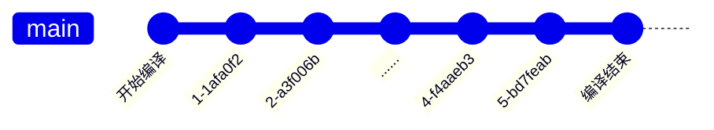

# 编译过程

webpack 的编译过程是一个基于 [Tapable](https://github.com/webpack/tapable) 的事件流，简单来说，就是在 webpack 处理的每个关键节点，都定义了相应的事件，在使用时，可以通过 Tapable 提前注册事件处理函数，在处理到对应的节点时，就会调用已经注册的处理函数。



Tapable 类似于 EventEmitter，或者更简单的 [mitt](https://github.com/developit/mitt)，是一个事件发布/订阅的工具。示例如下

```js
const { SyncHook } = require("tapable");

// 定义 hooks
class Car {
  constructor() {
    this.hooks = {
      brake: new SyncHook(),
    };
  }
}

const myCar = new Car();

// 注册钩子函数
myCar.hooks.brake.tap("test", () => console.log("test"));

// 触发事件
myCar.hooks.brake.call();
```

特别的是，webpack 中注册处理函数的方式是插件，因此，webpack 中的插件可以理解为事件处理函数。

:::info 🤔
首先有这样一个印象，webpack 函数处理文件时，从输入到输出的执行过程，就是一个事件流，在各个节点抛出事件，执行通过插件注册的处理函数。
:::

## 编译器初始化

webpack 定义，省略了暂时不必关注的内容，过程如下

```js title="lib/webpack.js"
const webpack = (options, callback) => {
  // 创建编译器
  let compiler = createCompiler(options);

  // ...

  // 执行编译
  compiler.run();

  return compiler;
};
```

通过对 Webpack CLI 的过程的理解，可以知道这里的 options 就是编译配置，理解为一个 `webpack.config.js` 配置即可，callback 暂不用关注。

```js
const createCompiler = (options) => {
  // 1. 设置默认配置，并与options的配置合并，初始化 compiler
  options = new WebpackOptionsDefaulter().process(options);
  const compiler = new Compiler(options.context);
  compiler.options = options;

  // 2. 安装插件
  new NodeEnvironmentPlugin({
    infrastructureLogging: options.infrastructureLogging,
  }).apply(compiler);

  if (Array.isArray(options.plugins)) {
    for (const plugin of options.plugins) {
      if (typeof plugin === "function") {
        plugin.call(compiler, compiler);
      } else {
        plugin.apply(compiler);
      }
    }
  }

  // 3. 发布环境状态事件
  compiler.hooks.environment.call();
  compiler.hooks.afterEnvironment.call();

  // 4. 根据 options 设置插件
  compiler.options = new WebpackOptionsApply().process(options, compiler);
  return compiler;
};
```

这里的内容很多，已经在代码中做了简要注释。理解 hooks 和 plugin 相关的初始化，对于理解 Webpack 工作流程至关重要。
逐步来看其中的内容

### 创建 compiler

compiler 是 webpack 编译的引擎，负责整体调度。

```js
compiler = new Compiler(options.context);
compiler.options = options;
```

`options.context` 是执行时指定的配置文件所在的目录，如下就是 config 目录的路径。

```shell
config
└── webpack.config.js
```

Compiler 的定义 如下

```js
const {
  SyncHook,
  SyncBailHook,
  AsyncParallelHook,
  AsyncSeriesHook,
} = require("tapable");

class Compiler {
  /**
   * @param {string} context the compilation path
   */
  constructor(context) {
    // 定义钩子
    this.hooks = Object.freeze({
      shouldEmit: new SyncBailHook(["compilation"]),
      done: new AsyncSeriesHook(["stats"]),
      /** @type {SyncHook<[Stats]>} */
      afterDone: new SyncHook(["stats"]),
      /** @type {AsyncSeriesHook<[]>} */
      additionalPass: new AsyncSeriesHook([]),
      /** @type {AsyncSeriesHook<[Compiler]>} */
      beforeRun: new AsyncSeriesHook(["compiler"]),
      /** @type {AsyncSeriesHook<[Compiler]>} */
      run: new AsyncSeriesHook(["compiler"]),
      /** @type {AsyncSeriesHook<[Compilation]>} */
      emit: new AsyncSeriesHook(["compilation"]),
      /** @type {AsyncSeriesHook<[string, AssetEmittedInfo]>} */
      assetEmitted: new AsyncSeriesHook(["file", "info"]),
      /** @type {AsyncSeriesHook<[Compilation]>} */
      afterEmit: new AsyncSeriesHook(["compilation"]),
      // ...省略其他 hooks 定义
    });

    this.context = context;
    this.options = /** @type {WebpackOptions} */ ({});

    // ...一堆属性初始化
  }

  // ...实例化过程不调用其他方法，暂不用关注
}
```

`compiler.hooks` 定义了 compiler 所支持的所有事件，具体可参考[Compiler Hooks](https://webpack.js.org/api/compiler-hooks/)，由此 compiler 具备了事件发布/订阅的能力。compiler 执行过程中在对应的节点会发布相应的事件，触发已注册的处理函数执行。

### 配置插件安装

👨‍💻‍ Go On... 👨‍💻‍

```js
const createCompiler = (options) => {
  // ...
  new NodeEnvironmentPlugin({
    infrastructureLogging: options.infrastructureLogging,
  }).apply(compiler);

  if (Array.isArray(options.plugins)) {
    for (const plugin of options.plugins) {
      if (typeof plugin === "function") {
        plugin.call(compiler, compiler);
      } else {
        plugin.apply(compiler);
      }
    }
  }

  // ...
};
```

插件具有统一的结构，都是通过 apply 函数进行安装，而且 apply 的参数都是 compiler，这个函数的主要作用是注册编译过程的事件处理函数，也可以在 compiler 上定义一些属性。以这里的 NodeEnvironmentPlugin 为例，它最终是给 beforeRun 添加一个订阅函数。

```js
class NodeEnvironmentPlugin {
  constructor(options) {
    this.options = options || {};
  }

  apply(compiler) {
    // ...省略
    compiler.hooks.beforeRun.tap("NodeEnvironmentPlugin", (compiler) => {
      // ...
    });
  }
}
```

具体的插件机制，一些插件的重要能力，这里暂且不提，NodeEnvironmentPlugin 其实有很多重要作用，这里都暂且不提。

:::info 🤔
在 compiler 初始化之后是执行插件的安装，插件的安装是订阅编译过程中的事件。
:::

### 发布环境事件

👨‍💻‍ Go On... 👨‍💻‍ 在定义了事件，也添加了一些订阅事件之后，是内置的环境相关事件的发布，如下

```js
const createCompiler = (options) => {
  // ...发布环境状态相关的事件
  compiler.hooks.environment.call();
  compiler.hooks.afterEnvironment.call();

  // 根据options 设置插件
  compiler.options = new WebpackOptionsApply().process(options, compiler);
  return compiler;
};
```

这就表示环境已经准备好了。这里有点不太理解的地方，为什么不是最后再发布环境事件，而要在 compiler.options 设置之前呢？不过这个细节或许也不太重要。

### 安装内置插件

最后是根据传递的 options，去安装内置插件

```js
compiler.options = new WebpackOptionsApply().process(options, compiler);
```

这个初始化负责将 options 参数，转换为 Webpack 内部插件来处理，部分内容如下

```js
class WebpackOptionsApply extends OptionsApply {
  // ...
  process(options, compiler) {
    // ...
    new EntryOptionPlugin().apply(compiler); // 在这里对 entry 多种配置形式进行了统一处理转换
    compiler.hooks.entryOption.call(options.context, options.entry);
    // ...
    if (typeof options.mode !== "string") {
      const WarnNoModeSetPlugin = require("./WarnNoModeSetPlugin");
      new WarnNoModeSetPlugin().apply(compiler);
    }
    if (options.optimization.removeAvailableModules) {
      const RemoveParentModulesPlugin = require("./optimize/RemoveParentModulesPlugin");
      new RemoveParentModulesPlugin().apply(compiler);
    }
    if (options.optimization.removeEmptyChunks) {
      const RemoveEmptyChunksPlugin = require("./optimize/RemoveEmptyChunksPlugin");
      new RemoveEmptyChunksPlugin().apply(compiler);
    }
    // ...
    return options;
  }
}
```

以上只展示了原代码的一小部分内容，概括来说，这就是根据 options 中的配置，引入一个个内部提供的插件进行处理。基本上是下面这样的一个转换

```js
if (options.somePlugin) {
  const Plugin = require('./relative/path/to/somePlugin')；
  new Plugin().apply(compiler);
}
```

这一步将 webpack 插件的设计体现的淋漓尽致。

### 小结结

总结来说，compiler 初始化的过程，都围绕着 hooks 和 plugins 进行。

- 定义事件：编译器支持那些事件
- 订阅事件：通过配置的，内置的插件订阅了编译过程的事件
- 发布事件：初始化本身也是编译过程的一部分，有一些事件节点

让我觉得很受启发的，是 options 配置的各项转换为插件这个处理，很有意思。

## 2. 准备开始

创建 compiler 之后调用 `compiler.run` 开始执行编译，这个方法核心过程如下

```js title="webpack/lib/Compiler.js"
run(callback) {
  // ...

  this.hooks.beforeRun.callAsync(this, err => {
    if (err) return finalCallback(err);

    this.hooks.run.callAsync(this, err => {
      if (err) return finalCallback(err);

      this.readRecords(err => {
        if (err) return finalCallback(err);

        this.compile(onCompiled);
      });
    });
  });
}
```

从上面看，依次触发 `beforeRun`，`run` 两个事件，这两个事件的回调执行完成之后，最终调用 compile 函数。
compile 表示一次编译，onCompiled 这个回调函数是编译完成之后执行的。

```js
compile(callback) {
  const params = this.newCompilationParams();
  this.hooks.beforeCompile.callAsync(params, err => {
    if (err) return callback(err);

    this.hooks.compile.call(params);

    const compilation = this.newCompilation(params);

    const logger = compilation.getLogger("webpack.Compiler");

    logger.time("make hook");
    this.hooks.make.callAsync(compilation, err => {
      logger.timeEnd("make hook");
      if (err) return callback(err);

      process.nextTick(() => {
        logger.time("finish compilation");
        compilation.finish(err => {
          logger.timeEnd("finish compilation");
          if (err) return callback(err);

          logger.time("seal compilation");
          compilation.seal(err => {
            logger.timeEnd("seal compilation");
            if (err) return callback(err);

            logger.time("afterCompile hook");
            this.hooks.afterCompile.callAsync(compilation, err => {
              logger.timeEnd("afterCompile hook");
              if (err) return callback(err);

              return callback(null, compilation);
            });
          });
        });
      });
    });
  });
}
```

以上依次触发了 `beforeCompile`, `compile`, `make` 事件，hooks.make 是正式开始编译。从调用 compiler.run 到 hooks.make，都只是在做准备工作，每个节点都通知一下，到了 make 这个位置，才是最后大哄一声 —— 现在真的要开始了 😂。具体的编译由 compilation 负责，在这里 make 完成之后，表示文件已经进行了一次编译，之后是调用 compilation.finish 和 compilation.seal 做一些收尾工作。

## 3. 具体编译

`compiler.hooks.make` 事件的触发是编译的发令枪，之后由`compilation` 负责一次具体编译过程，具体的模块编译调度。compilation 根据 entry，使用 loader 对模块进行编译，生成 bundle。

这里只能看到事件的触发，具体的执行过程在事件的订阅函数当中，可通过搜索 `hooks.make.tap` 找到对应的订阅函数。

```js
grep -rn hooks.make.tap ./lib
```

得到

```js
./lib/AutomaticPrefetchPlugin.js:  compiler.hooks.make.tapAsync(
./lib/PrefetchPlugin.js:  compiler.hooks.make.tapAsync("PrefetchPlugin", (compilation, callback) => {
./lib/EntryPlugin.js:  compiler.hooks.make.tapAsync("EntryPlugin", (compilation, callback) => {
./lib/DynamicEntryPlugin.js:  compiler.hooks.make.tapAsync(
./lib/DllEntryPlugin.js:  compiler.hooks.make.tapAsync("DllEntryPlugin", (compilation, callback) => {
```

由此可以得知 make 具体做的事情就在这几个回调函数里面。从名字可以区分大概是什么内容，这里我们从 EntryPlugin.js(较早版本里面是 SingleEntryPlugin.js)开始研究，这个插件是用来处理配置的 entry，编译自然是从入口开始处理

```js title="lib/EntryPlugin.js"
const EntryDependency = require("./dependencies/EntryDependency");

class EntryPlugin {
  constructor(context, entry, name) {
    this.context = context;
    this.entry = entry;
    this.name = name;
  }

  apply(compiler) {
    // ...

    compiler.hooks.make.tapAsync("EntryPlugin", (compilation, callback) => {
      const { entry, name, context } = this;
      const dep = EntryPlugin.createDependency(entry, name);
      compilation.addEntry(context, dep, name, (err) => {
        callback(err);
      });
    });
  }

  static createDependency(entry, name) {
    const dep = new EntryDependency(entry);
    dep.loc = { name };
    return dep;
  }
}
```

这里的 entry 已经是单个文件，是在 compiler 初始化过程中已经处理过的，通过 addEntry 开始编译具体文件

```js
addEntry(context, entry, name, callback) {
  this.hooks.addEntry.call(entry, name);

  let entriesArray = this.entryDependencies.get(name);
  if (entriesArray === undefined) {
    entriesArray = [];
    this.entryDependencies.set(name, entriesArray);
  }
  entriesArray.push(entry);

  this.addModuleChain(context, entry, (err, module) => {
    if (err) {
      this.hooks.failedEntry.call(entry, name, err);
      return callback(err);
    }
    this.hooks.succeedEntry.call(entry, name, module);

    return callback(null, module);
  });
}
```

以 entry 作为第一个模块开始构建，在 addModuleChain 的回调函数中触发了 succeedEntry 事件，这说明在回调执行时当前 entry 已经构建完成。

中间过程其实比较复杂，涉及到依赖的分类，NormalModule 和 ContextModule 不同构造方法等等，这些内容过细了。举最常见的例子来说，在模块构建过程中，会调用内置的 NormalModule 构造函数去生成模块实例，模块实例会被保存到 compilation.modules 数组里面，然后执行模块的 build 方法

```js
const { getContext, runLoaders } = require("loader-runner");

class NormalModule extends Module {
  // ...
  doBuild(options, compilation, resolver, fs, callback) {
    // ...
    runLoaders(
      {
        resource: this.resource,
        loaders: this.loaders,
        context: loaderContext,
        readResource: fs.readFile.bind(fs),
      },
      (err, result) => {
        // ...
      }
    );
  }

  build(options, compilation, resolver, fs, callback) {
    // ...

    return this.doBuild(options, compilation, resolver, fs, (err) => {
      // ...
      result = this.parser.parse(this._ast || this._source.source(), {
        current: this,
        module: this,
        compilation: compilation,
        options: options,
      });
      handleParseResult(result);
    });
  }
  // ...
}
```

在 doBuild 函数中，调用了 runLoaders 去运行 loader 对文件进行具体转换。假设有这样一个 app.js 作为 entry

```js
import "./style.less";
const AGE = 100;
```

loader 配置如下

```js
rules: [
  {
    test: /\.js/i,
    use: {
      loader: "babel-loader",
      options: {
        presets: [["@babel/preset-env", { targets: "defaults" }]],
      },
    },
  },
  {
    test: /\.less$/i,
    loader: ["style-loader", "css-loader", "less-loader"],
  },
];
```

那么在 runLoaders 返回的结果如下

```js
'import \'./style.less\';\nvar AGE = 100;';
```

`parser.parse` 是根据当前的 source，使用 acorn (opens new window)这个解析工具，去生成 AST，根据 AST 提取到这个模块的依赖项，然后继续递归执行模块的编译过程，直到所有的依赖都处理完成。最终整个依赖处理完成后，进入到模块的 seal 环节，seal 有以下几个步骤

- chunk 生成：在前面的步骤中，各模块实例保存在 compilation.modules 上，seal 根据 entry 生成 chunk，生成 chunk hash
- asset 生成：根据 chunk 生成 asset，在这一步，require 等引用被转换为使用内置的**webpack_require**引用

asset 和 chunk 的区别是什么？假设我使用 MiniCssExtractPlugin 提取了 css，那么编译结果如下

````js
        Asset      Size  Chunks             Chunk Names
app.bundle.js  4.31 KiB     app  [emitted]  app
      app.css  4.18 KiB     app  [emitted]  app
      ```
````

在 seal 阶段生成的 compilation.assets 对象，与我们最终打包出来的 Asset，只差临门一脚的输出。

## 4. 文件输出

compilation 执行完成之后，内存中已经有即将输出的文件了，保存在 compilation.assets，提取出来写到对应输出文件即可。

```js
assets = {
  "app.css": {
    _source: {
      children: [
        {
          _value:
            ".hello {\n  color: red;\n}\n.hello .world {\n  color: blue;\n}\n",
        },
        "\n",
      ],
    },
    // ...
  },
  "app.bundle.js": {
    // ...
  },
};
```
