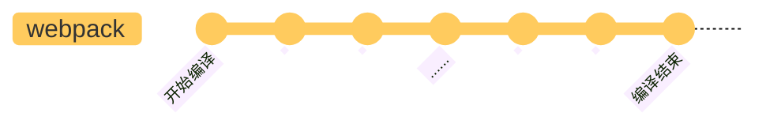
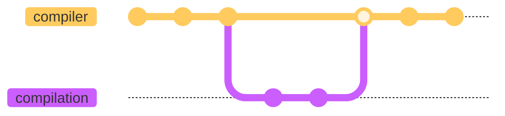

# 准备工作

本文先简单介绍一下 webpack 的事件流机制，以及 compiler 和 compilation 这两个核心对象。

## 事件流机制

webpack 的编译过程是一个基于 [Tapable](https://github.com/webpack/tapable) 的事件流，简单来说，就是在 webpack 处理的每个关键节点，都定义了相应的事件，在使用时，可以通过 Tapable 提前注册事件处理函数，在处理到对应的节点时，就会调用已经注册的处理函数。



Tapable 类似于 EventEmitter，或者更简单的 [mitt](https://github.com/developit/mitt)，是一个事件发布/订阅的工具。示例如下

```js
const { SyncHook } = require("tapable");

// 定义 hooks
class Car {
  constructor() {
    this.hooks = {
      brake: new SyncHook(),
    };
  }
}

const myCar = new Car();

// 注册钩子函数
myCar.hooks.brake.tap("test", () => console.log("test"));

// 触发事件
myCar.hooks.brake.call();
```

特别的是，webpack 中注册处理函数的方式是插件，因此 webpack 中的插件可以理解为事件处理函数。

:::info 🤔
首先有这样一个印象，webpack 函数处理文件时，从输入到输出的执行过程，就是一个事件流，在各个节点抛出事件，执行通过插件注册的处理函数。
:::

## 两个核心对象

| 对象        | 功能                   |
| ----------- | ---------------------- |
| compiler    | 整体调度，配置信息保存 |
| compilation | 一次具体的编译过程     |

compiler 保存 webpack.config.js 的配置转换后的信息，也就是”该怎样去构建“的描述，负责整体的调度。compilation 负责一次具体的编译过程，当文件变化需要重新编译时，会生成一个新的 compilation 对象，负责这一次新的构建。



## 调试方法

下载 webpack 仓库

```js
git clone https://github.com/webpack/webpack.git

cd webpack
mkdir debug
touch start.js
```

创建配置文件，入口文件
<Tabs>
<TabItem value="webpack.config.js" label="webpack.config.js" default>

```js
const path = require("path");
module.exports = {
  target: "web",
  mode: "development",
  entry: {
    app: "./app.js",
  },
  output: {
    filename: "[name][fullhash].js",
    path: path.resolve(__dirname, "dist"),
    publicPath: "",
  },
  devtool: "source-map",
  module: {
    rules: [
      {
        test: /\.js$/i,
        use: {
          loader: "babel-loader",
          options: {
            presets: ["@babel/preset-env"],
          },
        },
      },
      {
        test: /\.css$/i,
        loader: "css-loader",
      },
    ],
  },
};
```

</TabItem>
<TabItem value="app.js" label="app.js">

```js
const a = 23;
console.log("Hello World!!!", a);
```

</TabItem>
<TabItem value="start.js" label="start.js">

```js
const webpack = require("../lib/index.js");
const config = require("./webpack.config");
const compiler = webpack(config);
compiler.run((err, stats) => {
  if (err) {
    console.error("err");
  } else {
    console.log("stats");
  }
});
```

</TabItem>
</Tabs>

在 vscode 中添加一个 launch 配置

```js
{
  // 使用 IntelliSense 了解相关属性。
  // 悬停以查看现有属性的描述。
  // 欲了解更多信息，请访问: https://go.microsoft.com/fwlink/?linkid=830387
  "version": "0.2.0",
  "configurations": [
    {
      "type": "node",
      "request": "launch",
      "name": "启动webpack调试程序",
      "skipFiles": ["<node_internals>/**"],
      "program": "${workspaceFolder}/debug/start.js"
    }
  ]
}

```

添加 program 文件地址为 start.js，然后尝试执行编译

```js
node debug/start.js
```

如果正常产出了 dist，说明配置正常，后面可以直接在 vscode 中添加断点，使用源码调试了。
