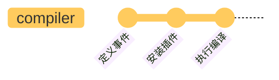

# compiler

compiler 保存配置信息，根据配置定义和发布事件，负责整体的调度。

## 前置概览

省略了暂时不必关注的内容，webpack 定义过程如下

```js title="lib/webpack.js"
const webpack = (options, callback) => {
  // 创建编译器
  let compiler = createCompiler(options);

  // ...

  // 执行编译
  compiler.run();

  return compiler;
};
```

options 可理解为 `webpack.config.js` 配置，callback 暂不用关注。createCompiler 如下

```js title="lib/webpack.js"
const createCompiler = (options) => {
  // 1. 设置默认配置，并与options的配置合并，初始化 compiler
  options = new WebpackOptionsDefaulter().process(options);
  const compiler = new Compiler(options.context);
  compiler.options = options;

  // 2. 安装插件
  new NodeEnvironmentPlugin({
    infrastructureLogging: options.infrastructureLogging,
  }).apply(compiler);

  if (Array.isArray(options.plugins)) {
    for (const plugin of options.plugins) {
      if (typeof plugin === "function") {
        plugin.call(compiler, compiler);
      } else {
        plugin.apply(compiler);
      }
    }
  }

  // 3. 发布环境状态事件
  compiler.hooks.environment.call();
  compiler.hooks.afterEnvironment.call();

  // 4. 根据 options 设置插件
  compiler.options = new WebpackOptionsApply().process(options, compiler);
  return compiler;
};
```

内容很多，已经在代码中做了简要注释，下面分节介绍。

<!-- 理解 hooks 和 plugin 相关的初始化，对于理解 Webpack 工作流程至关重要。 -->

## 实例化

```js
compiler = new Compiler(options.context);
compiler.options = options;
```

`options.context` 是执行时指定的配置文件所在的目录，如下就是 config 目录的路径。

```shell
config
└── webpack.config.js
```

Compiler 的定义 如下

```js
const {
  SyncHook,
  SyncBailHook,
  AsyncParallelHook,
  AsyncSeriesHook,
} = require("tapable");

class Compiler {
  /**
   * @param {string} context the compilation path
   */
  constructor(context) {
    // 定义钩子
    this.hooks = Object.freeze({
      shouldEmit: new SyncBailHook(["compilation"]),
      done: new AsyncSeriesHook(["stats"]),
      /** @type {SyncHook<[Stats]>} */
      afterDone: new SyncHook(["stats"]),
      /** @type {AsyncSeriesHook<[]>} */
      additionalPass: new AsyncSeriesHook([]),
      /** @type {AsyncSeriesHook<[Compiler]>} */
      beforeRun: new AsyncSeriesHook(["compiler"]),
      /** @type {AsyncSeriesHook<[Compiler]>} */
      run: new AsyncSeriesHook(["compiler"]),
      /** @type {AsyncSeriesHook<[Compilation]>} */
      emit: new AsyncSeriesHook(["compilation"]),
      /** @type {AsyncSeriesHook<[string, AssetEmittedInfo]>} */
      assetEmitted: new AsyncSeriesHook(["file", "info"]),
      /** @type {AsyncSeriesHook<[Compilation]>} */
      afterEmit: new AsyncSeriesHook(["compilation"]),
      // ...省略其他 hooks 定义
    });

    this.context = context;
    this.options = /** @type {WebpackOptions} */ ({});

    // ...一堆属性初始化
  }

  // ...实例化过程不调用其他方法，暂不用关注
}
```

`compiler.hooks` 定义了 compiler 所支持的所有事件，具体可参考[Compiler Hooks](https://webpack.js.org/api/compiler-hooks/)，由此 compiler 具备了事件发布/订阅的能力。compiler 执行过程中在对应的节点会发布相应的事件，触发已注册的处理函数执行。

## 插件安装

👨‍💻‍ Go On... 👨‍💻‍

```js
const createCompiler = (options) => {
  // ...
  new NodeEnvironmentPlugin({
    infrastructureLogging: options.infrastructureLogging,
  }).apply(compiler);

  if (Array.isArray(options.plugins)) {
    for (const plugin of options.plugins) {
      if (typeof plugin === "function") {
        plugin.call(compiler, compiler);
      } else {
        plugin.apply(compiler);
      }
    }
  }

  // ...
};
```

插件具有统一的结构，都是通过 apply 函数进行安装，而且 apply 的参数都是 compiler，这个函数的主要作用是注册编译过程的事件处理函数，也可以在 compiler 上定义一些属性。以这里的 NodeEnvironmentPlugin 为例，它最终是给 beforeRun 添加一个订阅函数。

```js
class NodeEnvironmentPlugin {
  constructor(options) {
    this.options = options || {};
  }

  apply(compiler) {
    // ...省略
    compiler.hooks.beforeRun.tap("NodeEnvironmentPlugin", (compiler) => {
      // ...
    });
  }
}
```

具体的插件机制，一些插件的重要能力，这里暂且不提，NodeEnvironmentPlugin 其实有很多重要作用，这里都暂且不提。

:::info 🤔
在 compiler 初始化之后是执行插件的安装，插件的安装是订阅编译过程中的事件。
:::

## 发布环境事件

👨‍💻‍ Go On... 👨‍💻‍ 在定义了事件，也添加了一些订阅事件之后，是内置的环境相关事件的发布，如下

```js
const createCompiler = (options) => {
  // ...发布环境状态相关的事件
  compiler.hooks.environment.call();
  compiler.hooks.afterEnvironment.call();

  // 根据options 设置插件
  compiler.options = new WebpackOptionsApply().process(options, compiler);
  return compiler;
};
```

这就表示环境已经准备好了。这里有点不太理解的地方，为什么不是最后再发布环境事件，而要在 compiler.options 设置之前呢？不过这个细节或许也不太重要。

## 内置插件安装

最后是根据传递的 options，去安装内置插件

```js
compiler.options = new WebpackOptionsApply().process(options, compiler);
```

这个初始化负责将 options 参数，转换为 Webpack 内部插件来处理，部分内容如下

```js
class WebpackOptionsApply extends OptionsApply {
  // ...
  process(options, compiler) {
    // ...
    new EntryOptionPlugin().apply(compiler); // 在这里对 entry 多种配置形式进行了统一处理转换
    compiler.hooks.entryOption.call(options.context, options.entry);
    // ...
    if (typeof options.mode !== "string") {
      const WarnNoModeSetPlugin = require("./WarnNoModeSetPlugin");
      new WarnNoModeSetPlugin().apply(compiler);
    }
    if (options.optimization.removeAvailableModules) {
      const RemoveParentModulesPlugin = require("./optimize/RemoveParentModulesPlugin");
      new RemoveParentModulesPlugin().apply(compiler);
    }
    if (options.optimization.removeEmptyChunks) {
      const RemoveEmptyChunksPlugin = require("./optimize/RemoveEmptyChunksPlugin");
      new RemoveEmptyChunksPlugin().apply(compiler);
    }
    // ...
    return options;
  }
}
```

以上只展示了原代码的一小部分内容，概括来说，这就是根据 options 中的配置，引入一个个内部提供的插件进行处理。基本上是下面这样的一个转换

```js
if (options.somePlugin) {
  const Plugin = require('./relative/path/to/somePlugin')；
  new Plugin().apply(compiler);
}
```

这一步将 webpack 插件的设计体现的淋漓尽致。

## 准备开始编译

创建 compiler 之后调用 `compiler.run` 开始执行编译，这个方法核心过程如下

```js title="webpack/lib/Compiler.js"
run(callback) {
  // ...

  this.hooks.beforeRun.callAsync(this, err => {
    if (err) return finalCallback(err);

    this.hooks.run.callAsync(this, err => {
      if (err) return finalCallback(err);

      this.readRecords(err => {
        if (err) return finalCallback(err);

        this.compile(onCompiled);
      });
    });
  });
}
```

从上面看，依次触发 `beforeRun`，`run` 两个事件，这两个事件的回调执行完成之后，最终调用 compile 函数。compile 表示一次编译，onCompiled 这个回调函数是编译完成之后执行的。

```js title="lib/Compiler.js"
compile(callback) {
  const params = this.newCompilationParams();
  this.hooks.beforeCompile.callAsync(params, err => {
    this.hooks.compile.call(params);
    // highlight-next-line
    const compilation = this.newCompilation(params);
    // highlight-next-line
    this.hooks.make.callAsync(compilation, err => {
      process.nextTick(() => {
        // highlight-next-line
        compilation.finish(err => {
          // highlight-next-line
          compilation.seal(err => {
            this.hooks.afterCompile.callAsync(compilation, err => {
              return callback(null, compilation);
            });
          });
        });
      });
    });
  });
}
```

以上依次触发了 `beforeCompile`, `compile`, `make` 事件，从调用 compiler.run 到 hooks.make，都只是在做准备工作，每个节点都通知一下，到了 make 这个位置，才是最后大哄一声 —— 现在真的要开始了 😂。

## 小结

总结来说，compiler 初始化的过程，都围绕着 hooks 和 plugins 进行

- 定义事件：编译器支持那些事件
- 订阅事件：或者也可以说是安装插件，通过配置的，内置的插件订阅了编译过程的事件
- 发布事件：初始化本身也是编译过程的一部分，有一些事件节点

或者最简单来说，compiler 的初始化过程，就当做是下面这样 3 个步骤就可以



让我觉得很受启发的，是 options 配置的各项转换为插件这个处理，很有意思。

:::info 🤔
本文只是编译过程的一个主要流程概览，真的深入去看更细节的内容的话，还有很多很多，比如内置插件安装的过程，如何实现 watch 重新编译等，这些内容过细了，暂时先把握主流程即可。
:::
