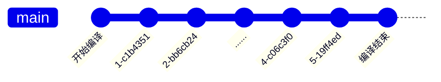

# webpack

> webpack is a static module bundler for modern JavaScript applications. When webpack processes your application, it internally builds a dependency graph which maps every module your project needs and generates one or more bundles.

相关源码说明主要基于

| pkg         | version          |
| ----------- | ---------------- |
| webpack     | v5.0.0-beta.12。 |
| webpack-cli | 4.6.0            |

webpack 的核心组成如下

| 组成    | 说明                         |
| ------- | ---------------------------- |
| Entry   | 编译入口                     |
| Output  | 输出                         |
| Loaders | 特定类型文件转换处理         |
| Plugins | 编译过程中的任务处理，可插拔 |

webpack 从 Entry 开始分析，收集依赖，生成依赖地图，通过 Loaders 转换各个模块。在整个处理过程中，在每个关键节点，根据需要应用不同的 Plugin，用于处理 Loader 之外的所有其他任务。

## 事件流机制

webpack 的处理过程是一个基于 [Tapable](https://github.com/webpack/tapable) 的事件流，简单来说，就是在 webpack 处理的每个关键节点，都定义了相应的事件，在使用时，可以通过 Tapable 提前注册事件处理函数，在处理到对应的节点时，就会调用已经注册的处理函数。



Tapable 类似于 EventEmitter，或者更简单的 [mitt](https://github.com/developit/mitt)，是一个事件发布/订阅的工具。示例如下

```js
const { SyncHook } = require("tapable");

// 定义钩子
class Car {
  constructor() {
    this.hooks = {
      brake: new SyncHook(),
    };
  }
}

const myCar = new Car();

// 注册钩子函数
myCar.hooks.brake.tap("test", () => {
  console.log("test");
});

// 触发事件
myCar.hooks.brake.call();
```

特别的是，webpack 中注册处理函数的方式是插件，因此，webpack 中的插件可以理解为事件处理函数。
