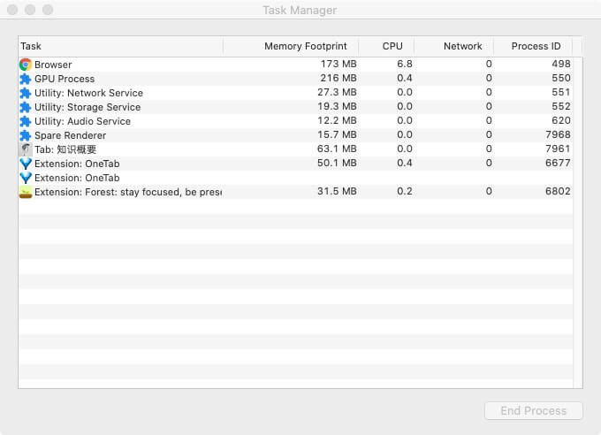
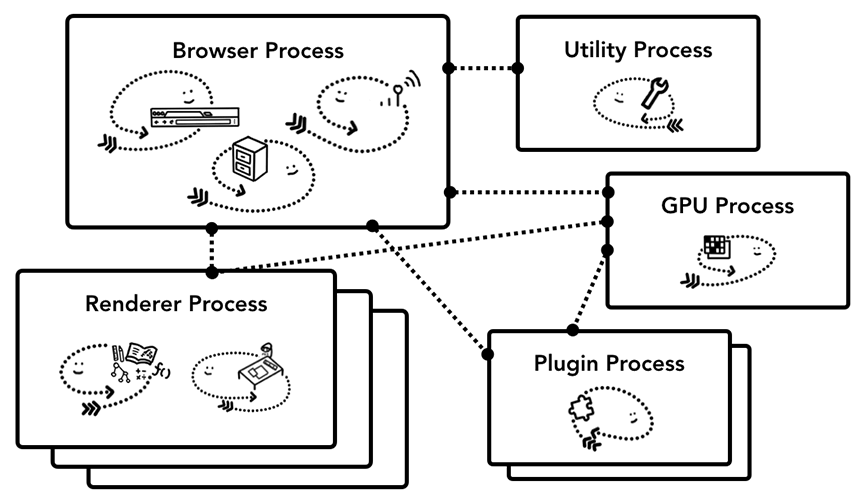
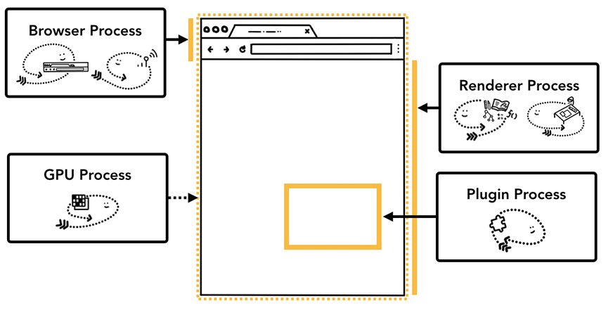
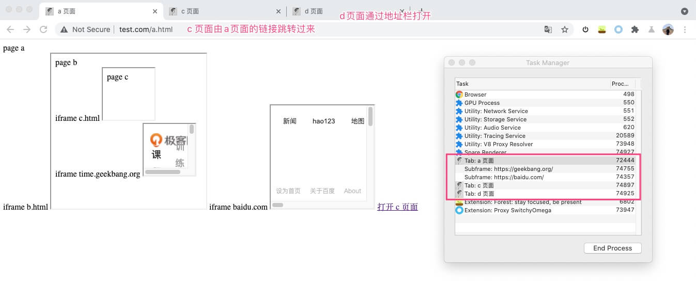

# 多进程架构

在 以 Chrome 为例，说明浏览器的多进程架构，多进程架构的好处，一些注意点。

## 进程分类

在 Chrome 标签栏空白处右键 -> Task Manager，显示的进程如下

有 Browser，Tab，Extension，GPU 等几类进程，各类进程之间的关系如图中所示

Browser 进程是主进程，负责整体的调度。

通过 IPC 与其他进程进行交互，其他进程的 Storage 和 Network 等基础服务，都必须通过主进程间接调用。

- Browser：进程负责整体的调度
- Utility：底层的基础服务，比如网络请求，存储服务
- Plugin：负责浏览器插件管理
- Renderer Process: 负责页面解析渲染，也就是我们平时说的渲染进程，是我们开发时主要关注的进程
- GPU Process: 负责整个浏览器界面的显示

具体到浏览器的整个界面上，各类进程负责的部分如下

图源 developers.google.com

Tab 栏和地址栏这些浏览器的”操作“，都由主进程处理，由此我们可以想到在地址栏输入 URL 时，主进程和渲染进程，网络进程等之间会进行一些通信。

## 未来已来 - SOA

在上一节 Task Manager 的显示中，Storage，Network 等 Utility 服务，也是以进程的形式存在。但是这些服务，其”进程“的特征在逐渐弱化，逐渐走向幕后做默默贡献，这是 Chrome 架构走向 SOA(Services Oriented Architecture，面向服务的架构) 的一个体现

Chrome 的弹性架构，能够根据设备的情况，选择将 Utility 服务作为一个单独的进程，还是合并到主进程中进行使用。条件好，就放肆玩耍，每个服务作为进程单独给资源，条件差点，就大家挤挤。

## 渲染进程的隔离与共享

渲染进程是我们主要关注的进程，首先提出两个问题：

- 为什么有的时候页面崩溃，是一批页面一起崩溃？
- 页面和页面中的 iframe 是共用渲染进程的吗？

通过 [一个例子](http://demo.mayueyue.com/html/browser-process/a.html) 来回答这个问题

在这个例子中

- a 页面：iframe 嵌套了 b 页面 和 百度首页
- b 页面：iframe 嵌套了 c 页面 和 极客时间首页
- a,b,c,d 页面是同一个站点页面
- c 页面由 a 页面链接打开
- d 页面从地址栏输入回车打开

由最终结果可知

### 渲染进程共享

同一个站点的页面，两种情况会共享

- 通过 iframe 嵌套
- 通过链接打开

正是由于渲染进程复用，尤其是第二种情况的复用，导致在页面崩溃时，很多时候是多个页面一起崩。

### 渲染进程隔离

- iframe 嵌套的页面，如果不同站点，是单独的渲染进程
- 通过地址栏打开的页面，不与其他页面复用，有单独渲染进程

:::caution
更新地址
:::

## 总结与参考

Chrome 的多进程架构，正处在由原来的多进程架构到面向服务的架构演变当中，服务化是一个趋势，而 Chrome 也越来越像一个操作系统。

相关的概念之前零零散散大概都知道，本文较大程度参考了这个文章，主要是借用了图片，借用一些图例进行一个总结概括。

[Inside look at modern web browser (part 1)](https://developers.google.com/web/updates/2018/09/inside-browser-part1)

在了解了多进程架构之后，可以再进一步研究 IPC，研究在一个渲染流水线中各个进程之间的配合过程，可参考下面这篇文章

[Inside look at modern web browser (part 2)](https://developers.google.com/web/updates/2018/09/inside-browser-part2)
