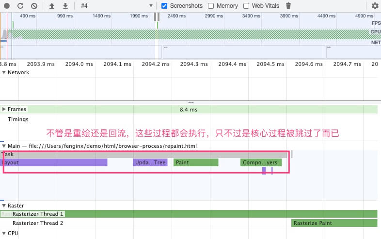
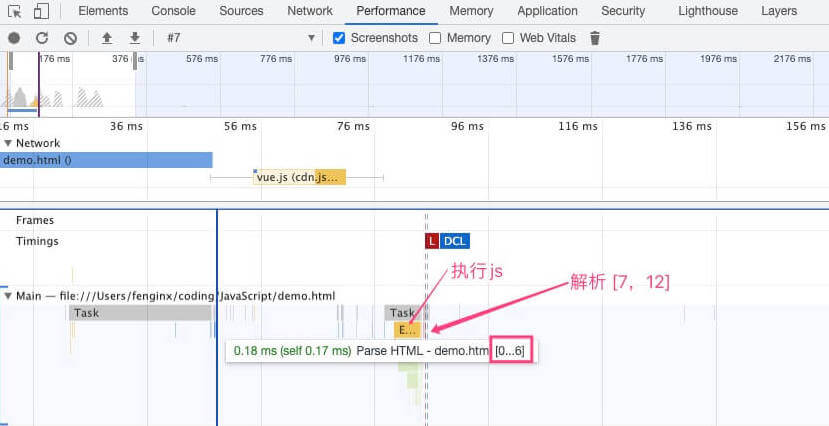
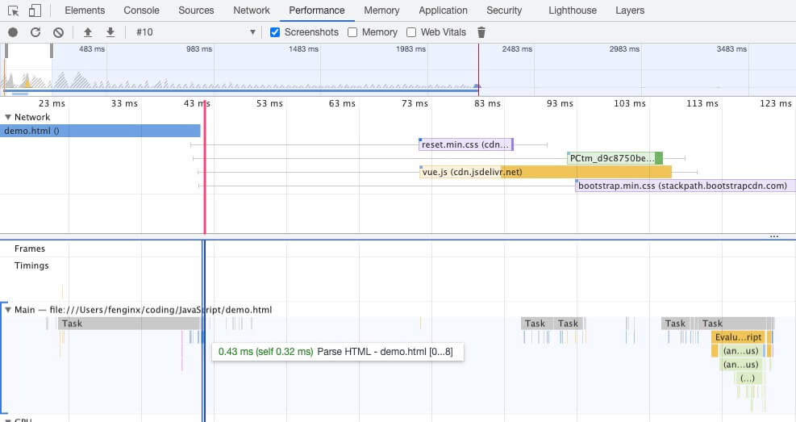

# 渲染流程

渲染流程的基本流程

<RenderFlow />

|   步骤    | 目的           | 描述                                                                          |
| :-------: | -------------- | ----------------------------------------------------------------------------- |
|    DOM    | 生成 DOM       | HTML 解析，边下载边解析                                                       |
|   Style   | 生成 CSSOM     | 解析 CSS，可通过 document.styleSheets 查看                                    |
|  Layout   | 确定尺寸和位置 | 组合 DOM 和 CSS 计算每个节点的样式和位置，剔除不可见(display: none)节点       |
|   Layer   | 确定绘制顺序   | 根据 z-index 等，遍历布局树，布局树进行分层，生成图层树，每个图层是一个布局树 |
|   Paint   | 生成绘制指令   | 遍历图层树，一层一层，遍历每层的布局树，生成每一层的绘制指令                  |
| Composite | 合成显示       | 合成，栅格化，GPU 生成位图等                                                  |

有时候会把 Layout 和 Layer 统称为 Layout，为了突出 Layer 这个过程，我选择单独提取出来。具体可以参考 [Inside look at modern web browser (part 3)](https://developers.google.com/web/updates/2018/09/inside-browser-part3)，里面的图示很清晰地表现了各个步骤的目的，说的很好，但需要一定的积累和研究才能比较深刻地验证和领会。

## 重绘

重绘是指在节点发生外观上的变化时要进行的操作，这些改变只是外观或可见性上的改变，不影响布局。比如说颜色，可见性(visibility) 的改变。根据它的名称 repaint 可知道重绘的代价，如下

<RenderFlow type="repaint" />

跳过了 Layout 和 Layer。

## 回流

与重绘相比，回流的代价更大，但触发的场景也更多。DOM，字体，窗口大小，内容文字调整等的变化，甚至于通过 offsetWidth 等获取尺寸或位置属性访问，都可能导致回流。

回流(reflow)，我更愿意称之为重排或者重新布局(relayout)，这样比较明确是需要重新布局排列

<RenderFlow type="reflow" />

很明显相对于重绘，回流代价更大。

## 重绘和回流的”跳过“

这小节提一个很多人不知道的细节 —— **重绘和回流，在性能分析面板里面，其实是一样的流程**。

检查是否需要做某件事情，在代码组织上可以有两种方式

```js
// 检查在外部
function process() {
  if (needReLayout()) {
    layout();
  } else {
    // ...
  }
}

// 在内部检查
function layout() {
  if (needReLayout()) {
    // ...
  } else {
    // ...
  }
}
```

采用的是第二种方式，毕竟各自的事情各自做，是否需要重新布局，那你的布局条件老复杂了，要怎么检查得自己才知道呀。在 Performance 面板里面，即使是重绘，也仍会看到有 Layout, Layer 这些过程



可以打开这两个页面例子对比一下 [重绘示例](http://demo.mayueyue.com/html/browser-process/repaint.html)，[回流示例](http://demo.mayueyue.com/html/browser-process/reflow.html)。

两者的流程仍是一样的，不过回流的执行时间会比较长

## 优化

关于重绘和重排的优化，优化有几个思想

- 次数变多为少
- 变重排为重绘
- 变重绘为...不需要重绘
- 减少改变的图层数

我觉得首要就是遵循一些基本的实践要求如

- fragment 和 display:none 等合并操作，减少 DOM 的增删改次数。
- 减少访问 offsetXXX 等位置，尺寸信息。

**transition 不会触发回流?**

```js
element.style.setProperty("transform", "translate(10px, 10px);");
```

其实是会的，使用 `translate3d` 触发 GPU 加速才不会触发回流。

根据不同的场景，团队应当根据具体实践有一套规则，目前我觉得我的实践场景过少，还没有这方面可落地的详细规则。

一方面，像 Vue 等框架其实已经做了很多这样的优化，很多时候并不需要直接去考虑。

另一方面，我觉得精细化的优化，较高依赖于团队成熟度。

## JS 阻塞

遇到 JS，会先下载 JS 并执行，因为 JS 中可能会修改到 DOM，在消除这个可能性之前，往下做的工作都可能会需要返工，可能是徒劳的。有点像需求开发过程中 PM 说可能变更需求，那自然得慎之又慎，确认之后再继续可能受影响的工作。

通过一个例子来看一下

```html
<!DOCTYPE html>
<html lang="en">
  <head>
    <title>JS的阻塞性</title>
  </head>
  <body>
    <div class="demo">hello</div>
    <script src="https://cdn.jsdelivr.net/npm/vue/dist/vue.js"></script>
    <div class="demo">world</div>
  </body>
</html>
```

结果如下



JS 阻塞从图中标注可以看出，在第 8 行遇到 JS 加载，需要等待 JS 加载并执行之后，再继续解析后面[7,12]行的内容，这体现的 JS 的阻塞性。

此外，由于 JS 中可能会进行 style 等样式相关的操作，在 JS 执行之前，要解析之前的所有 CSS 样式

```html
<body>
  <link rel="stylesheet" href="https://stackpath.bootstrapcdn.com/bootstrap/4.3.1/css/bootstrap.min.css" />
  <script>
    console.log('hello');
    // 即使没有操作CSSOM，也要等前面的CSS加载完之后才能执行
  </script>
  <link rel="stylesheet" href="https://cdn.jsdelivr.net/npm/reset-css@5.0.1/reset.min.css"></link>
</body>
```

在上述代码中，脚本执行之前，必须要加载完 bootstrap.min.css 脚本才能执行，但是对后面的 reset.min.css 就没要求了。如果是在 <head></head>里面呢？一样的，浏览器才不给你做特殊处理。

总结来说

- JS 可能会操作 DOM，所以阻塞了向下解析。
- JS 可能会操作 CSSOM，所以必须等待其前面的 CSS 加载完成。

## CSS 阻塞

有三个点，在上面的例子中其实已经体现了

- CSS 加载不直接阻塞解析
- CSS 加载阻塞 渲染
- CSS 阻塞其后 JS 的执行，间接阻塞解析；

## 预解析

关于页面解析，如下两个知识我们是知道的

页面是从上往下解析
JS 会阻塞页面解析
那么，如果我有下面连续的几个 js 文件加载，按照上面的两个点，这会是一个个串行加载？

```html
<script src="bundle1.js"></script>
<script src="bundle2.js"></script>
<script src="bundle3.js"></script>
<script src="bundle4.js"></script>
```

显然不！当然不！

- JS 文件可以并行加载
- JS 文件可以与其他文件并行加载

这就涉及到 **预解析** 优化了。渲染引擎收到 html 文件的字节流之后，会开启一个线程去预解析，看看依赖了哪些文件，提前下载依赖的 js, css, img 等文件。



从结果中可以看到，在 Parse HTML 之前之前已经开始了三个文件下载相关的工作了，解析之前就知道要下载什么文件了。
