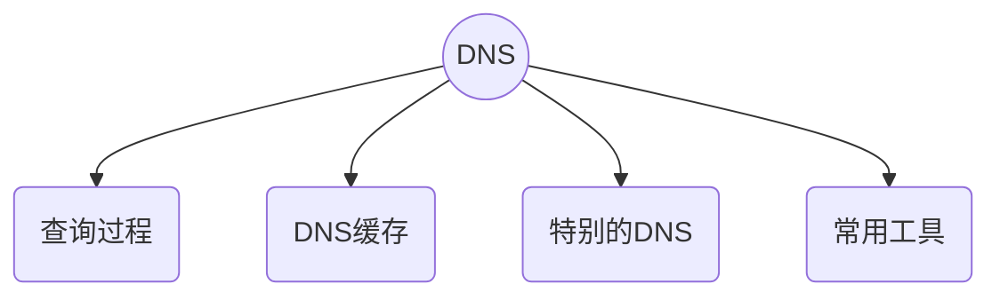
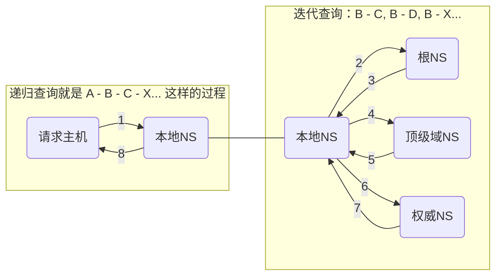

# DNS

DNS 相关的内容，包含



为了方便，后面统一使用 NS 表示 NS

## 查询过程

在对外查询之前，本机的查找过程是


### 本地查找

在本设备查找缓存的过程

##### 浏览器

以 Chrome 为例，在之前的版本，DNS 相关的内容可以在以下页面查看

```text
chrome://net-internals/#dns
```

新版的 Chrome 已经移除了具体的缓存展示，只有 lookup 和 clear 功能。现在需要在 [chrome://net-export](chrome://net-export) 导出缓存文件，然后使用 [netlog_viewer](https://netlog-viewer.appspot.com/) 查看。

> The net-internals events viewer and related functionality has been removed. Please use [chrome://net-export](chrome://net-export) to save netlogs and the external [netlog_viewer](https://netlog-viewer.appspot.com/) to view them.

示例如下


浏览器中的 TTL 是毫秒数，表示浏览器缓存的有效时间，与 Expires 有对应关系。域名的 TTL 在权威 DNS 配置，本地 DNS 会缓存记录，
浏览器查到的 DNS 记录一般是本地 DNS 提供的

```text
浏览器里面的 TTL = 权威 NS 配置的 TTL - 本地 NS 已经缓存的时间
```

##### 系统缓存

操作系统中的缓存这块是和 `mDNSResponder` 这个程序有关，应该是在内存中，而不是持久到文件里面了，没有特别直接的方式能够查看缓存列表。
这块一般不关注到也没有太多关系。

清理缓存的方式是

```shell
sudo killall -HUP mDNSResponder
```

##### hosts

`/etc/hosts` 是一个本地持久的映射表，一般用来配置 localhost。

修改 hosts 文件后需要刷新系统缓存。

### 向外查询

服务器查找就是常说的递归查询和迭代查询两个过程。不考虑缓存的情况，查询过程如下



使用 dig 追踪迭代查找过程结果如下

```bash
➜  coding git:(master) dig www.baidu.com +trace

; <<>> DiG 9.10.6 <<>> www.baidu.com +trace
;; global options: +cmd
.   49654 IN NS a.root-servers.net.
.   49654 IN NS b.root-servers.net.
.   49654 IN NS c.root-servers.net.
.   49654 IN NS d.root-servers.net.
.   49654 IN NS e.root-servers.net.
.   49654 IN NS f.root-servers.net.
.   49654 IN NS g.root-servers.net.
.   49654 IN NS h.root-servers.net.
.   49654 IN NS i.root-servers.net.
.   49654 IN NS j.root-servers.net.
.   49654 IN NS k.root-servers.net.
.   49654 IN NS l.root-servers.net.
.   49654 IN NS m.root-servers.net.
.   49654 IN RRSIG NS 8 0 518400 20230305170000 20230220160000 951 . xU5kKOHDoGfyQVeW8Huv74NJxyAaKyuDUxli5P0K08z+vvLlA3N87OVL bhwoihWpKg+Of2S2nI6jx80n+S2Ty74PSOijnu9sW7vvTD30Wg1Vgtda rrOc2gf9UmDkT+mLda/IiX7DtAla76k9t+owykaxyPHfdkLH1cfZmGj6 0KPRJDf9gnopBomQIBa4/m3UqwJlefYA0Wr01Bs+BaCKHPQEnrBSsBYJ jBbFOkadtuXtVym5Bapg8TYJQQfJxlutIuuEyC1BDSqw33poKUcKzXg3 v7VIeHSq+wKaOyDt7m9wrCxOhj3uZurNO+b88xmtV4pX+HxRGs+Yx2QY kCGskQ==
;; Received 525 bytes from 8.8.8.8#53(8.8.8.8) in 97 ms
# 返回了根DNS的地址
# 从上面可以看到 DNS 使用了 8.8.8.8，而不是默认的DHCP下发的网关，这是绕过了本地DNS，使用8.8.8.8作为本地DNS

com.   172800 IN NS d.gtld-servers.net.
com.   172800 IN NS f.gtld-servers.net.
com.   172800 IN NS j.gtld-servers.net.
com.   172800 IN NS a.gtld-servers.net.
com.   172800 IN NS l.gtld-servers.net.
com.   172800 IN NS c.gtld-servers.net.
com.   172800 IN NS h.gtld-servers.net.
com.   172800 IN NS e.gtld-servers.net.
com.   172800 IN NS i.gtld-servers.net.
com.   172800 IN NS b.gtld-servers.net.
com.   172800 IN NS g.gtld-servers.net.
com.   172800 IN NS k.gtld-servers.net.
com.   172800 IN NS m.gtld-servers.net.
com.   86400 IN DS 30909 8 2 E2D3C916F6DEEAC73294E8268FB5885044A833FC5459588F4A9184CF C41A5766
com.   86400 IN RRSIG DS 8 1 86400 20230306050000 20230221040000 951 . GUAFdN2uybWtSv+N6uD2wXAooWUW4Cj3m0I+QHuypzTiBP0zJ7wN4wsD G3h0ft6euO83kGNFWIem4WkZdLgnPvCXNItRJutzWU8+wfNeLosBRhQX YWRlkFRfxp91NDUZ9xwCx1jMuElbmm+8tNl/q1r2BkdOK7FQvySRMjYa 2Hj+o9T1OKdCEmWNVR9y5m9nI7RP7HZ3PHcd5ust7UB5nYa9ArWOv11a kcaaJUJkq1IS8jrQfBG98p13t+0rwIJgpOmKjsYsysY9Xcj8kuh7qkMh Tj6H6QBgzYaPmvEE6Njwj+tHBxuRluB5sd16FnTM5nI7zBU7eSoYAZjS dn//Ng==
;; Received 1176 bytes from 193.0.14.129#53(k.root-servers.net) in 339 ms
# 根DNS返回了顶级DNS地址

baidu.com.  172800 IN NS ns2.baidu.com.
baidu.com.  172800 IN NS ns3.baidu.com.
baidu.com.  172800 IN NS ns4.baidu.com.
baidu.com.  172800 IN NS ns1.baidu.com.
baidu.com.  172800 IN NS ns7.baidu.com.
CK0POJMG874LJREF7EFN8430QVIT8BSM.com. 86400 IN NSEC3 1 1 0 - CK0Q2D6NI4I7EQH8NA30NS61O48UL8G5  NS SOA RRSIG DNSKEY NSEC3PARAM
CK0POJMG874LJREF7EFN8430QVIT8BSM.com. 86400 IN RRSIG NSEC3 8 2 86400 20230227052255 20230220041255 36739 com. YJw2xFEhDVUfIlym8yUrXw8rVYLxS+e/EkIJVmOkBANnfCmNPVATcGuM /DIrUz8PTWTezM5z6f2tM+KnzzXYMNL1ScDIgO/jaJUrs4aOz1EOPwD4 hk5rJ/pRSY9C87vRoxqdryDIHxg3TwwEfQglqQ9hk+P1qvU7qY5nd0yc tO+IV8Vqd0sRiteg/P1h6Bpp79v/kZNjntRTdnWLI2oW2g==
HPVV07LPQ3T8RQS9HETLBJF268LK3OQ2.com. 86400 IN NSEC3 1 1 0 - HPVV8SARM2LDLRBTVC5EP1CUB1EF7LOP  NS DS RRSIG
HPVV07LPQ3T8RQS9HETLBJF268LK3OQ2.com. 86400 IN RRSIG NSEC3 8 2 86400 20230225070303 20230218055303 36739 com. FQeSaunxrF7FE6Co6JgBsrP7awaHJkPuymX94sw+oemonApN2aLc1Ug6 v7F2Wkf4NeSCtfuHsyf1E6khUnkI5kOkTaKpMnNOtwu4xBPV64yWBI7X K7S5w4RzYTj5utuXypx2yz98Au6lW+/ZFWJAbEnV8luqT95D3l9zO/Mo AEfdxc6+mKcZPJa/SLkSXNazgQOW/evN36o+36XiZ731GA==
;; Received 849 bytes from 192.55.83.30#53(m.gtld-servers.net) in 254 ms
# 顶级DNS 返回了权威DNS地址

www.baidu.com.  1200 IN CNAME www.a.shifen.com.
;; Received 72 bytes from 180.76.76.92#53(ns7.baidu.com) in 9 ms
# 权威DNS返回了ip地址
```

其中，权威和本地两个名称，是不够清晰的，怎样才算权威？本地为何不是本机？

### 本地 NS

通过 DHCP 接入网络时，一般是 DHCP 下发的局域网 NS 地址，在 Mac 中会缓存到 `/etc/resolv.conf` 中

```text
#
# macOS Notice
#
# This file is not consulted for DNS hostname resolution, address
# resolution, or the DNS query routing mechanism used by most
# processes on this system.
#
# To view the DNS configuration used by this system, use:
#   scutil --dns
#
# SEE ALSO
#   dns-sd(1), scutil(8)
#
# This file is automatically generated.
#
nameserver 172.16.1.21
nameserver 172.16.1.22
```

将本地 NS 理解为运营商就可以了，毕竟即使中间还有局域网路由器，也是要转发到运营商。大部分的情况，都可以在本地 DNS 找到缓存记录。

### 权威 NS

权威 NS ，是距离研发人员比较近的，就是那些在阿里云，或者腾讯云域名解析时的服务提供商。

很多大厂都搭建了自己的 NS，比如前面看到的百度的一个 NS

```bash
ns7.baidu.com
```

又或者腾讯的

```bash
ns2.qq.com
```

## DNS 缓存

### 缓存刷新

### 缓存设置

有人的地方就有江湖，有 DNS 的地方就有缓存。

<!-- 本地DNS的理解，是一个重点 -->

## 特别的 NS

### HttpDNS

传统的 DNS 解析，在数据缓存更新，域名转发，域名更新(如机房切换)等存在一些问题。HTTP DNS，就是不走传统 DNS，自己搭建基于 HTTP 的 NS 集群。一般 HttpDNS 用于手机端应用，使用 SDK 加载缓存 HttpDNS Server 的 IP 列表，通过 HTTP 绕过传统 DNS 获得 IP。

### CdnDNS

CDN 一般会在权威 NS 中设置 CNAME，当访问某个域名，返回的不再是源站的 IP 地址，而是返回一个 CDN 域名，本地 NS 拿到这个域名之后，去访问 CDN 自己搭建的权威 NS ，这个 NS 再次返回负载均衡器的 CNAME，本地 DNS 再次请求负载均衡器即可得到缓存服务器的 IP。在获取到缓存服务器的 IP 之后，再依次访问边缘节点，区域节点，中心节点，最后回源。


## 相关工具

主要是两个 dig 和 nslookup

<!-- https://help.aliyun.com/document_detail/39799.html -->

## Q & A

<details>
  <summary>根服务器，顶级服务器都不止一个，本地NS如何知道向哪个发起请求？</summary>
  <div></div>
</details>

<details>
  <summary>本地NS如何知道根NS的地址？好像并没有人告诉它呀</summary>
  <div>写死的，只有13各，而且固定的IP</div>
</details>

<details>
  <summary>根NS只有13个，中国没有？那怎么办呢？</summary>
  <div></div>
</details>

<!-- 根NS的数据是同步的吗？如何知道某个域名已经被注册 -->

<!-- 本地dns为何不缓存顶级DNS？ -->

<!-- 114.114.114.114、8.8.8.8 -->
<!-- 添加解析记录后多久生效？
修改或删除解析后多久生效？
修改DNS服务器后多久生效？ -->
<!-- https://support.huaweicloud.com/dns_faq/dns_faq_013.html -->
<!-- DNS 劫持是什么 -->
