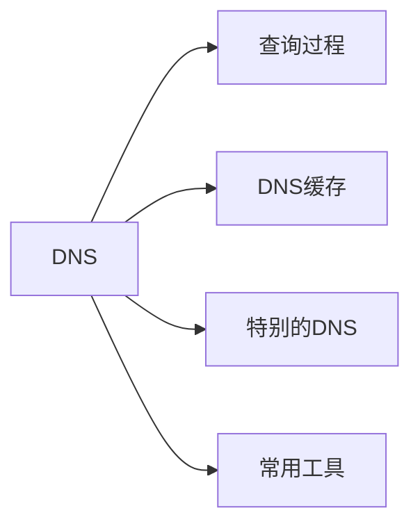
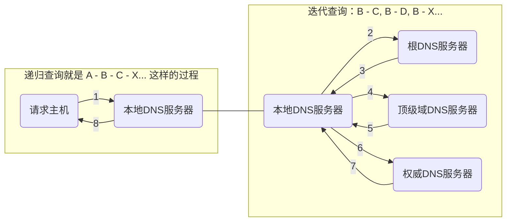

# DNS

DNS 相关的内容，包含



## 查询过程

在对外查询之前，本机的查找过程是


### 本地查找

##### 浏览器

以 Chrome 为例，在之前的版本，DNS 相关的内容可以在以下页面查看

```text
chrome://net-internals/#dns
```

新版的 Chrome 已经移除了具体的缓存展示，只有 lookup 和 clear 功能。现在需要在 [chrome://net-export](chrome://net-export) 导出缓存文件，然后使用 [netlog_viewer](https://netlog-viewer.appspot.com/) 查看。

> The net-internals events viewer and related functionality has been removed. Please use [chrome://net-export](chrome://net-export) to save netlogs and the external [netlog_viewer](https://netlog-viewer.appspot.com/) to view them.

示例如下


浏览器中的 TTL 是毫秒数，表示浏览器缓存的时间，与 Expires 有对应关系。域名的 TTL 在权威 DNS 配置，本地 DNS 会缓存记录，
浏览器查到的 DNS 记录一般是本地 DNS 提供的，一般而言

```text
浏览器里面的 TTL = 权威 NS 配置的 TTL - 本地 NS 已经缓存的时间
```

##### 系统缓存

操作系统中的缓存这块是和 `mDNSResponder` 这个程序有关，应该是在内存中，而不是持久到文件里面了，没有特别直接的方式能够查看缓存列表。
这块一般不关注到也没有太多关系。

清理缓存的方式是

```shell
sudo killall -HUP mDNSResponder
```

##### hosts

`/etc/hosts` 是一个本地持久的映射表，一般用来配置 localhost。

修改 hosts 文件后需要刷新系统缓存。

### 服务器查找

服务器查找就是常说的递归查询和迭代查询两个过程。不考虑缓存的情况，查询过程如下



其中，权威和本地两个名称，是不够清晰的，怎样才算权威？本地为何不是本机？

### 本地 DNS 服务器

本地 DNS 服务器这个概念可能不太清晰。当通过 DHCP 接入网络时，一般是 DHCP 下发的，在 Mac 中会缓存到 `/etc/resolv.conf` 中

```text
#
# macOS Notice
#
# This file is not consulted for DNS hostname resolution, address
# resolution, or the DNS query routing mechanism used by most
# processes on this system.
#
# To view the DNS configuration used by this system, use:
#   scutil --dns
#
# SEE ALSO
#   dns-sd(1), scutil(8)
#
# This file is automatically generated.
#
nameserver 172.16.1.21
nameserver 172.16.1.22
```

理解为运营商就可以了，毕竟即使中间还有局域网路由器，也是要转发到运营商。大部分的情况，都可以在本地 DNS 找到缓存记录。

### 权威 DNS 服务器

权威 DNS 服务器，是距离研发人员比较近的，就是那些在阿里云，或者腾讯云域名解析时的服务提供商。

## DNS 缓存

### 缓存刷新

### 缓存设置

有人的地方就有江湖，有 DNS 的地方就有缓存。

<!-- 本地DNS的理解，是一个重点 -->

## 特别的 DNS

### HttpDNS

传统的 DNS 解析，在数据缓存更新，域名转发，域名更新(如机房切换)等存在一些问题。HTTP DNS，就是不走传统 DNS，自己搭建基于 HTTP 的 DNS 服务器集群。一般 HttpDNS 用于手机端应用，使用 SDK 加载缓存 HttpDNS Server 的 IP 列表，通过 HTTP 绕过传统 DNS 获得 IP。

### CdnDNS

CDN 一般会在权威 DNS 服务器中设置 CNAME，当访问某个域名，返回的不再是源站的 IP 地址，而是返回一个 CDN 域名，本地 DNS 服务器拿到这个域名之后，去访问 CDN 自己搭建的权威 DNS 服务器，这个 DNS 服务器再次返回负载均衡器的 CNAME，本地 DNS 再次请求负载均衡器即可得到缓存服务器的 IP。在获取到缓存服务器的 IP 之后，再依次访问边缘节点，区域节点，中心节点，最后回源。


## 相关工具

主要是两个 dig 和 nslookup

<!-- https://help.aliyun.com/document_detail/39799.html -->

## Q & A

<details>
  <summary>根服务器，顶级服务器都不止一个，本地DNS服务器如何知道向哪个发起请求？</summary>
  <div></div>
</details>
