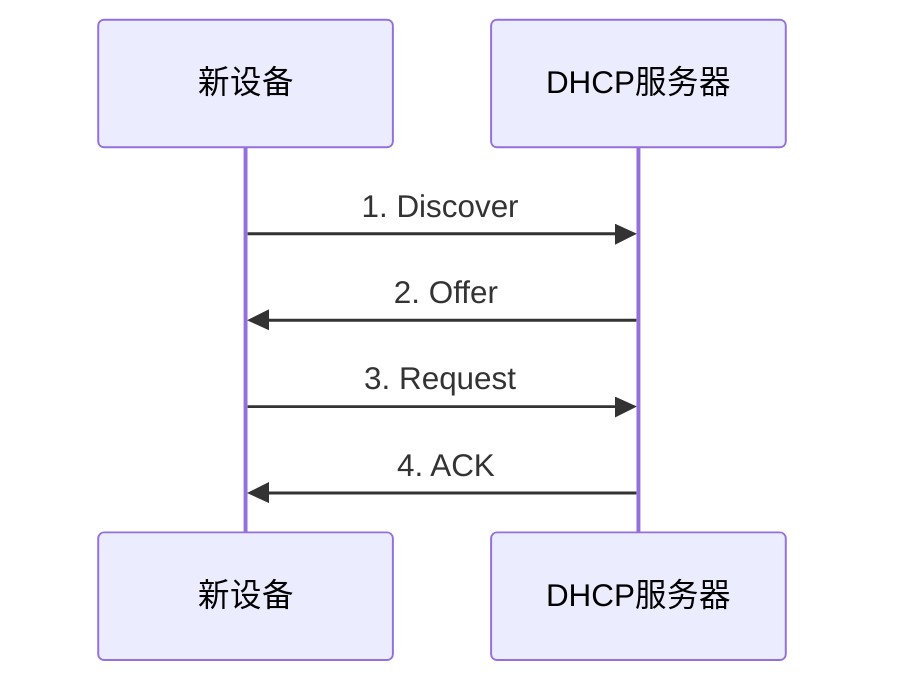

# DHCP

动态主机协议(Dynamic Host Configuration Protocol)，用以在局域网中设备接入分配 IP，基本的原理是接入设备和 DHCP Server 通过广播进行通信协商，协商好之后通过广播广而告之。

## 接入流程

新设备加入网络时，基本流程如下

连接过程抓包示意如下

<MyImg src={require("./assets/2023-02-20-11-02-28.png")} width="700px" />

### Discover

| 序号 | 说明                                                                       |
| ---- | -------------------------------------------------------------------------- |
| 13   | 新主机以 0.0.0.0 为 IP 地址，广播发送一个请求，这里关键是带上了 MAC 地址。 |

<MyImg src={require("./assets/2023-02-20-03-18-44.png")} width="600px" />

其中 DHCP 报文中出现的 [BOOTP](https://baike.baidu.com/item/BOOTP/610878?fr=aladdin) 是 DHCP 的前身，不必特意关注。

在 DHCP 沟通中， DHCP Server 是期望以单播的形式和设备沟通的，尽量减少对其他设备的打扰。
单播需要客户端协议栈的能力，因此这个 flags 字段就表示客户端的能力，0 表示支持单播，1 表示广播。

### Offer

| 序号 | 说明                                              |
| ---- | ------------------------------------------------- |
| 14   | DHCP 服务器返回一个 IP，告诉设备可以使用这个 IP。 |

这个报文可能是广播，也可能是单播，取决于 Discover 报文中的 flags 字段值。
由于是一个局域网中通信，虽然目的 IP 地址是尚未分配，但 MAC 地址存在，仍可达，主机的 DHCP 程序进行相应处理即可。

如果有多个 DHCP 服务器，新设备可能会收到多个 offer，它一般会接受最先收到的 offer，
因为这些 offer 没有薪资待遇团队等差异需要考虑，客户端也不在乎不能是 4 呀这些所谓不吉利的数字。

### Request

| 序号 | 说明                                  |
| ---- | ------------------------------------- |
| 16   | 广播告诉 DHCP Server，已经接受某个 IP |

新设备收到广播，发现是给自己分配 IP 的消息，很愉快地接收了，给 DHCP 服务器回复说接受 Offer 了。
这一步是广播的，因为 DHCP Server 也并不一定是唯一的。它准备接受某个 offer 的同时，也告诉其他服务器”我已经接受了其他公司的 offer“。

这与求职不一样，没有太多的套路，可以比较及时地坦诚沟通当前的状态，不用担心坑被占了怎样的。

<!-- 需要告诉其他 Server，它已经接受某个公司提供的 Offer 了。 -->

### ACK

| 序号 | 说明               |
| ---- | ------------------ |
| 16   | 确认接受设备的请求 |

服务器收到确认，它也很高兴，欢迎新主机加入。

### ARP 同步

| 序号  | 说明                             |
| ----- | -------------------------------- |
| 18-20 | 问一下这个 IP 是否有其他人还在用 |
| 21-23 | 声明已经占用这个 IP              |

通过 3 个 ARP Probe 广播询问”这个 IP 有人在用吗？没有人用我就用咯？“，一定时间没有收到回复说明没有人用，就正式使用这个 IP。
确认使用 IP 后，连续发出 3 个 ARP Announcement, 告诉其他设备，这个 IP 是我在用，你们可以存起来，有事打电话(根据 MAC)找我。

## 重连与续租

当本机网络断开，重新连接到网络，由于本机缓存了之前使用的 IP，会跳过 Discover 和 Offer，再次广播 Request 请求。

至于续租，这是客户端的行为，在租期过去一段时间后，请求续租，这个也是直接发起 Request 请求。

  
本机IP存储在哪里？

  

