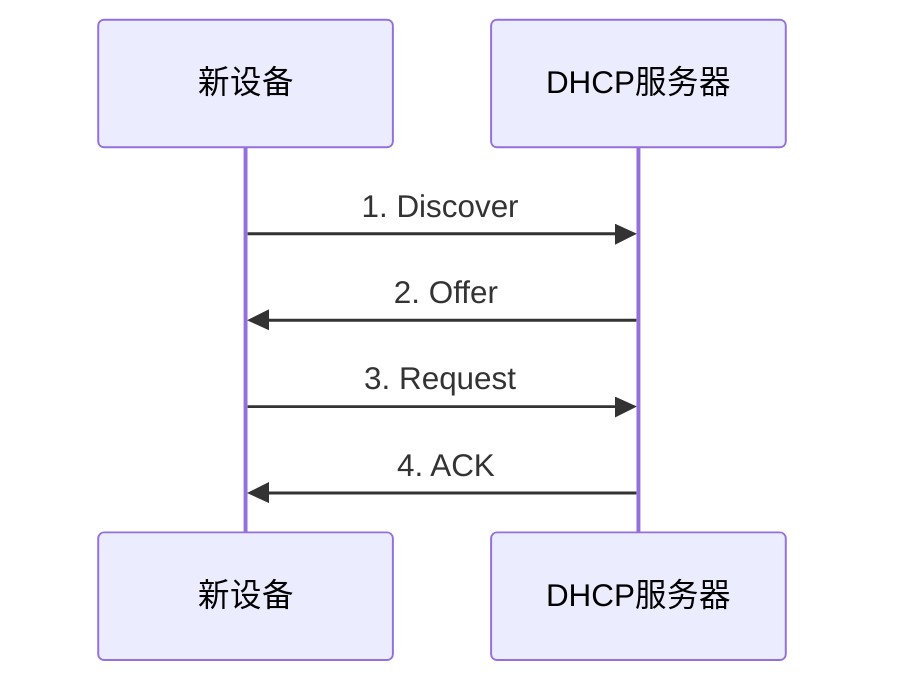
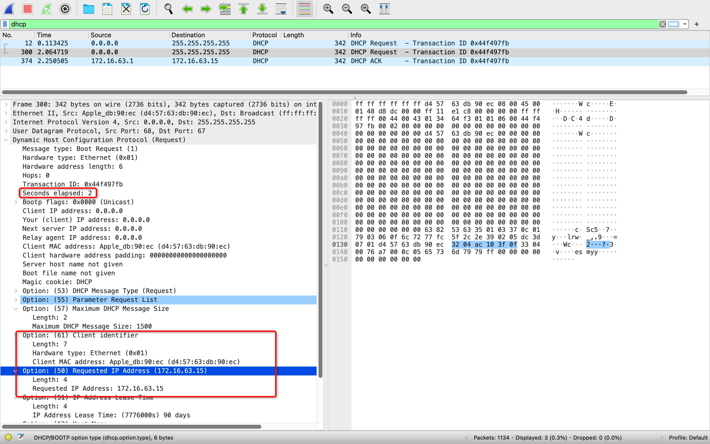

# DHCP

动态主机协议(Dynamic Host Configuration Protocol)，用以在局域网中设备接入分配 IP，基本的原理是接入设备和 DHCP Server 通过广播进行通信协商，协商好之后通过广播广而告之。

## 接入流程

新设备加入网络时，基本流程如下



这个过程跟求职有些类似。

### Discover

新主机以 0.0.0.0 为 IP 地址，广播发送一个请求，这里关键是带上了 MAC 地址。

<MyImg src={require("./assets/2023-02-20-03-18-44.png")} width="600px" />

其中DHCP报文中出现的 [BOOTP](https://baike.baidu.com/item/BOOTP/610878?fr=aladdin) 是DHCP的前身，不必特意关注。

### Offer

DHCP 服务器返回一个 IP，告诉设备可以使用这个 IP。

### Request

新主机收到广播，发现是给自己分配 IP 的消息，很愉快地接收了，给 DHCP 服务器回复说接受 Offer 了。注意这一步仍是广播的，因为 DHCP Server 也并不一定是唯一的

<!-- 需要告诉其他 Server，它已经接受某个公司提供的 Offer 了。 -->

### ACK

服务器收到确认，招到一个满意的新员工，它也很高兴，欢迎新主机加入

## 网络重连

当本机网络断开，重新连接到网络，由于本机内存中已经有 IP 了，会跳过 Discover 和 Offer，再次广播 Request 请求。



## 固定 IP

日常开发中，有时候为了开发方便，

可以通过 nmap 模拟一下

```bash
nmap --script broadcast-dhcp-discover
```

其中 DHCP Offer 响应如


从中可以看到 IP 的有效期是 2 hours。客户机在租期过去 50%，即 1 小时之后，会向 HTTP Server 请求续租，直接向为其提供 IP 的 DHCP Server 发送 DHCP Request，尝试使用原来的同一个 IP，这个时候客户机和服务器之间就不用广播了。

<!-- https://learn.microsoft.com/en-us/windows-server/troubleshoot/troubleshoot-problems-on-dhcp-client -->

<!-- 有MAC地址为什么还需要IP地址，从理论上，只有一个地址，能够替代吗 -->

## BOOTP

## 相关工具
