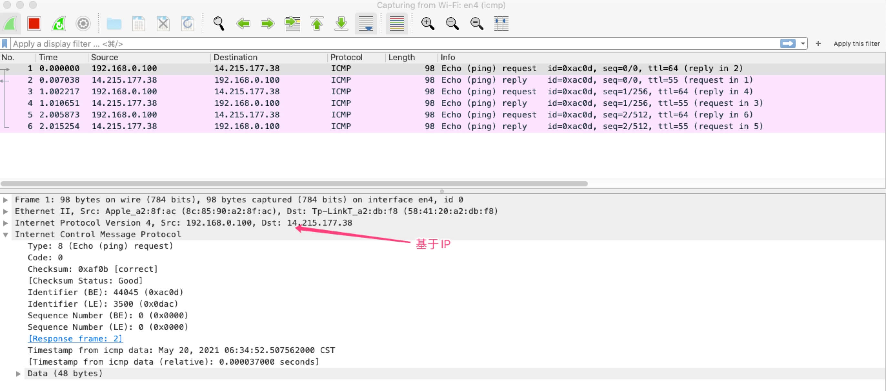
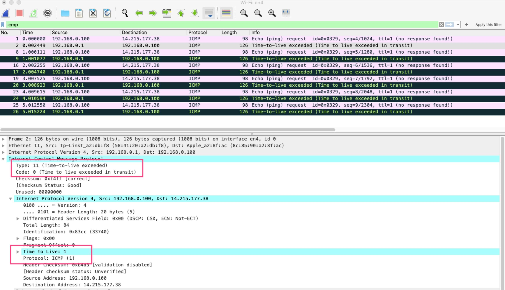
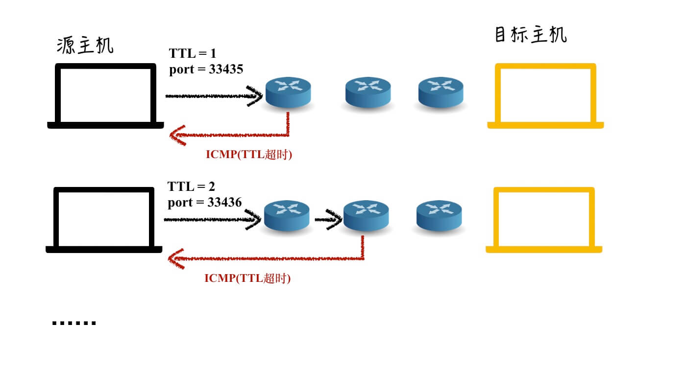

# ICMP

ICMP 全称 Internet Control Message Protocol，关键在于 Message，根据得到的消息做相应的处理，这个消息有主动获取的，有被动接收的。

使用 ICMP 的工具 ping, traceroute 等

## 报文格式

使用 ping 发送 ICMP 报文的抓包结果如下

 ICMP 报文中，需要稍微关注的字段(言下之意就是不需要记...记不住)的是 type 和 code

- type：消息类型，比如回显(echo) 请求，回显请求的应答，ping 请求是 8，ping 的响应是 0，不可达消息是 3。 消息含义的概括
- code：概括消息含义 典型的是 type 为 3 的情况表示不可达，而 code 进一步表示了是什么不可达，是协议(code 2)，还是端口(code 3)。
  从截图中可以看到，ICMP 是基于 IP 协议的，所以 ICMP 需要先发 DNS 查询，这就不用多解释了吧...ICMP 基于 IP，IP 要查的嘛。

# 报文分类

ICMP 报文一般分为 查询报文 和 差错报文，查询报文就是简单看一下能不能通，code 没有更多具体信息，而差错报文，code 会是概括错误信息的错误编号。

直白一点吧，查询报文就是 回显请求 和 回显请求的响应 这两种。理解为大约等价于 ping 的请求和响应也成。

- ping request：type 为 0，code 为 0
- ping response: type 为 8，code 为 0

查询报文有俩特点，请求是主动发出的，其次在 code，code 不代表更多信息了，因为也不需要更多信息，这是一个”是或者否“的问题。

差错报文就比较复杂了，不同的 type 和 code 组合代表了各种各样的差错信息。

### ping

ping 就是简单的发送 ICMP 包，可以用来探测主机是否可达，计算往返时间等。

反正一般觉得可能网络有问题了，我往往用来试一下网络是不是通的，这也是平时不多的用到 百度 的地方。

```bash
ping baidu.com
```

可以通过 ping 来看一下所谓的差错报文

```bash
# Mac 是 -m, Linux -t
ping baidu.com -m 1
```

以上指定了在 IP 报文中设置 TTL 为 1，这样就会超时，结果如下



由于我设置的 TTL 为 1，所以由我房间里的路由器(168.0.0.1)返回了 ICMP 差错报文。从图中也可以看到，不用去记那些啥 type，code 呀，抓包工具会告诉我们具体信息的，靠记...哪成呀。

### traceroute

traceroute 使用 UDP 协议，指定一个不可达端口，每次依次发送的报文 TTL 从 1 递增，链路上各个路由器由于 TTL 超时，返回一个 ICMP 消息通知源主机



## 总结

ping 和 traceroute 都是使用的 ICMP 协议。traceroute 基于 UDP，通过设置 TTL，中间路由在解析发现超时之后向源主机发送 ICMP 差错报文。

虽然是叫做 ICMP，但是其实是 M，然后 C，是接收到消息，然后进行相应的控制处理。

## Q & A

### ICMP 是哪层的协议

虽然 ICMP 是基于 IP 的，但一般认为 ICMP 属于网络层。这个就没必要纠结是哪一层了，各种解释，理由有一大堆。我觉得 IP 是用于 host-to-host 通信的，而 ICMP 针对的是目标主机，或者说目标 IP，能不能到达，好不好到达，是看这个 IP “好不好用”。RFC (opens new window)的说明如下

> ICMP, uses the basic support of IP as if it were a higher level protocol, however, ICMP is actually an integral part of IP, and must be implemented by every IP module.
