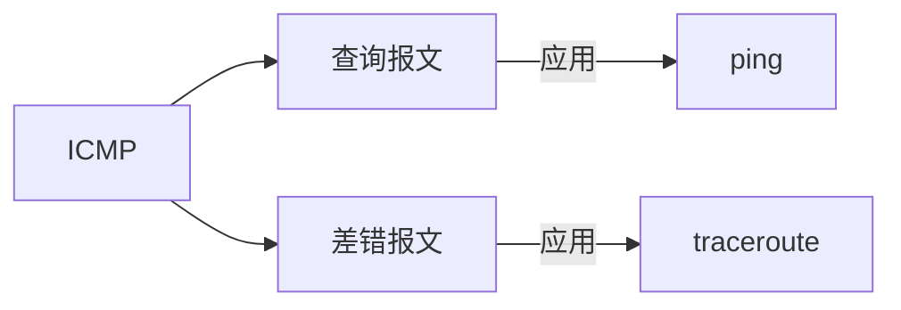

# ICMP

ICMP 因特网消息控制协议，它就像一个侦察兵，快速侦察，向源主机反馈情况，以便源主机决策。

<!-- 使用 ICMP 的工具 ping, traceroute 等 -->



## 报文格式

使用 `ping` 发送 ICMP 报文的抓包结果如下

<MyImg src={require("./assets/2023-02-20-16-17-23.png")} width="600px" />

type 和 code 两个字段是最重要的标记

| 字段 | 解释         |
| ---- | ------------ |
| type | 消息类型     |
| code | 消息含义概括 |

举个例子来说明，一般接口返回值类似这样的格式

```js
{
  code: 200,
  message: "",
  data: {}
}
```

type 就像网络层面的 HTTP Code，而 code 就是业务层面的错误信息标记。

## 报文分类

- type：消息类型，比如回显(echo) 请求，回显请求的应答，ping 请求是 8，ping 的响应是 0
- code：概括 典型的是 type 为 3 的情况表示不可达，而 code 进一步表示了是什么不可达，是协议(code 2)，还是端口(code 3)。

ICMP 报文一般分为 查询报文 和 差错报文，查询报文就是简单看一下能不能通，code 没有更多具体信息，而差错报文，code 会是概括错误信息的错误编号。

直白一点吧，查询报文就是 回显请求 和 回显请求的响应 这两种。理解为大约等价于 ping 的请求和响应也成。

查询报文有俩特点，请求是主动发出的，其次在 code，code 不代表更多信息了，因为也不需要更多信息，这是一个”是或者否“的问题。

差错报文就比较复杂了，不同的 type 和 code 组合代表了各种各样的差错信息。

## 查询报文

查询报文主动发送一个请求，期望获得一个答复。

### ping

发送查询报文最常用的工具是 `ping`，它用来探测主机是否可达，计算往返时间等。
一般用来试一下网络是不是通的，这是平时使用百度搜索最频繁的场景 🤷‍♂️。

| 报文类型     | type | code |
| ------------ | ---- | ---- |
| ping request | 8    | 0    |
| ping reply   | 0    | 0    |

```bash
ping baidu.com -c 2
```

<!-- todo ping 数据包的 data 是什么内容？由什么决定 -->

## 差错报文

当传输过程中发生错误，向源主机发生一个差错报文，告诉源主机发生了什么问题。

可以通过 ping 来看一下所谓的差错报文，指定 TTL 为 1，这样就会超时，对应的路由器会向源主机发送差错报文

## traceroute

traceroute 使用 UDP 协议，指定一个不可达端口，每次依次发送的报文 TTL 从 1 递增，链路上各个路由器由于 TTL 超时，返回一个 ICMP 消息通知源主机


## 总结

ping 和 traceroute 都是使用的 ICMP 协议。traceroute 基于 UDP，通过设置 TTL，中间路由在解析发现超时之后向源主机发送 ICMP 差错报文。

<!--
虽然是叫做 ICMP，但是其实是 M，然后 C，是接收到消息，然后进行相应的控制处理。 -->

## Q & A

### ICMP 是哪层的协议

虽然 ICMP 是基于 IP 的，但一般认为 ICMP 属于网络层。这个就没必要纠结是哪一层了，各种解释，理由有一大堆。我觉得 IP 是用于 host-to-host 通信的，而 ICMP 针对的是目标主机，或者说目标 IP，能不能到达，好不好到达，是看这个 IP “好不好用”。RFC (opens new window)的说明如下

> ICMP, uses the basic support of IP as if it were a higher level protocol, however, ICMP is actually an integral part of IP, and must be implemented by every IP module.

<!-- TCPPing, ICMPPing -->
