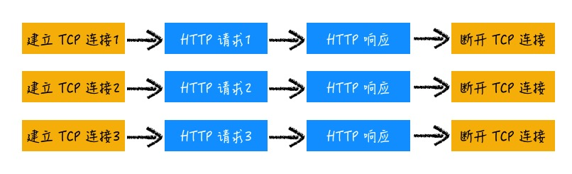
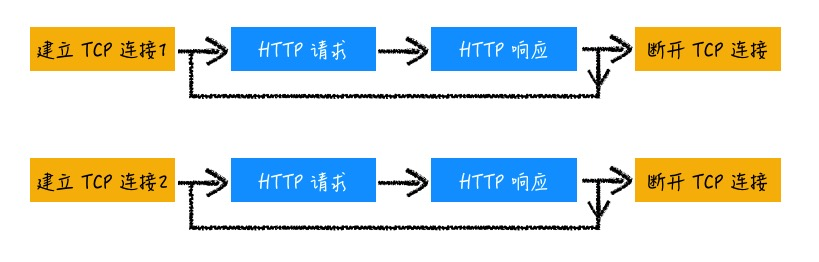

# HTTP

了解 HTTP 协议的发展，各关键版本的一些基本知识。

## 0.9 - 单行协议

这个时候的 HTTP 是个“单行协议”，只支持 GET 请求，很纯粹地描述了需求 —— 给我一个 HTML。

```bash
GET /mypage.html
```

这个时候的 HTML 页面只是纯文本的，一个请求直接返回一个 HTML 完整的页面，不会异步请求其他资源，因此在一次请求被响应后就关闭了连接。

## 1.0 - 多种文件

随着互联网的发展，浏览器和服务器迅速扩展，产生了双端互操作，支持图像、样式和脚本等更丰富需求及一些实现。

HTTP/1.0 并不是一个严格的标准，它是已有实践的一份总结，一份参考文档，是分析当时 HTTP 发展的状态，思考以后的发展的一个承上启下的阶段性归纳。

HTTP 1.0 最核心的是支持文本之外的文件传输。要实现不同文件传输，需要在 C/S 之间进行协商

- 客户端需要提供更明确的需求
- 服务器需要返回文件的一些描述

这种协商是通过引入 HTTP Header，添加具体的描述字段而实现。

##### 客户端描述请求

为了识别 CSS 和 JavaScript 等不同的文件。在请求头部中添加了 `accept`，`accept-*` 提出了进一步的内容协商

```bash
accept: text/html
accept-encoding: gzip, deflate, br
accept-charset: utf-8
accept-language: zh-CN,zh
```

##### 服务器描述响应

服务器在收到请求后，也需要对应答的文件做一些描述，以便客户端确认和处理。服务器通过 `Content-Type` 等字段进行描述被返回的文件

```bash
content-length: 3495
content-encoding: br
content-type: text/html; charset=utf-8
content-language: en-US
```

服务器不一定能够满足客户端的要求，增加 Status Code 来向客户端表明发生了什么。比如说 `accept-language` 的要求我服务器实在做不到，就可以通过 406 来表示。

```bash
Status Code: 406
```

##### HTTP 1.0 的问题

在 0.9，一个页面就是单纯 HTML 文本，一次请求就完事了。0.9 之后迅速发展，有各种各样的拓展实现，随着支持其他资源，完整显示一个页面需要发送多个请求。默认情况下，HTTP/1.0 对每个资源请求，需要建立单独的 TCP 连接，频繁的 TCP 连接的建立和断开会消耗资源，导致页面显示的延迟。



:::info 🤔
1.0 并不是一个严格的标准，只是一个归纳总结，可以发现沿袭 0.9 下来的实现 —— 一个文件一个 TCP 连接，已经不能满足发展的需要了。

事实上，当前最广泛应用的还是 HTTP/1.1，而在形式上，HTTP/1.0 与 1.1 已经差别不大了。
:::

## 1.1 - 长连接

HTTP/1.1 最核心的内容，是针对 1.0 中的连接问题支持了 TCP 长连接。通过 TCP 长连接，减少了 TCP 的建立和断开带来的消耗



需要注意的是，HTTP 1.1 的请求和响应中，并没有序号标识，这就意味着响应解析的顺序必须和发送的顺序一致。
这就是 1.1 所谓的管线化的方案。在同一个 TCP 连接中

- 客户端可以连续发送多个请求，不必等待响应返回之后再发起下一个请求
- 服务器阻塞性处理，必须先到的先返回

<!-- 服务器如何知道是顺序的，管线化还需要更多的理解 -->

简单来说，就是单连接上串行请求，是你可以一下子给我很多需求，但我只能一个一个处理。

管线化意味着如果前面某个请求没有及时返回，我后面的也没法玩，这就是所谓的 **队头阻塞问题**。

:::info 🤔

因为 队头阻塞 问题, Chrome 中对同一个域名使用 6 个 TCP 并行连接，这也是有的网站优化方案使用了多域名分发 CDN 的原因。本来采用持久连接就是为了减少 TCP 连接，而最后却仍需要采用多 TCP 连接来解决效率问题，这并不完美。
:::

## 2 - 多路复用

针对 HTTP/1.1 长连接的队头阻塞问题，如果允许在一个 TCP 中并发执行 HTTP 请求，是否就可以不再需要多 TCP 连接？这就是 HTTP/2 的解决方案。

HTTP 2 通过引入**二进制分帧层**，将传输的 HTTP 包分成了更小的帧，采用二进制进行编码。这里面有两个核心概念

- 帧：帧就是一次请求
- 流：流是帧的双向传输序列，每个帧都属于某个流，一个流有多个帧。

流相当于 1.1 里面的一个”请求-响应“，也就是 1.1 的一个完整的双端 HTTP 通信。其实就是理解为原来是一个个完整的大包裹，现在拆成一个个小包裹了，就需要加一个标记，谁跟谁是一起的。


服务端接收到多个请求后，可以根据自身的优先级设置，有选择地决定先返回哪些内容。
浏览器接收到信息后，根据流 ID 筛选，将内容拼接为完整的数据。

:::info 🤔
HTTP/2 通过允许 TCP 并发请求，有效缓解了队头阻塞问题，但是仍旧存在不足。由于 TCP 是有序的，假如服务器向客户端依次发送了 A,B,C 三个包，当出现 A 丢包的情况，客户端必须等前面的包接收到，才能继续组装。问题是 A，B，C 的数据可能分属与不同的 HTTP 流，和 A 并没有应用层上的顺序关系，但是仍旧被阻塞了。
:::

## HTTP 3 - QUIC

1.1 和 2 都是尝试在 HTTP 协议上进行改造，对于 TCP 本身的限制无能为力。QUIC 是在运输层做出改变，使用 UDP 进行传输。

QUIC 避免 TCP 队头阻塞问题的关键，也就在于 UDP 的无序传输，这样就从根本上解决了队头阻塞的问题。

## Q & A

<details>
  <summary>那么为什么要采用管线化方案呢？问题这么大，不用不行么？</summary>
  <div></div>
</details>

<!-- ##### 引入了分块传输

HTTP/1.1 引入了 分块传输(Chunk Transfer)机制来解决大文件传输等方面的问题。Chunk Transfer 机制，允许服务器对数据进行分块，这个时候传输的 HTTP 包，称为 不定长包体，打个比方来说

定长包体传输是直接告诉你长度是多少，你就照着接收就好
不定长包体，分块传输是让你先接收着，到结束的时候我会告诉你的
分块传输，通过使用 [Transer-Encoding](https://developer.mozilla.org/zh-CN/docs/Web/HTTP/Headers/Transfer-Encoding) 指明使用分块传输方式，这个时候就不必在响应时指定 Content-Length 了，可以边压缩边传输，大文件也可以拆开了。以一个简单的例子看一下

```js
const express = require("express");
const app = express();
const port = 3000;

app.get("/", (req, res) => {
  res.setHeader("Transfer-Encoding", "chunked");
  let text = "Hello Wolrd";
  for (let i = 0, len = text.length; i < len; i++) {
    res.write(text.charAt(i) + "\n");
  }
  res.end();
});

app.listen(port, () => {
  console.log(`Example app listening at http://localhost:${port}`);
});
````

从 WireShark 可以看到在返回中分成了一块块的数据，最后再合并起来。

<MyImg src={require("../assets/chunk.jpg")} width="600px" /> -->

<!-- ##### HTTP2 的其他特性

| 特性           | 说明                                         |
| -------------- | -------------------------------------------- |
| 服务端推送     | 支持将数据主动推送到浏览器                   |
| 请求优先级设置 | 支持设置请求优先级，让服务器优先处理高优请求 |
| 头部压缩       | HTTP/2 对请求头和响应头进行了压缩          |

| 功能         | 解释                    |
| ------------ | ----------------------- |
| 支持多种文件 | Content-Type, accept-\* |
| 支持内容推送 | 引入 POST 请求          |
| 支持状态说明 | 引入 Status Code        |
| 其他         | 缓存和认证等            | -->
