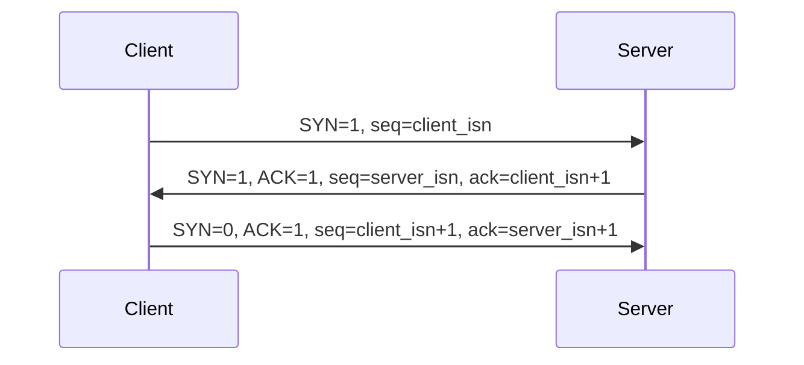
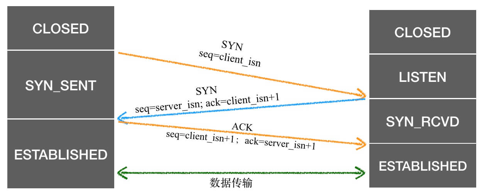
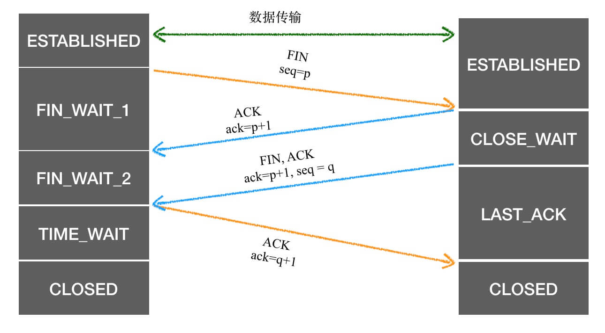

# TCP

捋一下连接和断开等内容。

## 报文格式

<MyImg src={require("../assets/tcp.jpg")} width="600px" />

| 字段            | 描述                     |
| --------------- | ------------------------ |
| 端口号          | 应用程序的标识           |
| 序号            | 发送的数据的起始字节序号 |
| 确认号          | 接受的数据的起始字节号   |
| 6 bits 标记字段 | TCP 报文的分类           |
| 窗口字段        | 用于流量控制             |

## 建立连接

TCP 的连接，也就是常说的三次握手过程。连接是两个通信端系统的 TCP 程序中之间建立的关系，对于中间链路来说，是没有连接这件事的，这也是常说的 TCP 是点对点的链接。

第一个报文称作 SYN 报文，第二个报文称作 SYNACK 报文，这两个报文都是比较特殊的。经过前面的确认，第 3 个报文已经大概率会达成合租，已经可以顺便携带部分数据去准备开始正式合作了。

### ISN

三次握手除了建立连接，还有一个核心的作用是同步初始化序列号(ISN，Initial Sequence Number)，这是后续双方愉快地合作的基础。

数据流之间是有顺序的，这个毋庸置疑，当我们说 ISN 的时候，不是说的它有没有必要，而是它为什么不是一个确定的值，比如说每次都从 1 开始？

简单来说，是为了在不同的连接里面数据不要串了。

报文在网络中可能遇到各种情况，有延迟，有丢包，有重发，

### ACK 与 ack

<MyImg src={require("./assets/2023-03-06-16-08-35.png")} width="600px" />

一般 ACK 指的是标记位中的 ACK，而 ack 就是确认号。

## 断开连接

## 状态图

为了维护双方的连接，需要维护一个状态机，建立连接过程中相关的状态变化如下

1. 服务端处于监听状态
1. 客户端发出 SYN 请求同步之后，客户端变为 SYN_SENT
1. 服务端收到 SYN 请求之后，给客户端响应，变为 SYN_RCVD
1. 客户端收到 SYN 响应之后，给服务端发出确认应答，变为 ESTABLISHE
1. 客户端收到确认后，变为 ESTABLISHE
1. 双方都是 ESTABLISHE 之后就可以进行正式通信了

相对于连接来说，断开的过程不那么容易理解

假设左侧是 A，右侧是 B。为什么 A 会有 FIN_WAIT_1 和 FIN_WAIT_2 的区别，B 要发送两次 ACK 消息，而不是合并呢？

1. A 给 B 发送 FIN：我没有数据要给你了，你也准备准备断开吧
1. B 给 A 发送 ACK 响应 FIN 通知：我知道你不会再发数据了，我正在收尾
1. B 给 A 发送 FIN：我也没东西要给你了
1. A 给 B 发 ACK：好的，那就再见了！

**不要认为步骤 2 和步骤 3 是连续的，中间还可能有其他操作**。TCP 是全双工通信有关，FIN_WAIT_1 和 FIN_WAIT_2，都表示在等待一个 FIN 响应，在步骤 2 和 步骤 3 之间，B 可能还是会给 A 发消息。 A 不能直接跑路，只能一步一步来，不然 B 的部分数据可能就丢了，所以要在保留接收能力的情况下，启动关闭流程。

在 B 发送 FIN 之后，B 进入到 LAST_ACK 状态，表示期待收到一个确认，而 A 收到后，会发送一个确认，进入 TIME_WAIT(2 MSL，Maximum Segment Lifetime，报文最大生存时间) 状态。B 在期待一个 ACK，如果没有收到它会重发，因而 A 等待 2MSL 的时间，最后没再收到 B 的结束通知，就关闭了。

<!-- TCP的理解还差很多，尤其是它的顺序问题，队头阻塞问题。 -->
