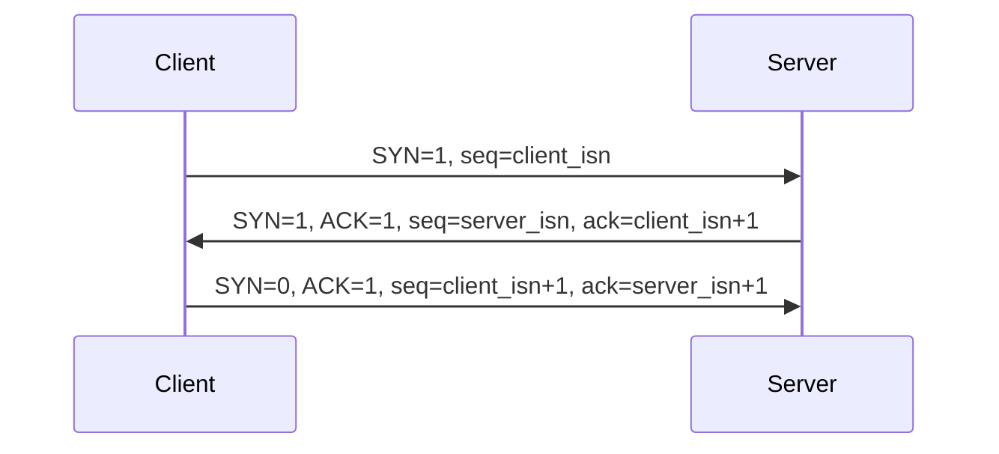
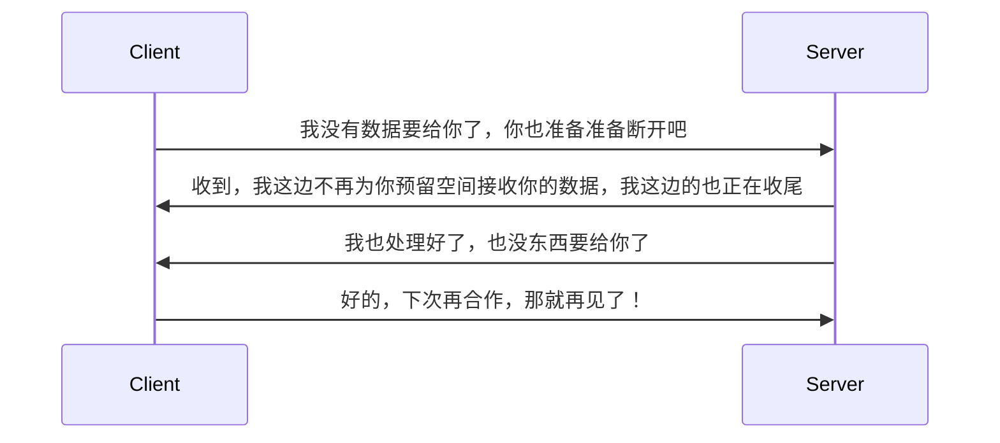

# TCP

说到 TCP，那内容就太多了，简单捋一下连接和断开等内容。

## 报文格式

<MyImg src={require("./assets/2023-03-06-23-37-22.png")} width="600px" />

| 字段            | 描述                     |
| --------------- | ------------------------ |
| 端口号          | 应用程序的标识           |
| 序号            | 发送的数据的起始字节序号 |
| 确认号          | 接受的数据的起始字节号   |
| 6 bits 标记字段 | TCP 报文的分类           |
| 窗口字段        | 用于流量控制             |

## 建立连接

TCP 的连接，也就是常说的三次握手过程。

连接是两个通信端系统的 TCP 程序中之间建立的关系，对于中间链路来说，是没有连接这件事的，这也是常说的 TCP **点对点的连接**。

第一个报文称作 SYN 报文，第二个报文称作 SYNACK 报文，这两个报文都是比较特殊的。经过前面的确认，第 3 个报文已经大概率会达成合租，已经可以顺便携带部分数据去准备开始正式合作了。

### ISN

三次握手除了建立连接，还有一个核心的作用是同步初始化序列号(ISN，Initial Sequence Number)，这是后续双方愉快地合作的基础。

数据流之间是有顺序的，这个毋庸置疑，当我们说 ISN 的时候，不是说的它有没有必要，而是它为什么不是一个确定的值，比如说每次都从 1 开始？

**简单来说，是为了在不同的连接里面数据不要串了。**

<MyImg src={require("./assets/2023-03-06-23-07-44.png")} width="500px" />

TCP 上面是应用层，或者说是程序，程序通过端口号来标识，通过套接字与 TCP 程序交互。如果每次 TCP 连接都从 1 开始，那么假如前面一个连接发出 1,2,3，而客户端又因为某些原因断开了连接，再次连接时又发出了 1,2,3。

同一个程序很可能使用同样的端口，而不同的程序也可能使用同样的端口，这两次发送的同一个编号的数据是无法确定谁先到的，端口又都一样，分不清谁属于哪个连接。

为了保证 ISN 的唯一性，SYN 一般是与时间相关的一个计数值，具体算法不同的 OS 有不同的实现，只要确保唯一性即可。

### ACK 与 ack

一般 ACK 指的是标记位中 1 比特的 ACK，而 ack 是 32 位的确认号，这两个在连接过程中都是重要的。

<MyImg src={require("./assets/2023-03-06-16-08-35.png")} width="600px" />

### 为什么是三次握手

为什么是 3 次握手，不是 2 次，不是 4 次？100 次都可以，但是 3 次是较为合适的。

经过 3 次握手，双方都经过了一次发送一次接收，建立了初步的信任，而且第 3 次客户端就可以携带数据了。当然，每一步都可能会丢了，但没关系，双方都有预期，中间丢了就不会收到回复，没丢会在一定时间内收到回复，着急的自己再问问。连接过程中的状态变化如下

<MyImg src={require("../assets/handshake-status-1.jpg")} width="600px" />

只有达到一发一收的状态，双方才做置办的准备，也就是到达 ESTABLISHED 的状态，正式分配资源，置办东西准备招待对方。

## 断开连接

断开连接的过程，就是常说的四次挥手的过程。简单来理解，之所以是 4 次挥手，是因为 TCP 是全双工通信，客户端说要断开连接了，服务端不一定能立即断开，合作是相互的，不是只有一方有诉求。断开连接的状态图如下

<MyImg src={require("../assets/tcp-close.jpg")} width="600px" />

假设左侧是 A，右侧是 B。其实就是由于全双工，都可能独立地给对方发消息，需要对两条数据通道分别做一次来回的确认。
换成通俗的对话形式也可以像下面这样

针对步骤 2，3，从断开要做的事情上去理解，可以知道

- 2 和 3 不一定连续的，中间还可能有其他操作，比如 B 消息没发完，可能还是会给 A 发消息
- 2 和 3 甚至可以合并，这边提了分手那边刚好也准备好提分手

A 不能直接跑路，只能一步一步来，不然 B 的部分数据可能就丢了，所以要在保留接收能力的情况下，启动关闭流程。

在 B 发送 FIN 之后，B 进入到 LAST_ACK 状态，表示期待收到一个确认，而 A 收到后，会发送一个确认，进入 TIME_WAIT(2 MSL，Maximum Segment Lifetime，报文最大生存时间) 状态。B 在期待一个 ACK，如果没有收到它会重发，因而 A 等待 2MSL 的时间，最后没再收到 B 的结束通知，就关闭了。

<!-- TCP的理解还差很多，尤其是它的顺序问题，队头阻塞问题。 -->

## 可靠传输

## 拥塞控制

## 队头阻塞问题

## Q & A

  
为什么是3次握手，不是2次，不是4次

  
100次都可以，但是3次是较为合适的。经过3次握手，双方都经过了一次发送一次接收，建立了初步的信任，而且第3次客户端就可以携带数据了。当然，每一步都可能会丢了，但没关系，双方都有预期，中间丢了就不会收到回复，没丢会在一定时间内收到回复，着急的自己再问问。只有达到一发一收的状态，双方才做置办的准备，分配资源，置办东西准备招待对方。

  
TCP 的全双工，在三次握手里面如何体现的

  

