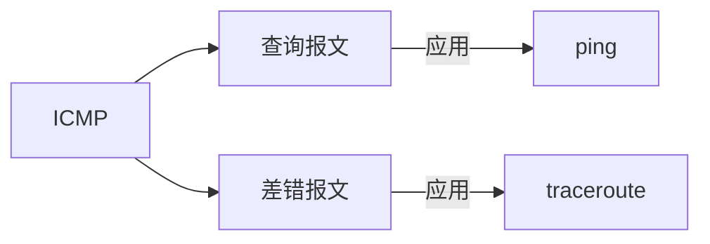

# ICMP

ICMP 因特网消息控制协议，它就像一个侦察兵，快速侦察，向源主机反馈情况，以便源主机决策。

一般分为 查询报文 和 差错报文，查询报文就是简单看一下能不能通，差错报文是用来报告发生了怎样的错误。



## 报文格式

使用 `ping` 发送 ICMP 报文的抓包结果如下

<MyImg src={require("./assets/2023-02-20-16-17-23.png")} width="600px" />

type 和 code 两个字段是最重要的标记

| 字段 | 解释         |
| ---- | ------------ |
| type | 消息类型     |
| code | 消息含义概括 |

举个例子来说明，一般接口返回值类似这样的格式

```js
{
  code: 200,
  message: "",
  data: {}
}
```

type 就像网络层面的 HTTP Code，而 code 就是业务层面的错误信息标记。

## 查询报文

查询报文主动发送一个请求，期望获得一个答复。
发送查询报文最常用的工具是 `ping`，它用来探测主机是否可达，计算往返时间等。
一般用来试一下网络是不是通的，这是平时使用百度搜索最频繁的场景 🤷‍♂️。

| 报文类型     | type | code |
| ------------ | ---- | ---- |
| ping request | 8    | 0    |
| ping reply   | 0    | 0    |

```bash
ping baidu.com -c 2
```

## 差错报文

| type | 报文类型     |
| ---- | ------------ |
| 3    | 终点不可达为 |
| 4    | 源抑制       |
| 5    | 重定向       |
| 11   | 超时         |

当传输过程中发生错误，向源主机发生一个差错报文，告诉源主机发生了什么问题。

<MyImg src={require("./assets/2023-02-22-17-39-58.png")} width="600px" />

## traceroute

traceroute 使用 UDP 协议，指定一个不可达端口，每次依次发送的报文 TTL 从 1 递增，链路上各个路由器由于 TTL 超时，返回一个 ICMP 消息通知源主机

<MyImg src={require("../assets/traceroute.jpg")} width="600px" />

<!--
虽然是叫做 ICMP，但是其实是 M，然后 C，是接收到消息，然后进行相应的控制处理。 -->

<!-- TCPPing, ICMPPing -->
<!-- 超时的标准，怎样算是不可达 -->
<!-- 使用 ICMP 的工具 ping, traceroute 等 -->
