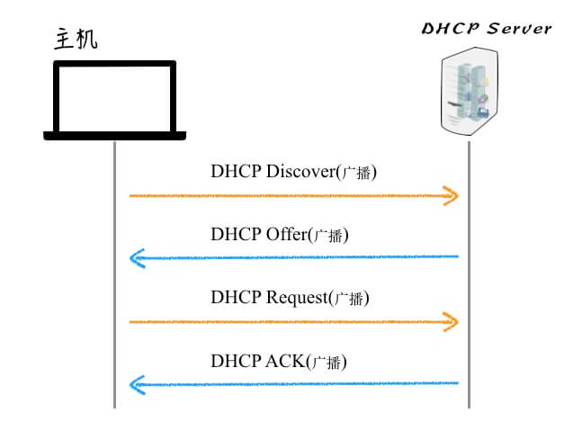
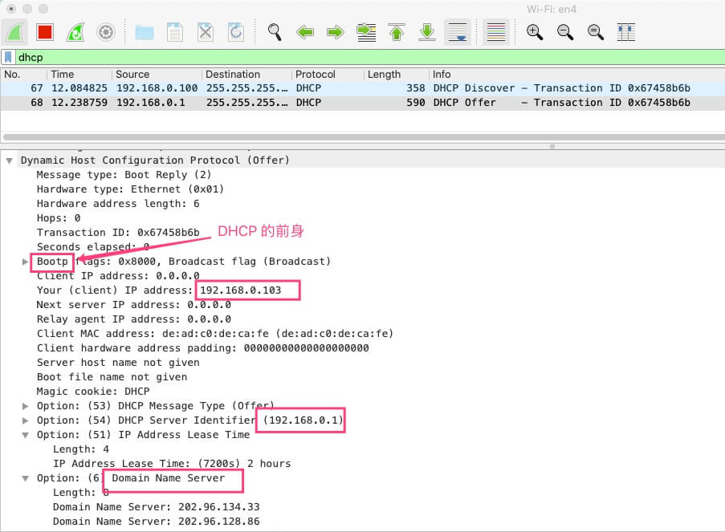

# DHCP

Dynamic Host Configuration Protocol

动态主机协议，用以在局域网中设备接入分配 IP，基本的原理是接入设备和 DHCP Server 通过广播进行通信协商，协商好之后通过广播广而告之。

## 接入流程

新设备加入网络时，基本流程如下



1. **DHCP Discover**: 新主机以 0.0.0.0 为 IP 地址，广播发送一个请求，这里关键是带上了 MAC 地址。
1. **DHCP Offer**: DHCP 服务器收到消息，广播回复，这里会带上服务器的 MAC 和 IP。
1. **DHCP Request**:新主机收到广播，发现是给自己分配 IP 的消息，很愉快地接收了，给 DHCP 服务器回复说接受 Offer 了。注意这一步仍是广播的，因为 DHCP Server 也并不一定是唯一的，需要告诉其他 Server，它已经接受某个公司提供的 Offer 了。
1. **DHCP ACK**:服务器收到确认，招到一个满意的新员工，它也很高兴。正式登记，再次大喊一声，广而告之(虽然其他人不怎么关注就是了)，欢迎新主机加入

可以通过 nmap 模拟一下

```bash
nmap --script broadcast-dhcp-discover
```

其中 DHCP Offer 响应如



从中可以看到 IP 的有效期是 2 hours。客户机在租期过去 50%，即 1 小时之后，会向 HTTP Server 请求续租，直接向为其提供 IP 的 DHCP Server 发送 DHCP Request，尝试使用原来的同一个 IP，这个时候客户机和服务器之间就不用广播了。

了解基本过程，知道连接 wifi 的时候大概是个什么过程即可。这个过程，还蛮有意思的，跟求职的过程类似。
