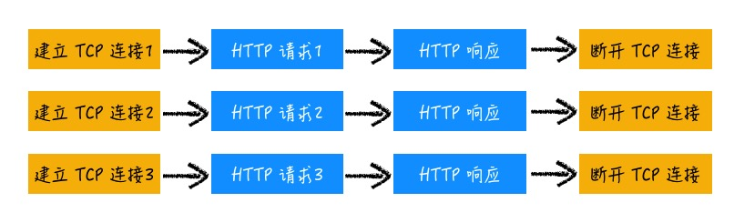

# HTTP

了解 HTTP 协议的发展，各关键版本的一些基本知识。

## 0.9 - 单行协议

HTTP 的名称 Hyper Text Transfer Protocol 描述了其最初满足的需求 —— 在网络中传输 HTML 文本。 最早的时候，HTTP 是很简单的，只支持 GET 请求，只有一行请求

```bash
GET /mypage.html
```

这个时候的 HTTP，是个“单行协议”，一行文本，很纯粹地描述了需求，我要一个 HTML，你给我一个 HTML，不逼逼。不过虽然 HTTP 0.9 结构简单，但是已经约定了使用 C/S 模式，80 端口，基于 TCP 等，这些是传承至今的。

## 1.0 - 支持多种文件

HTTP 1.0 最核心的需求是支持不同类型文件的下载，通过引入 Header，实现了在客户端和服务器之间的协商，通过引入 Status Code，概括了服务器的应答情况。

为了识别 CSS 和 JavaScript 等不同的文件，添加了请求头部分。在请求头中引入了 accept 字段以描述客户端请求的是什么类型文件

```bash
accept: text/html
accept-encoding: gzip, deflate, br
accept-charset: utf-8
accept-language: zh-CN,zh
```

在 accept 的基础上，又添加了 accept-\* 相关的字段，对文件提出了进一步的内容协商。而服务器则通过 Content-Type 等字段进行资源描述

```bash
content-length: 3495
content-encoding: br
content-type: text/html; charset=utf-8
content-language: en-US
```

通过这些请求和响应头部的字段，已经能够在 C，S 之间进行文件的协商。在客户端提出内容协商后，服务器不一定能够满足客户端的要求，于是提出 Status Code 来向客户端表明发生了什么，比如说 accept-language 的要求我服务器实在做不到，就可以通过 406 来表示。

```bash
Status Code: 406
```

此外，其他的很多重要的字段在 HTTP/1.0 也已经定义，如 User-Agent 和 Server 相互沟通各自的一些基本信息，Location 告诉客户端在某种情况下的下一步操作，Pragma，Cache(If-Modified-Since，Expires) 等利用缓存节约流量。

#### HTTP/1.0 中，有这么几个需要注意的问题

- **每个 HTTP 请求建立独立 TCP 连接**：默认情况下，HTTP/1.0 对每个资源请求，需要建立单独的 TCP 连接，当页面中的资源数膨胀时，在 TCP 连接和断开耗费的时间和硬件资源需要考虑。



- **只支持定长包体**：服务端需要指定 Content-Length 响应头，浏览器将根据这个字段判断文件何时传输完成。定长包体的要求意味着如果请求要求压缩，服务端需要全部压缩完成之后才能返回数据，这带来了时间和性能上的消耗。

- **域名和 IP 绑定**：每个域名绑定了唯一的 IP，请求时没有 Host 的概念。

## 1.1 - 长连接

HTTP/1.1 是如今仍在广泛引用的版本，其对 HTTP/1.0 的主要改进如下

### 复用 TCP 连接

也叫持久连接或者长连接。通过复用连接，减少了 TCP 的建立和断开带来的消耗


但是在同一个 TCP 连接中，HTTP 请求仍旧是串行的，这带来了 队头阻塞 的问题，如果前面某个请求没有及时返回，我后面的也没法玩。

Chrome 中对同一个域名使用 6 个 TCP 并行连接，正是因为 队头阻塞 问题。本来采用持久连接就是为了减少 TCP 连接，而最后却仍需要采用多 TCP 连接来解决效率问题，这并不完美。

### 引入了分块传输

HTTP/1.1 引入了 分块传输(Chunk Transfer)机制来解决动态生成内容，大文件传输等方面的问题。Chunk Transer 机制，允许服务器对数据进行分块，这个时候传输的 HTTP 包，称为 不定长包体，打个比方来说

定长包体传输是直接告诉你长度是多少，你就照着接收就好
不定长包体，分块传输是让你先接收着，到结束的时候我会告诉你的
分块传输，通过使用 [Transer-Encoding](https://developer.mozilla.org/zh-CN/docs/Web/HTTP/Headers/Transfer-Encoding) 指明使用分块传输方式，这个时候就不必在响应时指定 Content-Length 了，可以边压缩边传输，大文件也可以拆开了。以一个简单的例子看一下

```js
const express = require("express");
const app = express();
const port = 3000;

app.get("/", (req, res) => {
  res.setHeader("Transfer-Encoding", "chunked");
  let text = "Hello Wolrd";
  for (let i = 0, len = text.length; i < len; i++) {
    res.write(text.charAt(i) + "\n");
  }
  res.end();
});

app.listen(port, () => {
  console.log(`Example app listening at http://localhost:${port}`);
});
```

从 WireShark 可以看到在返回中分成了一块块的数据，最后再合并起来。

[Chunk 传输](assets/chunk.jpg)

### 支持虚拟主机

不再要求域名和 IP 的一一对应关系，一个服务器可以支持多个域名，如今我们已经当做自然而然的 Web 服务器虚拟主机的配置，是在 1.1 才添加的。

### 其他

引入了 Cookie
拓展了缓存相关字段

## 2.0 - 多路复用

HTTP/1.1 长连接的队头阻塞问题，是因为在一个 TCP 连接中 HTTP 请求只能串行执行，由于这个问题，Chrome 等采用了多 TCP 连接的方式。那么，我们自然就能想到，如果允许在一个 TCP 中并发执行 HTTP 请求，是否就能解决阻塞问题，是否就可以不再需要多 TCP 连接？这就是 HTTP/2.0 的解决方案

> 一个域名只使用一个 TCP 长连接，并且通过多路复用消除阻塞问题

如下所示


图源谷歌开发者网站

通过引入**二进制分帧层**，将传输的 HTTP 包分成了更小的帧，采用二进制进行编码。每个帧都标记了所属 HTTP 请求的 ID，然后通过建立的通道进行**交错发送**。

服务端接收到多个请求后，可以根据自身的优先级设置，有选择地决定先返回哪些内容。而浏览器接收到信息知乎，根据 ID 筛选，将内容拼接为完整的 HTTP 响应数据。

### HTTP2 的其他特性

请求优先级设置：支持设置请求优先级，让服务器优先处理高优请求。
服务端推送：支持将数据主动推送到浏览器。
头部压缩：HTTP/2.0 对请求头和响应头进行了压缩。
